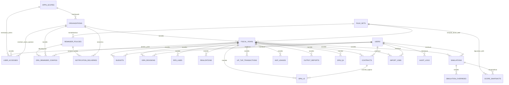
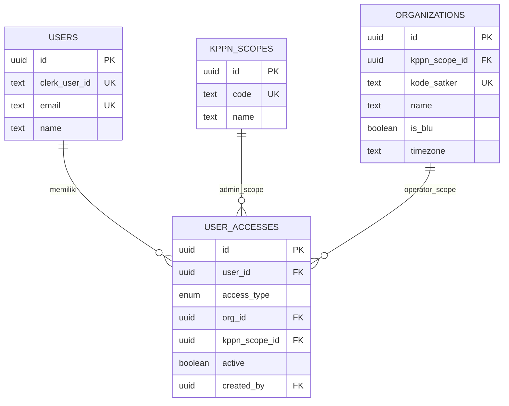
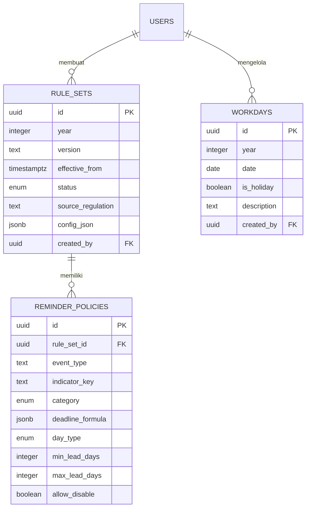
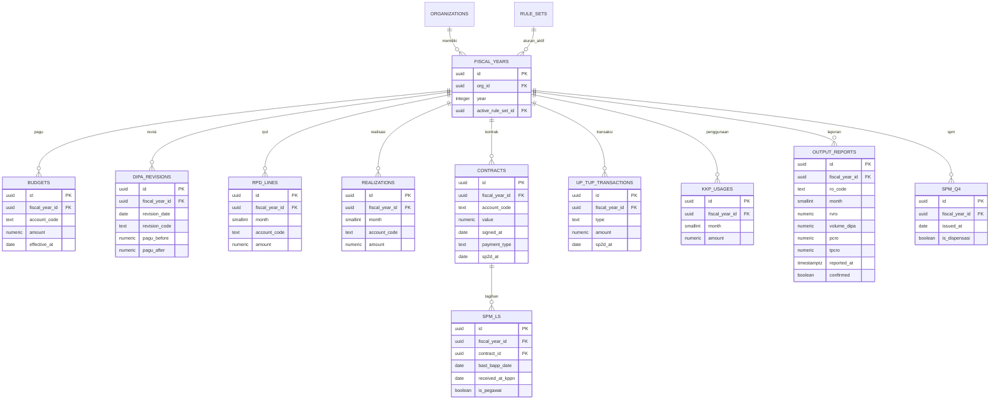
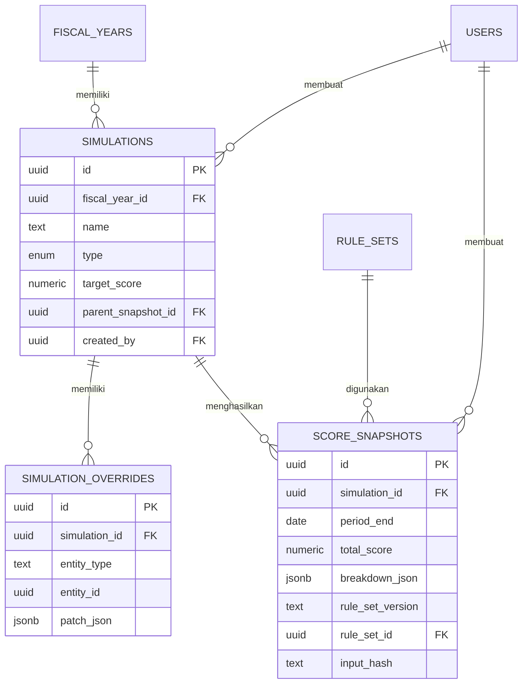
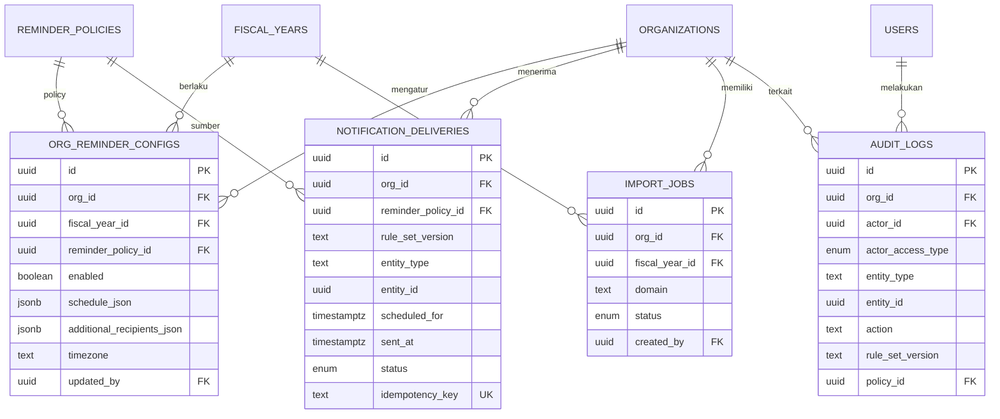

# ERD — Entity Relationship Diagram

**Produk:** Simulator Penilaian IKPA Satker  
**Basis:** PRD Final v1.3, FSD MVP v1.0, dan TSD MVP v1.0  
**Versi:** 1.0  
**Tanggal:** 31 Agustus 2026  
**Database:** PostgreSQL (NeonDB)  
**ORM:** Drizzle ORM

> ERD ini adalah desain data MVP untuk dua jenis akses: `operator_satker` dan `admin_kppn`. Data operasional selalu berada dalam konteks satker (`organizations`) dan tahun anggaran (`fiscal_years`).

---

## 1. Domain Data

| Domain | Tabel | Tujuan |
|---|---|---|
| Identitas & akses | `users`, `kppn_scopes`, `organizations`, `user_accesses` | Identitas pengguna, cakupan KPPN, profil satker, dan mapping email akses |
| Regulasi & policy | `rule_sets`, `reminder_policies`, `workdays` | Parameter IKPA, policy reminder, dan kalender hari kerja berversi |
| Tahun anggaran | `fiscal_years` | Penghubung satker, tahun anggaran, dan rule set aktif |
| Input IKPA | `budgets`, `dipa_revisions`, `rpd_lines`, `realizations`, `contracts`, `spm_ls`, `up_tup_transactions`, `kkp_usages`, `output_reports`, `spm_q4` | Data sumber perhitungan tujuh indikator serta dispensasi SPM |
| Simulasi | `simulations`, `simulation_overrides`, `score_snapshots` | Actual, forecast, scenario, override, dan hasil skor historis |
| Reminder | `org_reminder_configs`, `notification_deliveries` | Konfigurasi delivery satker dan jejak pengiriman notifikasi |
| Operasional | `import_jobs`, `audit_logs` | Proses import dan audit trail |

---

## 2. ERD Utama



---

## 3. Tabel Identitas dan Akses

### 3.1 `kppn_scopes`

Merepresentasikan cakupan monitoring KPPN. Satu KPPN scope dapat membawahi banyak satker dan memiliki banyak Admin KPPN.

| Kolom | Tipe | Key | Keterangan |
|---|---|---|---|
| `id` | UUID | PK | Identitas scope |
| `code` | text | UQ | Kode KPPN/scope |
| `name` | text | — | Nama KPPN |
| `created_at` | timestamptz | — | Waktu dibuat |
| `updated_at` | timestamptz | — | Waktu diperbarui |

### 3.2 `organizations`

Merepresentasikan satu satker. Semua data operasional satker terhubung secara tidak langsung melalui `fiscal_years`.

| Kolom | Tipe | Key | Keterangan |
|---|---|---|---|
| `id` | UUID | PK | Identitas satker |
| `clerk_org_id` | text | UQ, nullable | ID Organization dari Clerk bila digunakan |
| `kppn_scope_id` | UUID | FK → `kppn_scopes.id` | Scope KPPN yang membawahi satker |
| `kode_satker` | text | UQ | Kode satker |
| `name` | text | — | Nama satker |
| `kppn_name` | text | — | Nama KPPN tampilan |
| `is_blu` | boolean | — | Status BLU |
| `timezone` | text | — | Default `Asia/Jakarta` |
| `created_at` | timestamptz | — | Waktu dibuat |
| `updated_at` | timestamptz | — | Waktu diperbarui |

### 3.3 `users`

Profil internal aplikasi yang dipetakan dari identitas Clerk.

| Kolom | Tipe | Key | Keterangan |
|---|---|---|---|
| `id` | UUID | PK | Identitas pengguna internal |
| `clerk_user_id` | text | UQ | ID user Clerk |
| `email` | text | UQ | Email terverifikasi |
| `name` | text | — | Nama pengguna |
| `created_at` | timestamptz | — | Waktu dibuat |
| `updated_at` | timestamptz | — | Waktu diperbarui |

### 3.4 `user_accesses`

Tabel utama otorisasi MVP. Mapping menentukan apakah email adalah Operator Satker atau Admin KPPN.

| Kolom | Tipe | Key | Keterangan |
|---|---|---|---|
| `id` | UUID | PK | Identitas mapping akses |
| `user_id` | UUID | FK → `users.id` | Pengguna |
| `access_type` | enum | — | `operator_satker` atau `admin_kppn` |
| `org_id` | UUID | FK → `organizations.id`, nullable | Wajib untuk Operator Satker |
| `kppn_scope_id` | UUID | FK → `kppn_scopes.id`, nullable | Wajib untuk Admin KPPN |
| `active` | boolean | — | Status akses |
| `created_by` | UUID | FK → `users.id`, nullable | Admin KPPN pembuat mapping |
| `created_at` | timestamptz | — | Waktu dibuat |
| `updated_at` | timestamptz | — | Waktu diperbarui |

**Constraint bisnis:**

- Bila `access_type = operator_satker`, `org_id` wajib terisi dan `kppn_scope_id` harus kosong.
- Bila `access_type = admin_kppn`, `kppn_scope_id` wajib terisi dan `org_id` harus kosong.
- Satu user dapat memiliki beberapa mapping Operator Satker pada satker berbeda.
- Setiap scope harus selalu memiliki minimal satu Admin KPPN aktif.



---

## 4. Tabel Regulasi dan Policy

### 4.1 `rule_sets`

Menyimpan konfigurasi IKPA berversi per tahun anggaran. Formula, bobot, target, bucket nilai, asumsi, dan parameter regulasi berada di `config_json`.

| Kolom | Tipe | Key | Keterangan |
|---|---|---|---|
| `id` | UUID | PK | Identitas rule set |
| `year` | integer | UQ bersama `version` | Tahun anggaran |
| `version` | text | UQ bersama `year` | Contoh `2026.1` |
| `effective_from` | timestamptz | Index | Waktu mulai berlaku |
| `status` | enum | — | `draft`, `published`, `retired` |
| `source_regulation` | text | — | Referensi peraturan/dokumen |
| `change_notes` | text | — | Ringkasan perubahan |
| `config_json` | jsonb | — | Formula dan parameter penilaian |
| `created_by` | UUID | FK → `users.id` | Admin KPPN pembuat |
| `published_at` | timestamptz | — | Waktu publish |
| `retired_at` | timestamptz | — | Waktu retired |
| `created_at` | timestamptz | — | Waktu dibuat |
| `updated_at` | timestamptz | — | Waktu diperbarui |

### 4.2 `reminder_policies`

Menyimpan definisi event reminder yang menjadi bagian dari satu rule set.

| Kolom | Tipe | Key | Keterangan |
|---|---|---|---|
| `id` | UUID | PK | Identitas policy |
| `rule_set_id` | UUID | FK → `rule_sets.id` | Rule set pemilik |
| `event_type` | text | UQ bersama `rule_set_id` | ID event stabil |
| `indicator_key` | text | — | Indikator terkait atau `global` |
| `category` | enum | — | `mandatory`, `recommended`, `optional` |
| `deadline_formula` | jsonb | — | DSL formula deadline/trigger |
| `day_type` | enum | — | `workday`, `calendar_day`, `event_based`, `schedule` |
| `min_lead_days` | integer | — | Lead time minimum |
| `max_lead_days` | integer | — | Lead time maksimum |
| `default_schedule_json` | jsonb | — | Jadwal default reminder |
| `required_recipients_json` | jsonb | — | Penerima wajib yang tidak dapat dihapus Operator |
| `allow_disable` | boolean | — | Selalu false untuk `mandatory` |
| `allow_recipient_override` | boolean | — | Mengizinkan penerima tambahan |
| `is_active` | boolean | — | Status event policy |
| `created_at` | timestamptz | — | Waktu dibuat |
| `updated_at` | timestamptz | — | Waktu diperbarui |

### 4.3 `workdays`

Kalender yang dipakai untuk kalkulasi deadline berbasis hari kerja, seperti batas tagihan H+17 hari kerja dan pelaporan output.

| Kolom | Tipe | Key | Keterangan |
|---|---|---|---|
| `id` | UUID | PK | Identitas record kalender |
| `year` | integer | UQ bersama `date` | Tahun kalender |
| `date` | date | UQ bersama `year` | Tanggal |
| `is_holiday` | boolean | — | Penanda libur/non-hari kerja |
| `description` | text | — | Keterangan libur/cuti bersama |
| `created_by` | UUID | FK → `users.id` | Admin KPPN pembuat/perubahan |
| `created_at` | timestamptz | — | Waktu dibuat |
| `updated_at` | timestamptz | — | Waktu diperbarui |



---

## 5. Tabel Satker dan Data IKPA

### 5.1 `fiscal_years`

Satu record mewakili satu tahun anggaran untuk satu satker. Seluruh input indikator merujuk ke tabel ini.

| Kolom | Tipe | Key | Keterangan |
|---|---|---|---|
| `id` | UUID | PK | Identitas tahun anggaran satker |
| `org_id` | UUID | FK → `organizations.id` | Satker pemilik |
| `year` | integer | UQ bersama `org_id` | Tahun anggaran |
| `active_rule_set_id` | UUID | FK → `rule_sets.id` | Rule set aktif untuk konteks satker/tahun |
| `created_at` | timestamptz | — | Waktu dibuat |
| `updated_at` | timestamptz | — | Waktu diperbarui |

### 5.2 Tabel pagu, RPD, dan revisi

| Tabel | PK | FK utama | Fungsi |
|---|---|---|---|
| `budgets` | `id` | `fiscal_year_id` → `fiscal_years.id` | Pagu akun 51/52/53/57 menurut tanggal efektif |
| `dipa_revisions` | `id` | `fiscal_year_id` → `fiscal_years.id` | Riwayat revisi, kode revisi, pagu sebelum/sesudah |
| `rpd_lines` | `id` | `fiscal_year_id` → `fiscal_years.id` | RPD bulanan per akun belanja |
| `realizations` | `id` | `fiscal_year_id` → `fiscal_years.id` | Realisasi bulanan per akun belanja |

#### Detail `budgets`

| Kolom | Tipe | Key | Keterangan |
|---|---|---|---|
| `id` | UUID | PK | Identitas pagu |
| `fiscal_year_id` | UUID | FK | Tahun anggaran satker |
| `account_code` | text | — | `51`, `52`, `53`, `57` |
| `amount` | numeric(18,2) | — | Nominal pagu |
| `effective_at` | date | — | Tanggal efektif pagu |
| `created_by` | UUID | FK → `users.id` | Operator pembuat |
| `deleted_at` | timestamptz | — | Soft delete |
| `created_at` | timestamptz | — | Waktu dibuat |
| `updated_at` | timestamptz | — | Waktu diperbarui |

#### Detail `dipa_revisions`

| Kolom | Tipe | Key | Keterangan |
|---|---|---|---|
| `id` | UUID | PK | Identitas revisi |
| `fiscal_year_id` | UUID | FK | Tahun anggaran satker |
| `revision_date` | date | — | Tanggal revisi |
| `revision_code` | text | — | Kode revisi |
| `pagu_before` | numeric(18,2) | — | Total pagu sebelum revisi |
| `pagu_after` | numeric(18,2) | — | Total pagu sesudah revisi |
| `notes` | text | — | Catatan |
| `created_by` | UUID | FK → `users.id` | Operator pembuat |
| `deleted_at` | timestamptz | — | Soft delete |

#### Detail `rpd_lines` dan `realizations`

| Kolom | Tipe | Key | Keterangan |
|---|---|---|---|
| `id` | UUID | PK | Identitas baris |
| `fiscal_year_id` | UUID | FK | Tahun anggaran satker |
| `month` | smallint | UQ bersama akun/tahun aktif | 1–12 |
| `account_code` | text | — | `51`, `52`, `53`, `57` |
| `amount` | numeric(18,2) | — | Nominal RPD/realisasi |
| `created_by` | UUID | FK → `users.id` | Operator pembuat |
| `deleted_at` | timestamptz | — | Soft delete |

### 5.3 Tabel kontrak dan tagihan

| Tabel | PK | FK utama | Fungsi |
|---|---|---|---|
| `contracts` | `id` | `fiscal_year_id` → `fiscal_years.id` | Kontrak untuk indikator belanja kontraktual |
| `spm_ls` | `id` | `fiscal_year_id` → `fiscal_years.id`; `contract_id` → `contracts.id` | Tagihan/SPM-LS untuk penyelesaian tagihan |

#### Detail `contracts`

| Kolom | Tipe | Key | Keterangan |
|---|---|---|---|
| `id` | UUID | PK | Identitas kontrak |
| `fiscal_year_id` | UUID | FK | Tahun anggaran satker |
| `contract_number` | text | UQ opsional per fiscal year | Nomor/referensi kontrak |
| `account_code` | text | — | `51`, `52`, `53`, `57` |
| `value` | numeric(18,2) | — | Nilai kontrak |
| `signed_at` | date | — | Tanggal tanda tangan |
| `payment_type` | enum/text | — | `sekaligus` atau `termin` |
| `sp2d_at` | date | — | Tanggal SP2D bila tersedia |
| `created_by` | UUID | FK → `users.id` | Operator pembuat |
| `deleted_at` | timestamptz | — | Soft delete |

#### Detail `spm_ls`

| Kolom | Tipe | Key | Keterangan |
|---|---|---|---|
| `id` | UUID | PK | Identitas tagihan/SPM |
| `fiscal_year_id` | UUID | FK | Tahun anggaran satker |
| `contract_id` | UUID | FK → `contracts.id` | Kontrak sumber |
| `reference_number` | text | — | Nomor/referensi SPM |
| `bast_bapp_date` | date | — | Tanggal BAST/BAPP |
| `received_at_kppn` | date | — | Tanggal diterima/dikonversi KPPN |
| `is_pegawai` | boolean | — | Flag belanja pegawai |
| `created_by` | UUID | FK → `users.id` | Operator pembuat |
| `deleted_at` | timestamptz | — | Soft delete |

### 5.4 Tabel UP/TUP, KKP, output, dan SPM Q4

| Tabel | PK | FK utama | Fungsi |
|---|---|---|---|
| `up_tup_transactions` | `id` | `fiscal_year_id` → `fiscal_years.id` | UP, TUP, GUP, GUP nihil, PTUP, setoran TUP |
| `kkp_usages` | `id` | `fiscal_year_id` → `fiscal_years.id` | Penggunaan KKP bulanan |
| `output_reports` | `id` | `fiscal_year_id` → `fiscal_years.id` | Capaian output RO per bulan |
| `spm_q4` | `id` | `fiscal_year_id` → `fiscal_years.id` | SPM Q4 dan flag dispensasi |

#### Field penting `up_tup_transactions`

| Kolom | Tipe | Keterangan |
|---|---|---|
| `type` | enum/text | `UP`, `TUP`, `GUP`, `GUP_NIHIL`, `PTUP`, `SETORAN_TUP` |
| `amount` | numeric(18,2) | Nominal transaksi |
| `sp2d_at` | date | Tanggal SP2D/transaksi |
| `reference_sp2d_at` | date | Referensi SP2D sebelumnya bila diperlukan |

#### Field penting `kkp_usages`

| Kolom | Tipe | Keterangan |
|---|---|---|
| `month` | smallint | Bulan 1–12 |
| `amount` | numeric(18,2) | Nilai penggunaan KKP |

#### Field penting `output_reports`

| Kolom | Tipe | Keterangan |
|---|---|---|
| `ro_code` | text | Kode rincian output |
| `month` | smallint | Bulan laporan 1–12 |
| `rvro` | numeric(18,4) | Realisasi volume RO |
| `volume_dipa` | numeric(18,4) | Target volume RO dalam DIPA |
| `pcro` | numeric(8,4) | Persentase capaian RO |
| `tpcro` | numeric(8,4) | Target persentase capaian RO |
| `reported_at` | timestamptz | Waktu pelaporan |
| `confirmed` | boolean | Status konfirmasi |

#### Field penting `spm_q4`

| Kolom | Tipe | Keterangan |
|---|---|---|
| `reference_number` | text | Nomor/referensi SPM |
| `issued_at` | date | Tanggal terbit; validasi Q4 |
| `is_dispensasi` | boolean | Flag SPM dispensasi |



---

## 6. Tabel Simulasi dan Snapshot

### 6.1 `simulations`

Mewakili konteks perhitungan `actual`, `forecast`, atau `scenario`.

| Kolom | Tipe | Key | Keterangan |
|---|---|---|---|
| `id` | UUID | PK | Identitas simulasi |
| `fiscal_year_id` | UUID | FK → `fiscal_years.id` | Tahun anggaran satker |
| `name` | text | — | Nama simulasi |
| `type` | enum | — | `actual`, `forecast`, `scenario` |
| `target_score` | numeric(8,4) | — | Target IKPA |
| `parent_snapshot_id` | UUID | FK self/`score_snapshots.id`, nullable | Snapshot asal scenario |
| `created_by` | UUID | FK → `users.id` | Operator pembuat |
| `deleted_at` | timestamptz | — | Soft delete |
| `created_at` | timestamptz | — | Waktu dibuat |
| `updated_at` | timestamptz | — | Waktu diperbarui |

### 6.2 `simulation_overrides`

Menampung patch asumsi untuk scenario tanpa mengubah data actual.

| Kolom | Tipe | Key | Keterangan |
|---|---|---|---|
| `id` | UUID | PK | Identitas override |
| `simulation_id` | UUID | FK → `simulations.id` | Scenario pemilik |
| `entity_type` | text | — | Jenis data yang dioverride |
| `entity_id` | UUID | nullable | ID data sumber bila ada |
| `patch_json` | jsonb | — | Nilai perubahan asumsi |
| `created_at` | timestamptz | — | Waktu dibuat |
| `updated_at` | timestamptz | — | Waktu diperbarui |

### 6.3 `score_snapshots`

Menyimpan hasil hitung yang bersifat historis dan immutable secara bisnis.

| Kolom | Tipe | Key | Keterangan |
|---|---|---|---|
| `id` | UUID | PK | Identitas snapshot |
| `simulation_id` | UUID | FK → `simulations.id` | Simulasi sumber |
| `period_end` | date | — | Akhir periode perhitungan |
| `total_score` | numeric(8,4) | — | Nilai IKPA total; nullable jika incomplete |
| `breakdown_json` | jsonb | — | Hasil per indikator, warning, rekomendasi, input trace |
| `rule_set_version` | text | — | Versi rule set untuk audit tampilan |
| `rule_set_id` | UUID | FK → `rule_sets.id` | Rule set sumber |
| `input_hash` | text | — | Hash input/override untuk integritas |
| `created_by` | UUID | FK → `users.id` | Pembuat snapshot |
| `created_at` | timestamptz | — | Waktu dibuat |



---

## 7. Tabel Reminder, Notifikasi, Import, dan Audit

### 7.1 `org_reminder_configs`

Menyimpan konfigurasi delivery reminder pada level satker, dengan batas yang berasal dari `reminder_policies`.

| Kolom | Tipe | Key | Keterangan |
|---|---|---|---|
| `id` | UUID | PK | Identitas konfigurasi |
| `org_id` | UUID | FK → `organizations.id` | Satker pemilik |
| `fiscal_year_id` | UUID | FK → `fiscal_years.id` | Tahun anggaran |
| `reminder_policy_id` | UUID | FK → `reminder_policies.id` | Policy sumber |
| `enabled` | boolean | — | Status aktif; dikunci true jika mandatory |
| `schedule_json` | jsonb | — | Lead time, jam kirim, eskalasi |
| `additional_recipients_json` | jsonb | — | Penerima tambahan tervalidasi |
| `custom_message` | text | — | Pesan internal tambahan |
| `timezone` | text | — | Default `Asia/Jakarta` |
| `updated_by` | UUID | FK → `users.id` | Operator pembaruan |
| `created_at` | timestamptz | — | Waktu dibuat |
| `updated_at` | timestamptz | — | Waktu diperbarui |

**Unique constraint:** `(org_id, fiscal_year_id, reminder_policy_id)`.

### 7.2 `notification_deliveries`

Merekam setiap jadwal dan hasil pengiriman notification/email.

| Kolom | Tipe | Key | Keterangan |
|---|---|---|---|
| `id` | UUID | PK | Identitas delivery |
| `org_id` | UUID | FK → `organizations.id` | Satker tujuan |
| `reminder_policy_id` | UUID | FK → `reminder_policies.id` | Policy sumber |
| `rule_set_version` | text | — | Versi policy/rule saat jadwal dibuat |
| `entity_type` | text | — | Jenis entitas, misalnya `spm_ls` atau `output_report` |
| `entity_id` | UUID | nullable | ID entitas sumber event |
| `scheduled_for` | timestamptz | Index | Waktu yang dijadwalkan |
| `sent_at` | timestamptz | — | Waktu sukses kirim |
| `status` | enum | — | `scheduled`, `sent`, `skipped`, `failed` |
| `attempt_count` | integer | — | Jumlah percobaan kirim |
| `idempotency_key` | text | UQ | Pencegah email ganda |
| `payload_json` | jsonb | — | Context email dan recipients final |
| `error_message` | text | — | Error aman jika gagal |
| `created_at` | timestamptz | — | Waktu dibuat |
| `updated_at` | timestamptz | — | Waktu diperbarui |

### 7.3 `import_jobs`

Menyimpan status proses import data CSV/XLSX.

| Kolom | Tipe | Key | Keterangan |
|---|---|---|---|
| `id` | UUID | PK | Identitas job import |
| `org_id` | UUID | FK → `organizations.id` | Satker pemilik |
| `fiscal_year_id` | UUID | FK → `fiscal_years.id` | Tahun anggaran |
| `domain` | text | — | Domain data yang diimpor |
| `filename` | text | — | Nama file asli |
| `storage_key` | text | — | Referensi file sementara, bila diperlukan |
| `status` | enum | — | Status pipeline import |
| `total_rows` | integer | — | Jumlah total baris |
| `valid_rows` | integer | — | Jumlah baris valid |
| `invalid_rows` | integer | — | Jumlah baris invalid |
| `error_report_json` | jsonb | — | Detail error per baris/kolom |
| `created_by` | UUID | FK → `users.id` | Operator pembuat |
| `created_at` | timestamptz | — | Waktu dibuat |
| `updated_at` | timestamptz | — | Waktu diperbarui |

### 7.4 `audit_logs`

Tabel append-only untuk aktivitas penting.

| Kolom | Tipe | Key | Keterangan |
|---|---|---|---|
| `id` | UUID | PK | Identitas audit |
| `org_id` | UUID | FK → `organizations.id`, nullable | Satker terkait bila ada |
| `actor_id` | UUID | FK → `users.id`, nullable | Pengguna pelaku |
| `actor_access_type` | enum | — | Tipe akses saat aksi |
| `entity_type` | text | — | Jenis entitas |
| `entity_id` | UUID | — | ID entitas |
| `action` | text | — | Aksi `create`, `update`, `delete`, `publish`, dll. |
| `before_json` | jsonb | — | Nilai sebelum perubahan |
| `after_json` | jsonb | — | Nilai sesudah perubahan |
| `rule_set_version` | text | — | Versi aturan bila relevan |
| `policy_id` | UUID | FK → `reminder_policies.id`, nullable | Policy terkait bila relevan |
| `request_id` | text | — | Korelasi log request |
| `created_at` | timestamptz | Index | Waktu aksi |



---

## 8. Cardinality dan Aturan Integritas

| Relasi | Kardinalitas | Aturan |
|---|---|---|
| KPPN scope → Organizations | 1 : N | Satu KPPN membawahi banyak satker; setiap satker wajib berada pada satu KPPN scope |
| KPPN scope → User accesses (Admin) | 1 : N | Satu scope memiliki satu atau lebih Admin KPPN aktif |
| Organization → User accesses (Operator) | 1 : N | Satu satker dapat memiliki banyak Operator Satker |
| Organization → Fiscal years | 1 : N | Satu satker memiliki banyak tahun anggaran |
| Rule set → Fiscal years | 1 : N | Satu rule set dapat dipakai banyak fiscal year satker |
| Rule set → Reminder policies | 1 : N | Satu rule set mendefinisikan banyak event reminder |
| Fiscal year → Input indikator | 1 : N | Setiap kelompok input IKPA berada di satu tahun anggaran satker |
| Contract → SPM-LS | 1 : N | Satu kontrak dapat memiliki banyak tagihan/SPM-LS |
| Fiscal year → Simulations | 1 : N | Satu tahun anggaran mempunyai banyak actual/forecast/scenario |
| Simulation → Overrides | 1 : N | Satu scenario dapat memiliki banyak override |
| Simulation → Snapshots | 1 : N | Satu simulation dapat menghasilkan banyak snapshot |
| Rule set → Snapshots | 1 : N | Setiap snapshot terikat ke satu versi rule set |
| Reminder policy → Org reminder configs | 1 : N | Satu policy dapat dikonfigurasi oleh banyak satker |
| Organization → Notification deliveries | 1 : N | Satu satker menerima banyak delivery |
| Reminder policy → Notification deliveries | 1 : N | Satu policy menghasilkan banyak delivery |
| User → Audit logs | 1 : N | Satu user dapat menghasilkan banyak audit log |

### Aturan referensial penting

- `fiscal_years.org_id` harus sama dengan organisasi yang diakses Operator Satker.
- `contracts.fiscal_year_id` dan `spm_ls.fiscal_year_id` harus berada pada fiscal year yang sama.
- `spm_ls.contract_id` harus mengarah ke kontrak pada `fiscal_year_id` yang sama; validasi ini diterapkan pada server/service layer atau trigger database.
- `org_reminder_configs.org_id` harus konsisten dengan `fiscal_years.org_id` pada `fiscal_year_id` terkait.
- `org_reminder_configs.reminder_policy_id` harus berasal dari rule set yang sama dengan `fiscal_years.active_rule_set_id` atau rule set efektif yang berlaku untuk konfigurasi tersebut.
- `notification_deliveries.rule_set_version` adalah snapshot teks versi policy ketika delivery dijadwalkan; jangan diubah saat rule set berubah.
- Snapshot tidak boleh diperbarui setelah dibuat. Jika perlu hasil baru, buat snapshot baru.
- Rule set published yang telah dipakai snapshot tidak boleh diedit; buat versi rule set baru.

---

## 9. Constraint dan Index Rekomendasi

### 9.1 Unique constraint

| Tabel | Unique constraint |
|---|---|
| `kppn_scopes` | `code` |
| `organizations` | `kode_satker`; `clerk_org_id` bila tidak null |
| `users` | `clerk_user_id`; `email` |
| `fiscal_years` | `(org_id, year)` |
| `rule_sets` | `(year, version)` |
| `reminder_policies` | `(rule_set_id, event_type)` |
| `workdays` | `(year, date)` |
| `rpd_lines` | Satu baris aktif per `(fiscal_year_id, month, account_code)` |
| `realizations` | Satu baris aktif per `(fiscal_year_id, month, account_code)` |
| `kkp_usages` | Satu baris aktif per `(fiscal_year_id, month)` |
| `output_reports` | Satu baris aktif per `(fiscal_year_id, ro_code, month)` |
| `org_reminder_configs` | `(org_id, fiscal_year_id, reminder_policy_id)` |
| `notification_deliveries` | `idempotency_key` |

### 9.2 Check constraint

| Tabel | Constraint |
|---|---|
| `user_accesses` | Operator wajib `org_id`; Admin KPPN wajib `kppn_scope_id` |
| `budgets`, `rpd_lines`, `realizations` | `account_code IN ('51','52','53','57')`; nominal ≥ 0 |
| `contracts` | Nilai > 0; payment type valid |
| `output_reports` | Bulan 1–12; `pcro`/`tpcro` 0–100; volume DIPA > 0 |
| `spm_q4` | Tanggal berada pada Q4 divalidasi di service layer atau trigger |
| `reminder_policies` | `max_lead_days >= min_lead_days`; mandatory → `allow_disable=false` |
| `notification_deliveries` | `attempt_count >= 0` |

### 9.3 Index performa

| Tabel | Index | Alasan |
|---|---|---|
| `user_accesses` | `(user_id, active)` | Resolusi akses setelah login |
| `organizations` | `(kppn_scope_id)` | Monitoring satker per KPPN |
| `fiscal_years` | `(org_id, year)` | Scope data operator |
| `rule_sets` | `(year, status, effective_from DESC)` | Rule set resolver |
| `workdays` | `(year, date)` | Kalkulator hari kerja |
| `contracts` | `(fiscal_year_id, signed_at)` | Analisis kontrak dan reminder |
| `spm_ls` | `(fiscal_year_id, bast_bapp_date)` | Reminder tagihan H+17 |
| `output_reports` | `(fiscal_year_id, month, confirmed)` | Reminder pelaporan output |
| `score_snapshots` | `(simulation_id, period_end DESC)` | Riwayat dan tren |
| `notification_deliveries` | Partial `(status, scheduled_for)` untuk `scheduled/failed` | Job pengiriman email |
| `audit_logs` | `(org_id, created_at DESC)` | Audit satker |
| `audit_logs` | `(entity_type, entity_id, created_at DESC)` | Audit per entitas |

---

## 10. Catatan Implementasi Drizzle

### 10.1 Pembagian schema

```text
packages/db/src/schema/
  enums.ts
  users.ts
  kppn-scopes.ts
  organizations.ts
  user-accesses.ts
  fiscal-years.ts
  rule-sets.ts
  reminder-policies.ts
  workdays.ts
  budgets.ts
  dipa-revisions.ts
  rpd-lines.ts
  realizations.ts
  contracts.ts
  spm-ls.ts
  up-tup-transactions.ts
  kkp-usages.ts
  output-reports.ts
  spm-q4.ts
  simulations.ts
  simulation-overrides.ts
  score-snapshots.ts
  org-reminder-configs.ts
  notification-deliveries.ts
  import-jobs.ts
  audit-logs.ts
  relations.ts
```

### 10.2 Konvensi Drizzle

- Gunakan `pgTable`, `uuid`, `timestamp(..., { withTimezone: true })`, `numeric`, `jsonb`, dan `pgEnum`.
- Gunakan `numeric({ precision: 18, scale: 2 })` untuk nominal; parsing ke Decimal dilakukan pada service/domain layer.
- Definisikan foreign key eksplisit, index, unique index, dan check constraint pada schema migration.
- Soft delete menggunakan `deletedAt` dan query helper `isNull(table.deletedAt)`.
- Hindari query tanpa scope. Sediakan helper seperti `getFiscalYearForOperator(orgId, fiscalYearId)` dan `getOrganizationForAdminScope(kppnScopeId, orgId)`.
- Pastikan relasi Drizzle dipakai untuk kemudahan query, tetapi jangan mengandalkan relasi ORM sebagai pengganti guard otorisasi server.

### 10.3 Data JSONB yang perlu divalidasi

| Kolom JSONB | Schema validasi |
|---|---|
| `rule_sets.config_json` | `RuleSetConfigSchema` |
| `reminder_policies.deadline_formula` | `DeadlineFormulaSchema` |
| `reminder_policies.default_schedule_json` | `ReminderScheduleSchema` |
| `reminder_policies.required_recipients_json` | `RequiredRecipientSchema` |
| `simulation_overrides.patch_json` | `ScenarioOverrideSchema` per entity type |
| `score_snapshots.breakdown_json` | `IkpaCalculationResultSchema` |
| `org_reminder_configs.schedule_json` | `OrgReminderScheduleSchema` |
| `org_reminder_configs.additional_recipients_json` | `AdditionalRecipientSchema` |
| `notification_deliveries.payload_json` | `NotificationPayloadSchema` |
| `import_jobs.error_report_json` | `ImportErrorReportSchema` |
| `audit_logs.before_json`/`after_json` | Snapshot aman sesuai entity type |

---

## 11. Migrasi dan Urutan Pembuatan

Urutan migration yang direkomendasikan:

1. Enum PostgreSQL.
2. `kppn_scopes`.
3. `users`.
4. `organizations`.
5. `user_accesses`.
6. `rule_sets`.
7. `workdays`.
8. `fiscal_years` dan FK `active_rule_set_id`.
9. `reminder_policies`.
10. Semua tabel input IKPA.
11. `simulations`, `simulation_overrides`, dan `score_snapshots`.
12. `org_reminder_configs` dan `notification_deliveries`.
13. `import_jobs`.
14. `audit_logs`.
15. Index, check constraint tambahan, dan trigger/validasi referensial opsional.

### Seed awal minimum

- Satu `kppn_scopes`.
- Minimal dua akun `admin_kppn` aktif pada scope awal.
- Satu atau lebih `organizations`.
- Mapping `operator_satker` untuk tiap satker uji.
- `rule_sets` tahun 2026 dengan status `published`.
- `reminder_policies` default tahun 2026.
- Kalender `workdays` tahun 2026.
- Satu `fiscal_years` aktif per satker uji.

---

## 12. Keputusan dan Batasan Data

- ERD ini dirancang untuk MVP dengan dua akses setara pada masing-masing kelompok: Operator Satker dan Admin KPPN.
- Tidak ada tabel role operasional PPK, Bendahara, Perencana, KPA, Policy Manager, maupun Approver pada MVP.
- Admin KPPN memegang kewenangan policy, kalender kerja, dan mapping akses. Seluruh tindakan ini dicatat dalam audit log.
- Data operasional tidak dapat dimutasi oleh Admin KPPN pada MVP.
- Event `mandatory` hanya boleh dikonfigurasi pada `reminder_policies` oleh Admin KPPN dan tidak boleh diasumsikan otomatis oleh aplikasi.
- `rule_sets` dan `score_snapshots` menjaga konsistensi historis: perubahan regulasi diterbitkan sebagai versi baru, tidak mengedit hasil masa lalu.
- Hubungan lintas tabel yang tidak dapat dijamin hanya dengan FK, misalnya kesamaan `fiscal_year_id` antara tagihan dan kontrak, harus dilindungi oleh service-layer validation dan integration test; database trigger dapat ditambahkan bila dibutuhkan.
