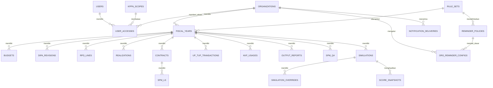

# FSD — Functional Specification Document

**Produk:** Simulator Penilaian IKPA Satker  
**Versi:** 1.0 — Berdasarkan PRD Final v1.3  
**Tanggal:** 31 Agustus 2026  
**Status:** Siap untuk desain UI, backend, dan implementasi MVP  
**Bahasa antarmuka:** Indonesia  
**Timezone default:** `Asia/Jakarta`

> **Disclaimer:** Simulator IKPA adalah alat bantu simulasi dan pengendalian internal. Hasil aplikasi bukan nilai resmi OMSPAN/KPPN. Seluruh perhitungan, deadline, dan kebijakan reminder mengikuti `rule_set` yang aktif serta harus dapat ditelusuri versinya.

---

## 1. Tujuan dan Ruang Lingkup

### 1.1 Tujuan

Aplikasi membantu satker menginput data pelaksanaan anggaran, menghitung proyeksi nilai IKPA secara real-time, mengidentifikasi risiko dan gap target, membuat skenario perbaikan, serta menerima reminder sebelum deadline operasional.

Aplikasi juga membantu KPPN melakukan monitoring lintas satker, pengelolaan rule set IKPA, kalender hari kerja, reminder policy, dan akses pengguna.

### 1.2 Ruang lingkup MVP

MVP mencakup:

- Landing page dan satu alur login.
- Dua jenis akses: `operator_satker` dan `admin_kppn`.
- Input manual dan import CSV/XLSX untuk data tujuh indikator serta dispensasi SPM.
- Perhitungan simulasi IKPA, actual, forecast, dan skenario *what-if*.
- Dashboard, rekomendasi, riwayat snapshot, visualisasi, dan ekspor.
- Reminder Center untuk konfigurasi delivery reminder oleh Operator Satker dalam batas policy.
- Dashboard monitoring KPPN, Admin Policy, kalender kerja, audit, dan manajemen mapping email.
- Rule set berversi per tahun anggaran dan reminder policy berversi.

### 1.3 Di luar ruang lingkup MVP

- Integrasi API resmi OMSPAN, SAKTI, SPAN, atau sistem pemerintah lain.
- Nilai resmi IKPA atau otorisasi pembayaran/transaksi.
- Aplikasi mobile native.
- Role operasional terpisah seperti PPK, Bendahara, Perencana, KPA, Viewer, Policy Manager, atau Approver.
- Perubahan data operasional satker oleh Admin KPPN.

---

## 2. Aktor dan Hak Akses

### 2.1 Aktor sistem

| Aktor | Kode akses | Deskripsi |
|---|---|---|
| Operator Satker | `operator_satker` | Pengguna satker yang mengelola seluruh data, simulasi, reminder, dan laporan satker sendiri |
| Admin KPPN | `admin_kppn` | Pengguna administratif KPPN yang memonitor satker dalam cakupan KPPN, mengelola policy, kalender kerja, dan mapping akses |
| Pengunjung | `public` | Pengguna yang mengakses landing page sebelum login |
| Pengguna tanpa akses | `unauthorized` | Pengguna yang berhasil login tetapi belum memiliki mapping akses aktif |

### 2.2 Matriks hak akses

| Fitur | Operator Satker | Admin KPPN |
|---|:---:|:---:|
| Login | Ya | Ya |
| Dashboard satker sendiri | Ya | Read-only |
| Dashboard agregat KPPN | Tidak | Ya |
| Input/edit data operasional satker | Ya, satker sendiri | Tidak pada MVP |
| Import CSV/XLSX | Ya, satker sendiri | Tidak pada MVP |
| Simulasi, skenario, snapshot | Ya, satker sendiri | Lihat detail read-only |
| Reminder Center satker | Ya, dalam batas policy | Lihat monitoring dan policy |
| Ekspor laporan satker | Ya, satker sendiri | Ya, agregat dan detail read-only |
| Rule set IKPA | Lihat versi aktif | Buat, edit draft, publish, retire |
| Reminder policy | Lihat policy aktif | Kelola |
| Kalender hari kerja | Lihat | Kelola |
| Audit log | Lihat aktivitas satker sendiri yang relevan | Lihat seluruh scope KPPN |
| Mapping email Operator Satker | Tidak | Kelola |
| Mapping email Admin KPPN | Tidak | Kelola |

### 2.3 Aturan otorisasi

- Server wajib memeriksa autentikasi Clerk dan mapping aktif pada `user_accesses` untuk setiap request yang membutuhkan login.
- `operator_satker` hanya boleh membaca dan memutasi data dengan `org_id` yang tercantum pada mapping aksesnya.
- `admin_kppn` hanya boleh melihat organisasi yang termasuk `kppn_scope_id` pada mapping aksesnya.
- `admin_kppn` tidak dapat membuat, mengubah, atau menghapus data operasional satker pada MVP.
- Semua Admin KPPN memiliki hak setara dalam scope masing-masing.
- Satu email dapat memiliki lebih dari satu mapping Operator Satker bila memang diberi akses ke beberapa satker; UI wajib meminta pemilihan satker aktif.
- Jika satu email memiliki akses Admin KPPN, sistem mengarahkan ke dashboard Admin KPPN secara default. Pengaturan perpindahan konteks dapat ditambahkan setelah MVP bila email tersebut juga memiliki akses satker.

---

## 3. Navigasi dan Halaman

### 3.1 Halaman publik

| Kode | Halaman | URL usulan | Pengguna | Fungsi |
|---|---|---|---|---|
| PUB-01 | Landing Page | `/` | Public | Menjelaskan produk, manfaat, disclaimer, dan CTA login |
| PUB-02 | Login | `/sign-in` | Public | Login melalui Clerk |
| PUB-03 | Akses Belum Diberikan | `/access-pending` | Unauthorized | Menjelaskan bahwa email belum dipetakan dan instruksi menghubungi Admin KPPN |

### 3.2 Menu Operator Satker

| Kode | Menu/halaman | URL usulan | Fungsi |
|---|---|---|---|
| OPS-01 | Dashboard IKPA | `/operator/dashboard` | Ringkasan skor, target, risiko, deadline, dan tindakan prioritas |
| OPS-02 | Simulasi IKPA | `/operator/simulation` | Hitung actual, forecast, dan scenario secara real-time |
| OPS-03 | Pagu & Revisi DIPA | `/operator/data/budget-revisions` | Input pagu dan riwayat revisi DIPA |
| OPS-04 | RPD & Realisasi | `/operator/data/rpd-realization` | Input rencana dan realisasi per bulan/akun |
| OPS-05 | Kontrak & Tagihan | `/operator/data/contracts-invoices` | Input kontrak, BAST/BAPP, SPM-LS, dan penerimaan KPPN |
| OPS-06 | UP/TUP & KKP | `/operator/data/up-tup-kkp` | Input UP/TUP/GUP/PTUP/setoran dan penggunaan KKP |
| OPS-07 | Capaian Output | `/operator/data/output` | Input RO, volume, capaian, pelaporan, dan konfirmasi |
| OPS-08 | SPM Dispensasi | `/operator/data/spm-dispensation` | Input SPM Q4 dan status dispensasi |
| OPS-09 | Import Data | `/operator/import` | Import template CSV/XLSX dan validasi hasil import |
| OPS-10 | Skenario & Riwayat | `/operator/history` | Daftar simulation, snapshot, duplikasi, perbandingan, soft delete |
| OPS-11 | Analisis & Rekomendasi | `/operator/analysis` | Gap indikator, tindakan prioritas, risiko deadline |
| OPS-12 | Laporan & Ekspor | `/operator/reports` | Ekspor XLSX dan ringkasan PDF |
| OPS-13 | Reminder Center | `/operator/reminders` | Melihat dan mengatur delivery reminder sesuai policy |
| OPS-14 | Panduan IKPA | `/operator/guides` | Panduan indikator, formula, istilah, dan praktik pengendalian |
| OPS-15 | Pengaturan Satker | `/operator/settings` | Profil satker, target default, timezone, dan preferensi yang diizinkan |

### 3.3 Menu Admin KPPN

| Kode | Menu/halaman | URL usulan | Fungsi |
|---|---|---|---|
| ADM-01 | Dashboard Monitoring | `/admin-kppn/dashboard` | Ringkasan nilai, risiko, deadline, dan kelengkapan data lintas satker |
| ADM-02 | Daftar Satker | `/admin-kppn/satker` | Pencarian, filter, dan daftar satker dalam scope KPPN |
| ADM-03 | Detail Satker | `/admin-kppn/satker/:orgId` | Detail read-only dashboard, indikator, data ringkas, riwayat, reminder |
| ADM-04 | Risiko & Reminder | `/admin-kppn/monitoring/reminders` | Monitoring event, deadline, eskalasi, dan status delivery lintas satker |
| ADM-05 | Laporan Agregat | `/admin-kppn/reports` | Rekap skor, indikator, risiko, tren, dan ekspor XLSX/PDF |
| ADM-06 | Rule Set IKPA | `/admin-kppn/policy/rule-sets` | Daftar, buat, edit draft, bandingkan, publish, retire rule set |
| ADM-07 | Detail/Edit Rule Set | `/admin-kppn/policy/rule-sets/:id` | Konfigurasi bobot, target, formula, asumsi, dan status aturan |
| ADM-08 | Reminder Policy | `/admin-kppn/policy/reminders` | Kelola event, kategori, deadline formula, batas lead time, penerima wajib |
| ADM-09 | Kalender Hari Kerja | `/admin-kppn/policy/workdays` | Kelola kalender hari kerja dan hari libur |
| ADM-10 | Riwayat Versi Policy | `/admin-kppn/policy/history` | Melihat versi rule set, perubahan, tanggal efektif, dan dampak |
| ADM-11 | Audit Log | `/admin-kppn/audit-logs` | Menelusuri perubahan data, policy, access, dan delivery |
| ADM-12 | Manajemen Akses | `/admin-kppn/access` | Mapping email Admin KPPN dan Operator Satker |

### 3.4 Struktur menu sidebar

**Operator Satker**

```text
Dashboard IKPA
Simulasi IKPA
Input Data
  Pagu & Revisi DIPA
  RPD & Realisasi
  Kontrak & Tagihan
  UP/TUP & KKP
  Capaian Output
  SPM Dispensasi
  Import Data
Skenario & Riwayat
Analisis & Rekomendasi
Reminder Center
Laporan & Ekspor
Panduan IKPA
Pengaturan Satker
```

**Admin KPPN**

```text
Dashboard Monitoring
Satker
  Daftar Satker
  Risiko & Reminder
Laporan Agregat
Admin Policy
  Rule Set IKPA
  Reminder Policy
  Kalender Hari Kerja
  Riwayat Versi
Audit Log
Manajemen Akses
```

---

## 4. Spesifikasi Fungsional

### 4.1 PUB-01 — Landing Page

**Tujuan:** Memberikan konteks produk dan mengarahkan pengguna ke login.

**Komponen:**

- Header dengan logo/nama produk dan tombol Login.
- Hero: tujuan simulator dan CTA Login.
- Ringkasan manfaat: simulasi, monitoring, rekomendasi, reminder.
- Ringkasan tujuh indikator IKPA dan dispensasi SPM.
- Disclaimer bahwa hasil bukan nilai resmi OMSPAN/KPPN.
- Footer berisi informasi aplikasi dan versi.

**Aturan:**

- Tidak ada data internal satker atau KPPN yang tampil pada landing page.
- Tombol Login menuju `/sign-in`.

### 4.2 PUB-02 — Login dan routing akses

**Tujuan:** Mengautentikasi pengguna dan mengarahkannya ke dashboard sesuai akses.

**Alur:**

1. Pengguna login melalui Clerk.
2. Backend mencari `users` berdasarkan `clerk_user_id` atau email terverifikasi.
3. Backend mencari `user_accesses` aktif.
4. Jika ditemukan akses `admin_kppn`, arahkan ke `/admin-kppn/dashboard`.
5. Jika hanya ditemukan satu akses `operator_satker`, arahkan ke `/operator/dashboard` dengan organisasi aktif.
6. Jika ditemukan lebih dari satu akses `operator_satker`, tampilkan pemilih satker lalu arahkan ke dashboard operator.
7. Jika tidak ada akses aktif, arahkan ke `/access-pending`.

**Kriteria validasi:**

- Hanya email yang telah diverifikasi oleh Clerk yang dapat dipetakan sebagai akses aktif.
- Routing dan scope akses diputuskan di server, bukan hanya melalui redirect klien.

### 4.3 OPS-01 — Dashboard IKPA

**Tujuan:** Memberikan kondisi IKPA satker secara cepat untuk periode aktif.

**Input/filter:** Tahun anggaran, bulan/periode penilaian, simulation/snapshot aktif.

**Komponen tampilan:**

- Kartu nilai IKPA akhir, target, gap, status kesehatan, dan timestamp kalkulasi.
- Kartu tujuh indikator: nilai indikator, bobot, kontribusi berbobot, perubahan dibanding snapshot sebelumnya.
- Kartu pengurang dispensasi SPM.
- Checklist kelengkapan data dan data yang belum valid.
- Daftar lima rekomendasi prioritas.
- Deadline/reminder terdekat dan status tindak lanjut bila tersedia.
- Grafik tren IKPA YTD dan tren indikator utama.
- Badge `rule_set_version` serta banner bila scenario memakai rule set yang tidak lagi aktif.

**Aturan:**

- Nilai dashboard berasal dari simulation atau snapshot terbaru pada konteks tahun/periode terpilih.
- Bila data minimum tidak lengkap, tampilkan nilai sebagai estimasi dan daftar domain data yang belum lengkap.
- Operator dapat membuka detail indikator dari setiap kartu.

### 4.4 OPS-02 — Simulasi IKPA

**Tujuan:** Menghitung dan mengevaluasi nilai IKPA secara interaktif.

**Input utama:**

- Tahun anggaran.
- Periode penilaian.
- Target nilai IKPA.
- Status BLU.
- Tipe simulasi: `actual`, `forecast`, atau `scenario`.
- Data yang sudah tersimpan dan/atau override skenario.

**Output:**

- Nilai akhir IKPA.
- Nilai per indikator.
- Kontribusi berbobot.
- Pengurang dispensasi.
- Formula, input, dan parameter yang digunakan.
- Warning kelengkapan data dan asumsi.
- Rekomendasi perbaikan.

**Aksi pengguna:**

- Ubah periode atau target.
- Simpan simulasi.
- Duplikasi sebagai scenario.
- Bandingkan dengan actual/snapshot.
- Buka detail indikator.

**Aturan proses:**

- Perubahan input atau override memanggil engine perhitungan secara real-time.
- Engine menggunakan rule set yang terikat pada tahun anggaran dan tanggal efektif periode.
- Snapshot yang disimpan wajib menyimpan `total_score`, `breakdown_json`, `rule_set_version`, `period_end`, dan referensi simulation.

### 4.5 OPS-03 — Pagu & Revisi DIPA

**Tujuan:** Mengelola pagu per jenis belanja dan histori revisi DIPA.

**Data input:**

| Field | Tipe | Wajib | Validasi |
|---|---|:---:|---|
| Tahun anggaran | Integer | Ya | Sesuai fiscal year aktif |
| Akun belanja | Enum | Ya | `51`, `52`, `53`, `57` |
| Nilai pagu | Numeric | Ya | Lebih dari atau sama dengan 0 |
| Tanggal efektif | Date | Ya | Dalam tahun anggaran |
| Tanggal revisi | Date | Ya untuk revisi | Dalam tahun anggaran |
| Kode revisi | Text | Ya untuk revisi | Validasi terhadap daftar rule set bila tersedia |
| Pagu sebelum | Numeric | Ya untuk revisi | Lebih dari atau sama dengan 0 |
| Pagu setelah | Numeric | Ya untuk revisi | Lebih dari atau sama dengan 0 |

**Fungsi:**

- Tambah/edit/hapus lunak pagu.
- Tambah/edit/hapus lunak revisi DIPA.
- Tampilkan flag apakah revisi termasuk objek penilaian menurut rule set.
- Tampilkan ringkasan jumlah revisi objek per semester dan proyeksi NKRA.

**Aturan penilaian default:**

- Revisi dihitung jika kode termasuk daftar objek penilaian dan tidak mengubah pagu satker.
- Nilai default 2026: 0–1 revisi = 110; 2 revisi = 100; 3 atau lebih = 50.
- Nilai tahunan = 50% semester I + 50% semester II.

### 4.6 OPS-04 — RPD & Realisasi

**Tujuan:** Mengelola RPD dan realisasi bulanan untuk deviasi Halaman III DIPA dan penyerapan anggaran.

**Data input:**

| Field | Tipe | Wajib | Validasi |
|---|---|:---:|---|
| Bulan | Integer | Ya | 1–12 |
| Akun belanja | Enum | Ya | `51`, `52`, `53`, `57` |
| Nilai RPD | Numeric | Ya | Lebih dari atau sama dengan 0 |
| Nilai realisasi | Numeric | Ya | Lebih dari atau sama dengan 0 |

**Fungsi:**

- Input tabel bulanan per akun belanja.
- Edit massal dan import template.
- Grafik realisasi versus RPD.
- Tampilkan deviasi per bulan/per akun dan deviasi tertimbang.
- Tampilkan penyerapan kumulatif versus target triwulan.

**Aturan penilaian default:**

- Deviasi dinilai Januari–November, per jenis belanja dan tertimbang proporsi pagu.
- Nilai maksimal deviasi saat rata-rata deviasi ≤5%; kurva penurunan di atas 5% berasal dari rule set.
- Penyerapan dihitung kumulatif per triwulan dan per jenis belanja; nilai maksimal per jenis belanja adalah 100.
- Target default: 51 = 20/50/75/95%; 52 = 15/50/70/90%; 53 = 10/40/70/90%; 57 = 25/50/75/95%.

### 4.7 OPS-05 — Kontrak & Tagihan

**Tujuan:** Mengelola data kontrak dan tagihan untuk indikator belanja kontraktual serta penyelesaian tagihan.

**Data kontrak:**

| Field | Tipe | Wajib | Validasi |
|---|---|:---:|---|
| Nomor/referensi kontrak | Text | Ya | Unik per satker/tahun bila diisi |
| Akun belanja | Enum | Ya | `51`, `52`, `53`, `57` |
| Nilai kontrak | Numeric | Ya | Lebih dari 0 |
| Tanggal tanda tangan | Date | Ya | Dalam/terkait tahun anggaran |
| Jenis pembayaran | Enum | Ya | `sekaligus` atau `termin` |
| Tanggal SP2D | Date | Tidak | Wajib untuk evaluasi penyelesaian kontrak |

**Data tagihan/SPM-LS:**

| Field | Tipe | Wajib | Validasi |
|---|---|:---:|---|
| Referensi kontrak | Relasi | Ya | Kontrak harus ada |
| Tanggal BAST/BAPP | Date | Ya | Tidak lebih besar dari tanggal diterima KPPN bila sudah ada |
| Tanggal diterima/dikonversi KPPN | Date | Tidak | Digunakan untuk nilai tepat waktu |
| Belanja pegawai | Boolean | Ya | Tagihan pegawai tidak dihitung dalam indikator |

**Fungsi:**

- CRUD kontrak dan tagihan.
- Tampilkan eligibility kontrak untuk tiap komponen indikator kontraktual.
- Hitung deadline H+17 hari kerja dari BAST/BAPP.
- Tampilkan status tagihan: aman, mendekati deadline, jatuh tempo hari ini, terlambat, atau selesai tepat waktu.
- Integrasi event reminder tagihan bila policy aktif.

**Aturan penilaian default:**

- Distribusi akselerasi kontrak berbobot 20% dalam indikator kontraktual.
- Kontrak dini berbobot 40%; kontrak minimum Rp50 juta sesuai parameter rule set.
- Akselerasi kontrak 53 berbobot 40%; akun 53, nilai Rp50–200 juta, bukan termin, dan penyelesaian berdasar SP2D.
- SPM-LS kontraktual non-pegawai tepat waktu jika diterima/dikonversi KPPN paling lambat 17 hari kerja sejak BAST/BAPP.

### 4.8 OPS-06 — UP/TUP & KKP

**Tujuan:** Mengelola data UP/TUP dan penggunaan KKP.

**Data transaksi UP/TUP:**

| Field | Tipe | Wajib | Validasi |
|---|---|:---:|---|
| Tipe transaksi | Enum | Ya | `UP`, `TUP`, `GUP`, `GUP_NIHIL`, `PTUP`, `SETORAN_TUP` |
| Nilai | Numeric | Ya | Lebih dari 0 kecuali koreksi yang diberi flag |
| Tanggal SP2D/transaksi | Date | Ya | Dalam tahun anggaran |
| Referensi SP2D sebelumnya | Date | Kondisional | Wajib untuk GUP/PTUP bila diperlukan perhitungan interval |

**Data KKP:**

| Field | Tipe | Wajib | Validasi |
|---|---|:---:|---|
| Bulan | Integer | Ya | 1–12 |
| Nilai penggunaan KKP | Numeric | Ya | Lebih dari atau sama dengan 0 |

**Fungsi:**

- CRUD transaksi UP/TUP dan penggunaan KKP.
- Ringkasan ketepatan waktu GUP/GUP nihil/PTUP.
- Proyeksi GUP disebulankan, rasio setoran TUP, dan penggunaan KKP terhadap target.
- Tampilkan deadline mendekati satu bulan untuk event GUP/PTUP sesuai policy.

**Aturan penilaian default:**

- Indikator UP/TUP: 90% nilai UP/TUP tunai dan 10% penggunaan UP KKP.
- UP/TUP tunai terdiri dari ketepatan waktu pengajuan GUP/GUP nihil/PTUP 50%, GUP disebulankan 25%, dan kinerja setoran TUP 25%.
- Target penggunaan KKP bersifat kumulatif dan dibaca dari rule set.

### 4.9 OPS-07 — Capaian Output

**Tujuan:** Mengelola pelaporan dan capaian RO.

**Data input:**

| Field | Tipe | Wajib | Validasi |
|---|---|:---:|---|
| Kode RO | Text | Ya | Unik per periode sesuai kebutuhan |
| Bulan laporan | Integer | Ya | 1–12 |
| Volume DIPA | Numeric | Ya | Lebih dari 0 bila RO dinilai |
| RVRO | Numeric | Ya | Lebih dari atau sama dengan 0 |
| PCRO | Numeric | Ya | 0–100 |
| TPCRO | Numeric | Ya | 0–100 |
| Tanggal pelaporan | DateTime | Ya | Dalam periode valid |
| Status konfirmasi | Boolean | Ya | Wajib terkonfirmasi untuk nilai capaian |

**Fungsi:**

- CRUD laporan output per RO dan bulan.
- Tampilkan status tepat waktu, terlambat, belum dikonfirmasi, atau valid.
- Hitung deadline lima hari kerja bulan berikutnya menurut kalender rule set.
- Tampilkan nilai ketepatan waktu, nilai capaian RO, dan kontribusi indikator output.
- Integrasi event reminder pelaporan output.

**Aturan penilaian default:**

- Bobot indikator output: 30% ketepatan waktu dan 70% capaian output.
- Laporan yang tidak terkonfirmasi bernilai nol sesuai ketentuan rule set.
- Untuk periode non-Desember ketika PCRO belum 100%, gunakan rasio PCRO/TPCRO; detail seluruh formula dibaca dari rule set.

### 4.10 OPS-08 — SPM Dispensasi

**Tujuan:** Mengelola data SPM Q4 untuk proyeksi pengurang dispensasi.

**Data input:**

| Field | Tipe | Wajib | Validasi |
|---|---|:---:|---|
| Nomor/referensi SPM | Text | Ya | Unik per satker/tahun bila diisi |
| Tanggal terbit | Date | Ya | Harus berada pada Q4 untuk perhitungan default |
| Status dispensasi | Boolean | Ya | Menandai SPM dispensasi |

**Fungsi:**

- CRUD SPM Q4.
- Tampilkan total SPM Q4, jumlah SPM dispensasi, rasio permil, dan pengurang nilai.
- Tampilkan proyeksi risiko dispensasi serta reminder akhir tahun sesuai policy.

**Aturan penilaian default:**

\[
Rasio\ dispensasi = \frac{Jumlah\ SPM\ dispensasi}{Jumlah\ SPM\ Q4} \times 1000
\]

| Rasio | Pengurang default |
|---|---:|
| 0‰ | 0 |
| 0,01–0,09‰ | 0,25 |
| 0,10–0,99‰ | 0,50 |
| 1,00–4,99‰ | 0,75 |
| ≥5‰ | 1,00 |

### 4.11 OPS-09 — Import Data

**Tujuan:** Mempercepat input data melalui CSV/XLSX.

**Fungsi:**

- Unduh template per domain: pagu/revisi, RPD/realisasi, kontrak/tagihan, UP/TUP/KKP, output, dan SPM dispensasi.
- Upload CSV/XLSX.
- Validasi file: ukuran, ekstensi, sheet, header, tipe data, nilai wajib, duplikasi, dan referensi relasi.
- Tampilkan preview data valid dan daftar error per baris/kolom.
- Pengguna memilih `Simpan data valid` atau `Batalkan import`.
- Simpan log import dan ringkasan hasil.

**Aturan:**

- File tidak langsung ditulis ke data produksi sebelum pengguna melakukan konfirmasi simpan.
- Baris invalid tidak boleh disimpan.
- Import hanya dapat dilakukan Operator Satker untuk `org_id` aktif.
- Import besar diproses asinkron; UI menampilkan status proses.

### 4.12 OPS-10 — Skenario & Riwayat

**Tujuan:** Mengelola simulation, scenario, dan score snapshot.

**Fungsi:**

- Daftar simulation/snapshot dengan nama, tipe, periode, target, nilai, pembuat, pembaruan terakhir, dan rule set version.
- Filter berdasarkan tahun, periode, tipe, dan status.
- Buka detail snapshot dan jejak perhitungan.
- Duplikasi actual/snapshot menjadi scenario.
- Bandingkan maksimal dua scenario atau actual versus satu scenario.
- Soft delete simulation/snapshot sesuai kebijakan retensi.

**Aturan:**

- Actual tidak boleh tertimpa oleh patch scenario.
- Scenario menggunakan `simulation_overrides` untuk menyimpan perubahan asumsi.
- Snapshot lama tidak dihitung ulang secara diam-diam setelah rule set baru terbit; tampilan harus menunjukkan versi aturan asal.

### 4.13 OPS-11 — Analisis & Rekomendasi

**Tujuan:** Membantu Operator Satker menentukan tindakan paling berdampak.

**Komponen:**

- Daftar rekomendasi dengan indikator, masalah, data pendukung, dampak estimasi, urgensi, deadline, dan tindakan yang disarankan.
- Filter indikator, prioritas, status deadline, dan tingkat kelengkapan data.
- Tautan langsung ke halaman input relevan.

**Prioritisasi default:**

\[
Prioritas = Bobot\ indikator \times Gap\ nilai \times Faktor\ urgensi\ deadline
\]

**Contoh rule rekomendasi:**

- Jika tagihan belum diproses dan sisa waktu ≤5 hari kerja sebelum H+17, rekomendasi prioritas tinggi untuk melengkapi/proses SPM-LS.
- Jika penyerapan akun 52 pada Q2 di bawah target, tampilkan gap nominal dan target kumulatif.
- Jika laporan output belum terkonfirmasi menjelang deadline, arahkan pengguna ke data Capaian Output.
- Jika revisi objek memasuki ambang kedua, tampilkan peringatan risiko NKRA.

### 4.14 OPS-12 — Laporan & Ekspor

**Tujuan:** Menyediakan laporan pengendalian satker.

**Jenis ekspor:**

- XLSX: tabel skor, data indikator, gap target, rekomendasi, dan daftar risiko.
- PDF: ringkasan eksekutif untuk KPA/rapat, berisi nilai, tren, kontribusi indikator, gap, risiko, dan rekomendasi.

**Input/filter:** Tahun, periode, simulation/snapshot, dan template laporan.

**Aturan:**

- Setiap laporan harus mencantumkan tanggal cetak, satker, periode, disclaimer simulasi, dan `rule_set_version`.
- Ekspor hanya mencakup data satker aktif milik Operator.

### 4.15 OPS-13 — Reminder Center

**Tujuan:** Memberi transparansi dan kontrol delivery reminder yang aman bagi Operator Satker.

**Tampilan daftar:**

- Nama event dan indikator terkait.
- Deadline dan dasar regulasi.
- Kategori: `mandatory`, `recommended`, atau `optional`.
- Jenis hari: `workday`, `calendar_day`, `event_based`, atau `schedule`.
- Default policy dan konfigurasi satker.
- Penerima wajib dan penerima tambahan.
- Status aktif.
- Jadwal kirim berikutnya.
- Rule set version.

**Aksi Operator Satker:**

- Mengaktifkan/nonaktifkan event jika `allow_disable=true`.
- Mengatur lead time dalam rentang policy.
- Menambah titik reminder.
- Mengatur jam kirim dan timezone.
- Menambah penerima valid.
- Mengatur eskalasi yang diizinkan.
- Mengatur digest mingguan.
- Menambah pesan internal.
- Mengembalikan field yang dapat ditimpa ke default policy.

**Batasan:**

- Event `mandatory` tidak dapat dinonaktifkan.
- Required recipient tidak dapat dihapus.
- `deadline_formula`, `day_type`, kategori, sumber regulasi, dan batas lead time tidak dapat diedit Operator.
- Pengiriman mandatory tidak boleh dijadwalkan setelah deadline.
- Semua perubahan wajib tercatat pada audit log.

### 4.16 OPS-14 — Panduan IKPA

**Tujuan:** Membantu pengguna memahami perhitungan dan tindakan pengendalian.

**Fungsi:**

- Daftar tujuh indikator dan dispensasi SPM.
- Detail definisi, bobot, periode, formula, input data, contoh, istilah, dan tips perbaikan.
- Tooltip formula dari dashboard/simulasi mengarah ke bagian panduan terkait.
- Badge untuk parameter yang masih berstatus asumsi atau perlu verifikasi formal.

### 4.17 OPS-15 — Pengaturan Satker

**Fungsi:**

- Lihat/edit nama satker, kode satker, KPPN, status BLU, timezone, dan target IKPA default.
- Lihat rule set aktif dan sumber regulasi.
- Lihat daftar email Operator Satker yang diberikan akses, tanpa hak mengubah mapping akses pada MVP.

**Aturan:**

- Perubahan profil satker dicatat pada audit log.
- Kode satker harus unik sesuai scope aplikasi.

### 4.18 ADM-01 — Dashboard Monitoring KPPN

**Tujuan:** Menyediakan pandangan risiko dan kinerja lintas satker.

**Komponen:**

- Jumlah satker dalam scope, satker aktif, dan satker dengan data belum lengkap.
- Rata-rata nilai IKPA, distribusi status kesehatan, dan tren agregat.
- Daftar satker dengan skor terendah, gap terbesar, indikator terendah, dan deadline terdekat.
- Ringkasan event reminder mandatory/recommended dan delivery gagal.
- Status rule set aktif serta perubahan policy terbaru.

**Filter:** Tahun anggaran, periode, satker, status risiko, indikator, dan kelengkapan data.

### 4.19 ADM-02/03 — Daftar dan Detail Satker

**Daftar Satker:**

- Pencarian nama/kode satker.
- Filter skor, risiko, kelengkapan data, BLU, indikator, dan deadline.
- Kolom minimal: kode satker, nama, skor terakhir, target, gap, risiko utama, deadline terdekat, dan last update.

**Detail Satker:**

- Dashboard satker dalam mode read-only.
- Breakdown indikator, pengurang dispensasi, tren, daftar risiko, snapshot, konfigurasi reminder, dan audit yang relevan.
- Ekspor detail satker read-only.

**Aturan:**

- Admin KPPN tidak melihat menu edit data operasional.
- Semua data dibatasi oleh KPPN scope.

### 4.20 ADM-04 — Monitoring Risiko & Reminder

**Tujuan:** Memantau risiko deadline dan kualitas delivery reminder lintas satker.

**Komponen:**

- Daftar event berdasarkan deadline, kategori, satker, indikator, status tindak lanjut, dan status delivery.
- Filter event mandatory/recommended/optional, indikator, rentang waktu, status send/failed/skipped, dan satker.
- Detail delivery: scheduled time, sent time, recipients, idempotency key, rule set version, status error bila ada.
- Aksi retry delivery hanya untuk status gagal dan harus dicatat dalam audit log.

### 4.21 ADM-05 — Laporan Agregat

**Tujuan:** Mengekspor rekap monitoring KPPN.

**Jenis laporan:**

- Rekap nilai dan target per satker.
- Rekap indikator dan gap per satker.
- Daftar risiko serta deadline mendekat.
- Ringkasan kelengkapan data.
- Status reminder/delivery.

**Aturan:**

- Seluruh laporan dibatasi oleh KPPN scope dan filter periode.
- Laporan mencantumkan tanggal cetak, filter, rule set version yang relevan, serta disclaimer simulasi.

### 4.22 ADM-06/07 — Rule Set IKPA

**Tujuan:** Memungkinkan Admin KPPN mengelola konfigurasi penilaian tanpa deploy aplikasi.

**Status rule set:** `draft`, `published`, `retired`.

**Field rule set:**

| Field | Wajib | Keterangan |
|---|:---:|---|
| Tahun anggaran | Ya | Tahun penerapan rule set |
| Versi | Ya | Contoh `2026.1` dan unik per tahun |
| Tanggal efektif | Ya | Waktu mulai berlaku |
| Sumber regulasi | Ya | Referensi peraturan/dokumen |
| Catatan perubahan | Ya | Ringkasan perubahan dari versi sebelumnya |
| Config JSON | Ya | Bobot, target, threshold, kode revisi, formula, bucket, asumsi |
| Status | Ya | Draft/published/retired |

**Aksi Admin KPPN:**

- Buat rule set draft.
- Edit draft.
- Validasi schema dan kelengkapan rule set.
- Bandingkan dengan versi lain.
- Publish rule set.
- Retire rule set lama bila tidak digunakan sebagai default aktif.

**Aturan publish:**

- Hanya satu rule set `published` yang aktif untuk kombinasi tahun dan tanggal efektif tertentu sesuai resolver.
- Rule set yang sudah dipakai oleh snapshot tidak dapat diedit langsung.
- Perubahan terhadap rule set published harus dilakukan dengan membuat versi baru.
- Publish memicu re-evaluasi reminder yang belum dikirim dan mencatat audit log.

### 4.23 ADM-08 — Reminder Policy

**Tujuan:** Mengelola event reminder dan batas konfigurasi Operator Satker.

**Field policy:**

| Field | Wajib | Keterangan |
|---|:---:|---|
| Rule set | Ya | Rule set pemilik policy |
| Event type | Ya | ID stabil, contoh `output_report_due` |
| Indicator key | Ya | Indikator atau `global` |
| Category | Ya | `mandatory`, `recommended`, `optional` |
| Deadline formula | Ya | Formula/trigger deadline dalam JSON |
| Day type | Ya | `workday`, `calendar_day`, `event_based`, `schedule` |
| Min lead days | Ya | Lead time minimum |
| Max lead days | Ya | Lead time maksimum |
| Default schedule | Ya | Titik reminder, jam, channel |
| Required recipients | Tidak | Role/email yang tidak dapat dihapus Operator |
| Allow disable | Ya | Selalu false untuk mandatory |
| Allow recipient override | Ya | Aturan penerima tambahan |
| Active | Ya | Status policy |

**Validasi:**

- `min_lead_days` lebih besar atau sama dengan 1.
- `max_lead_days` lebih besar atau sama dengan `min_lead_days`.
- Jika kategori mandatory, `allow_disable=false`.
- Deadline formula wajib dapat dievaluasi oleh Deadline Calculator sebelum publish.
- `day_type=workday` hanya dapat dipublish jika kalender tahun terkait tersedia.

### 4.24 ADM-09 — Kalender Hari Kerja

**Tujuan:** Menyediakan kalender resmi aplikasi untuk semua kalkulasi berbasis hari kerja.

**Fungsi:**

- Menampilkan kalender per tahun.
- Tandai tanggal sebagai hari kerja/hari libur.
- Tambahkan keterangan hari libur atau cuti bersama.
- Import kalender dari CSV/XLSX.
- Tampilkan dampak terhadap deadline event tertentu sebagai preview.

**Aturan:**

- Kalender yang digunakan oleh rule set published tidak boleh diubah tanpa audit dan proses policy versioning yang sesuai.
- Perubahan kalender yang memengaruhi jadwal belum terkirim memicu re-evaluasi reminder.

### 4.25 ADM-10 — Riwayat Versi Policy

**Tujuan:** Menelusuri perubahan regulasi dan dampaknya.

**Komponen:**

- Daftar rule set berdasarkan tahun, versi, status, tanggal efektif, pembuat, waktu publish, dan sumber regulasi.
- Detail perubahan dibanding versi sebelumnya.
- Daftar snapshot dan notification delivery yang menggunakan versi tersebut.
- Dampak ke jadwal reminder mendatang setelah publish.

### 4.26 ADM-11 — Audit Log

**Tujuan:** Menyediakan jejak perubahan yang dapat ditelusuri.

**Kolom minimum:**

- Waktu.
- Aktor/email.
- Jenis akses.
- Organisasi/satker terkait bila ada.
- Entity type dan entity ID.
- Aksi.
- Nilai sebelum dan sesudah.
- `rule_set_version` dan `policy_id` bila relevan.
- IP/request metadata bila tersedia dan sesuai kebijakan privasi.

**Aksi yang wajib dicatat:**

- CRUD data operasional.
- Import dan hasilnya.
- Pembuatan/ubah/hapus simulation dan snapshot.
- Perubahan konfigurasi reminder.
- Pembuatan, edit, publish, dan retire rule set/policy.
- Perubahan kalender hari kerja.
- Perubahan mapping akses email.
- Retry notification delivery.

### 4.27 ADM-12 — Manajemen Akses

**Tujuan:** Mengelola mapping email untuk dua jenis akses MVP.

**Fungsi:**

- Daftar akses aktif/nonaktif dengan email, nama, jenis akses, satker/KPPN scope, pembuat, dan waktu perubahan.
- Tambah akses Operator Satker: pilih user/email, pilih satker, aktifkan akses.
- Tambah akses Admin KPPN: pilih user/email, pilih KPPN scope, aktifkan akses.
- Ubah status aktif/nonaktif.
- Hapus mapping akses.
- Cari akses berdasarkan email, nama, tipe, satker, dan status.

**Aturan:**

- Email harus melalui identitas Clerk yang terverifikasi atau diundang melalui mekanisme Clerk.
- Hanya Admin KPPN yang dapat mengelola menu ini.
- Semua Admin KPPN memiliki hak yang sama untuk mengelola mapping, termasuk akses admin lain.
- Sistem harus mencegah kondisi tidak ada Admin KPPN aktif dalam suatu scope; penghapusan/nonaktifkan admin terakhir harus ditolak.
- Perubahan akses berlaku pada sesi berikutnya atau melalui refresh token/session sesuai kemampuan Clerk.
- Semua perubahan dicatat pada audit log.

---

## 5. Engine Perhitungan IKPA

### 5.1 Kontrak engine

Engine adalah paket TypeScript murni dan deterministik.

**Input:**

- Data satker dan tahun anggaran.
- Periode kalkulasi.
- Input indikator aktual atau overlay scenario.
- Rule set aktif beserta parameter formula.
- Kalender hari kerja.

**Output:**

```ts
type IkpaCalculationResult = {
  totalScore: number
  indicators: Array<{
    key: string
    score: number | null
    weight: number
    weightedContribution: number | null
    status: 'complete' | 'incomplete' | 'warning'
    inputs: Record<string, unknown>
    formulaTrace: string[]
    warnings: string[]
  }>
  dispensationDeduction: number
  recommendations: Recommendation[]
  missingData: MissingDataItem[]
  ruleSetVersion: string
  calculatedAt: string
}
```

### 5.2 Ketentuan perhitungan default 2026

#### Revisi DIPA

- Periode semester dan tidak kumulatif.
- Objek penilaian bila kode revisi termasuk daftar policy serta pagu satker tidak berubah.
- NKRA: 0–1 = 110; 2 = 100; ≥3 = 50.
- Nilai tahun: 50% semester I + 50% semester II.

#### Deviasi Halaman III DIPA

- Periode Januari–November.
- Hitung deviasi per akun belanja dan tertimbang berdasarkan proporsi pagu.
- Nilai maksimal bila rata-rata deviasi ≤5%.
- Kurva penurunan nilai di atas ambang harus berasal dari rule set, bukan kode engine.

#### Penyerapan Anggaran

- Dihitung kumulatif per triwulan dan per akun belanja.
- Nilai kinerja per akun dibatasi maksimal 100.
- Target default: 51 = 20/50/75/95%; 52 = 15/50/70/90%; 53 = 10/40/70/90%; 57 = 25/50/75/95%.
- Nilai indikator merupakan agregasi tertimbang sesuai proporsi pagu dan metode rule set.

#### Belanja Kontraktual

- Bobot internal default: distribusi akselerasi kontrak 20%; kontrak dini 40%; akselerasi kontrak 53 sebesar 40%.
- Kontrak objek dan bucket nilai/tanggal dibaca dari rule set.
- Akselerasi kontrak 53 default eligible bila akun 53, nilai Rp50–200 juta, bukan termin, dan memakai tanggal SP2D.

#### Penyelesaian Tagihan

- Objek adalah SPM-LS kontraktual non-pegawai.
- Tepat waktu bila diterima/dikonversi KPPN maksimal 17 hari kerja sejak BAST/BAPP.

\[
Nilai = \frac{Jumlah\ SPM\ tepat\ waktu}{Jumlah\ seluruh\ SPM\ objek} \times 100
\]

#### Pengelolaan UP/TUP

\[
Nilai\ indikator = (90\% \times Nilai\ UP/TUP\ tunai) + (10\% \times Nilai\ penggunaan\ KKP)
\]

- Komponen tunai: ketepatan waktu GUP/GUP nihil/PTUP 50%, GUP disebulankan 25%, setoran TUP 25%.
- Target dan mekanisme penggunaan KKP berasal dari rule set.

#### Capaian Output

\[
Nilai\ indikator = (30\% \times Nilai\ ketepatan\ waktu) + (70\% \times Nilai\ capaian\ output)
\]

- Laporan harus terkonfirmasi agar eligible sesuai rule set.
- Deadline default: lima hari kerja bulan berikutnya.
- Formula capaian per RO bergantung pada periode dan status PCRO, sesuai policy.

#### Dispensasi SPM

\[
Rasio\ dispensasi = \frac{Jumlah\ SPM\ dispensasi\ Q4}{Jumlah\ SPM\ Q4} \times 1000
\]

- Tabel pengurang berasal dari rule set.
- Default 2026: 0 = 0; 0,01–0,09‰ = 0,25; 0,10–0,99‰ = 0,50; 1,00–4,99‰ = 0,75; ≥5‰ = 1,00.

### 5.3 Aturan data tidak lengkap

- Engine tidak boleh menghasilkan nilai resmi atau menyembunyikan data yang belum ada.
- Jika input wajib suatu indikator tidak lengkap, indikator diberi status `incomplete` dan nilai dapat bernilai `null` atau estimasi sesuai parameter rule set.
- Nilai total harus menampilkan status estimasi/incomplete bila ada indikator belum lengkap.
- Dashboard harus memperlihatkan domain data yang menyebabkan nilai belum lengkap.

---

## 6. Reminder dan Notifikasi

### 6.1 Model dua lapisan

| Lapisan | Pengelola | Fungsi |
|---|---|---|
| Regulatory policy layer | Admin KPPN | Menentukan event, deadline, jenis hari, kategori, lead-time limit, default schedule, penerima wajib, dan dasar regulasi |
| Organization delivery layer | Operator Satker | Menentukan delivery reminder dalam batas policy: titik pengingat, jam, penerima tambahan, eskalasi, digest, dan pesan internal |

### 6.2 Kategori reminder

| Kategori | Aturan |
|---|---|
| Mandatory | Tidak dapat dimatikan Operator; required recipient tidak dapat dihapus; policy menentukan batas konfigurasi |
| Recommended | Memiliki default policy; Operator dapat aktif/nonaktif dan mengubah delivery dalam batas policy |
| Optional | Operator bebas aktif/nonaktif dan mengatur delivery dalam batas teknis/policy |

### 6.3 Event default 2026

| Event type | Indikator | Day type | Kategori default | Default delivery |
|---|---|---|---|---|
| `rpd_update_due` | Deviasi Halaman III DIPA | Workday | Recommended | H-10, H-3 |
| `absorption_gap_due` | Penyerapan Anggaran | Calendar day | Recommended | H-14, H-7 sebelum akhir triwulan |
| `early_contract_due` | Belanja Kontraktual | Calendar day | Optional/Recommended | H-30, H-14 sebelum 31 Maret |
| `capital_53_contract_due` | Belanja Kontraktual | Calendar day | Recommended | H-14 sebelum akhir triwulan |
| `invoice_timeliness_due` | Penyelesaian Tagihan | Workday | Mandatory bila ditetapkan policy | H-5, H-2, H-0 dari batas H+17 |
| `gup_ptup_due` | UP/TUP | Workday | Recommended | H-5, H-2 |
| `tup_deposit_due` | UP/TUP | Policy-defined | Recommended | H-10, H-3 |
| `kkp_target_due` | UP/TUP | Calendar day | Optional | H-14 sebelum akhir triwulan |
| `output_report_due` | Capaian Output | Workday | Mandatory bila ditetapkan policy | H-3, H-1, H-0 |
| `spm_dispensation_risk` | Dispensasi SPM | Calendar day | Recommended | H-30, H-14, H-7 akhir tahun |
| `dipa_revision_threshold` | Revisi DIPA | Event-based | Optional | Saat revisi objek ke-1/ke-2 |
| `ikpa_weekly_digest` | Semua | Schedule | Optional | Senin 07.00 WIB |

### 6.4 Proses scheduler

1. QStash Cron memanggil endpoint job harian yang ditandatangani.
2. Server memuat rule set sesuai tahun dan tanggal efektif.
3. Server mengambil reminder policy aktif.
4. Deadline Calculator menghitung deadline berdasarkan formula dan kalender kerja bila diperlukan.
5. Server mengevaluasi kondisi data satker dan kelayakan event.
6. Compliance Guard membaca konfigurasi delivery satker dan memvalidasi kembali batas policy.
7. Reminder Scheduler membuat delivery yang seharusnya dikirim.
8. Sistem membuat `idempotency_key` unik berdasarkan organisasi, policy, entity, waktu jadwal, dan rule set version.
9. Jika idempotency key belum pernah sukses dikirim, QStash/worker memanggil Resend.
10. Sistem menyimpan hasil `scheduled`, `sent`, `failed`, atau `skipped` pada `notification_deliveries`.
11. Bila event memenuhi eskalasi, sistem membuat delivery tambahan sesuai policy dan konfigurasi yang diizinkan.

### 6.5 Format minimum email

- Nama event dan indikator.
- Satker.
- Deadline dan jenis hari.
- Sisa waktu.
- Ringkasan risiko/tindakan.
- Link aman ke halaman aplikasi terkait.
- Dasar policy/rule set version.
- Pesan internal tambahan bila dikonfigurasi Operator.

### 6.6 Penanganan kegagalan

- Delivery gagal dicatat dengan error message yang aman.
- Retry otomatis mengikuti kebijakan QStash/Resend dan batas retry aplikasi.
- Admin KPPN dapat menjalankan retry manual dari monitoring delivery gagal.
- Retry manual memakai idempotency key turunan atau attempt counter agar jejak tetap jelas dan tidak mengirim duplikat.

---

## 7. Data Model dan Integrasi

### 7.1 Tabel utama

| Tabel | Tujuan |
|---|---|
| `organizations` | Profil satker |
| `users` | Referensi identitas aplikasi dari Clerk |
| `kppn_scopes` | Cakupan monitoring KPPN |
| `user_accesses` | Mapping akses `operator_satker` dan `admin_kppn` |
| `fiscal_years` | Konteks data per satker dan tahun |
| `rule_sets` | Konfigurasi IKPA dan policy berversi |
| `reminder_policies` | Event reminder dalam rule set |
| `workdays` | Kalender hari kerja/libur |
| `budgets` | Pagu per akun belanja |
| `dipa_revisions` | Riwayat revisi DIPA |
| `rpd_lines` | RPD bulanan |
| `realizations` | Realisasi bulanan |
| `contracts` | Data kontrak |
| `spm_ls` | Tagihan dan SPM-LS |
| `up_tup_transactions` | Transaksi UP/TUP/GUP/PTUP/setoran |
| `kkp_usages` | Penggunaan KKP |
| `output_reports` | Laporan capaian output |
| `spm_q4` | SPM Q4 dan flag dispensasi |
| `simulations` | Actual, forecast, scenario |
| `simulation_overrides` | Overlay asumsi skenario |
| `score_snapshots` | Hasil kalkulasi yang dapat diaudit |
| `org_reminder_configs` | Konfigurasi reminder per satker |
| `notification_deliveries` | Log scheduling dan pengiriman email |
| `audit_logs` | Jejak perubahan |
| `import_jobs` | Status import asynchronous dan laporan hasil |

### 7.2 Struktur `user_accesses`

| Kolom | Tipe | Aturan |
|---|---|---|
| `id` | UUID | Primary key |
| `user_id` | UUID | FK `users`, wajib |
| `access_type` | Enum | `operator_satker` atau `admin_kppn`, wajib |
| `org_id` | UUID nullable | Wajib untuk operator |
| `kppn_scope_id` | UUID nullable | Wajib untuk admin KPPN |
| `active` | Boolean | Default true |
| `created_by` | UUID | Admin KPPN pembuat mapping |
| `created_at` | Timestamptz | Wajib |
| `updated_at` | Timestamptz | Wajib |

### 7.3 Relasi inti



### 7.4 Integrasi eksternal

| Integrasi | Fungsi | Arah data |
|---|---|---|
| Clerk | Login, sesi, identitas pengguna, MFA opsional | Clerk → aplikasi untuk identitas; aplikasi → Clerk untuk session |
| Neon PostgreSQL | Penyimpanan data aplikasi | Aplikasi ↔ database |
| Upstash QStash | Cron dan antrean job | QStash → endpoint aplikasi; aplikasi → QStash untuk enqueue bila diperlukan |
| Resend | Pengiriman email | Aplikasi → Resend |
| Vercel | Hosting aplikasi dan server functions | Deployment/runtime |
| Cloudflare | DNS, CDN, WAF, rate limit | Traffic edge |

---

## 8. Validasi, Error Handling, dan Audit

### 8.1 Validasi umum

- Semua mutasi divalidasi dengan Zod di server.
- Mata uang tidak boleh diproses memakai floating point.
- Tanggal harus berada dalam tahun/periode fiskal yang valid, kecuali field yang secara eksplisit mendukung kontrak dini sebelum 1 Januari.
- Data relasional wajib berada dalam satker dan tahun anggaran yang sama.
- Penghapusan data penting menggunakan soft delete dan audit log.
- Pesan error harus jelas, spesifik pada field jika mungkin, dan tidak membocorkan data organisasi lain.

### 8.2 Error states UI

| Kondisi | Respons UI |
|---|---|
| Data belum lengkap | Tampilkan warning, domain yang kurang, dan CTA menuju input |
| Rule set belum tersedia | Blok perhitungan final dan tampilkan instruksi kepada Admin KPPN |
| Rule set versi lama pada snapshot | Tampilkan banner versi snapshot dan versi aktif saat ini |
| Konfigurasi reminder melanggar policy | Tolak simpan, highlight field, tampilkan batas yang diizinkan |
| Import memiliki error | Tampilkan baris/kolom error dan jangan simpan baris invalid |
| Email delivery gagal | Simpan status gagal dan tampilkan di monitoring Admin KPPN |
| Tidak memiliki akses | Redirect ke akses belum diberikan atau halaman 403 |

### 8.3 Audit minimum

Setiap audit log harus menyimpan actor, action, entity, before/after, waktu, organisasi jika ada, dan rule set/policy version bila relevan.

---

## 9. Kriteria Penerimaan MVP

### 9.1 Akses dan navigasi

1. Pengunjung dapat membuka landing page dan masuk melalui satu halaman login.
2. Email dengan `operator_satker` diarahkan ke Dashboard Operator Satker.
3. Email dengan `admin_kppn` diarahkan ke Dashboard Admin KPPN.
4. Email tanpa mapping aktif tidak dapat membuka area aplikasi dan melihat halaman akses belum diberikan.
5. Operator dapat mengakses semua menu input satker tanpa pembagian role operasional.
6. Beberapa email dapat menjadi Admin KPPN dan memiliki hak yang sama.
7. Sistem menolak penghapusan/nonaktifkan Admin KPPN aktif terakhir dalam satu scope.

### 9.2 Perhitungan dan data

8. Operator dapat menginput, mengubah, dan mengimpor data seluruh domain pada satker sendiri.
9. Sistem menghitung tujuh indikator dan pengurang dispensasi beserta breakdown dan rule set version.
10. Golden test default lulus: revisi DIPA tahunan = 80; penyerapan Q1 = 92,67; penyelesaian tagihan = 86,67; rasio dispensasi 4,62‰ menghasilkan pengurang 0,75.
11. Operator dapat menyimpan actual, forecast, snapshot, dan scenario tanpa mengubah actual.
12. Dashboard menampilkan nilai, target gap, data belum lengkap, deadline, tren, dan rekomendasi prioritas.

### 9.3 Policy dan reminder

13. Admin KPPN dapat membuat, mengedit draft, dan menerbitkan rule set baru tanpa deploy aplikasi.
14. Admin KPPN dapat mengelola reminder policy dan kalender hari kerja.
15. Operator dapat mengatur lead time, jam, penerima tambahan, digest, dan eskalasi dalam batas policy.
16. Operator tidak dapat menonaktifkan event mandatory, menghapus penerima wajib, mengubah formula deadline, atau menjadwalkan reminder mandatory setelah deadline.
17. Event berbasis hari kerja memakai kalender aktif.
18. Ketika rule set baru dipublish, jadwal reminder yang belum dikirim dievaluasi ulang dan snapshot lama tetap memakai rule set version asal.
19. Setiap email delivery tercatat bersama policy ID, rule set version, dan idempotency key.
20. Sistem tidak mengirim notifikasi duplikat untuk kombinasi organisasi, event, entitas, dan jadwal yang sama.

### 9.4 Monitoring dan audit

21. Admin KPPN dapat melihat daftar dan detail read-only satker dalam scope-nya.
22. Admin KPPN dapat melihat risiko, reminder, delivery gagal, dan laporan agregat lintas satker.
23. Admin KPPN dapat memetakan email Operator Satker serta email Admin KPPN.
24. Perubahan data, policy, kalender, reminder, delivery retry, dan mapping akses tercatat pada audit log.

---

## 10. Catatan Implementasi dan Verifikasi Regulasi

Parameter default 2026 dalam dokumen ini adalah basis desain dan harus dikonfirmasi terhadap PER-5 serta Ketentuan IKPA Tahun 2026 sebelum aplikasi *go-live*. Verifikasi formal diperlukan terutama untuk:

- Daftar 14 kode revisi DIPA yang menjadi objek penilaian.
- Kurva penurunan nilai deviasi di atas 5%.
- Bucket distribusi akselerasi kontrak di bawah rasio 50%.
- Metode agregasi kontrak dini dan rincian eligibility kontrak.
- Perlakuan final untuk satker BLU.
- Batas/tabel penggunaan KKP dan parameter UP/TUP lainnya.
- Event reminder yang wajib diberi kategori `mandatory`.

Seluruh parameter yang belum tervalidasi harus disimpan sebagai konfigurasi/asumsi pada `rule_sets`, memiliki sumber dan status verifikasi, serta terlihat oleh pengguna pada layar hasil. Aplikasi tidak boleh menetapkan status mandatory berdasarkan asumsi internal; status tersebut hanya berlaku setelah ditetapkan oleh Admin KPPN pada policy yang dipublikasikan.
