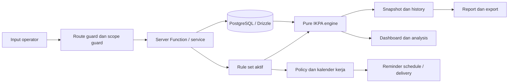

# Implementation Review Handoff — Simulator Penilaian IKPA

> Dokumen ini adalah konteks handoff untuk AI pembuat dan reviewer PRD, FSD, TSD, ERD, UI/UX Details Brief, serta UI/UX Wireframe.
>
> Tujuan utamanya bukan menyatakan bahwa semua hal sudah production-ready, melainkan membuat perbedaan antara dokumen rancangan dan implementasi lokal terlihat jelas sebelum perubahan fitur berikutnya diputuskan.

## Instruksi untuk AI Reviewer

Baca dokumen ini bersama source code dan dokumen sumber yang ditautkan. Gunakan kondisi working tree lokal terbaru sebagai representasi implementasi aktual, termasuk perubahan yang belum di-commit.

Saat melakukan review:

1. Jangan menganggap checkbox `Completed`, keberadaan route, atau adanya komponen UI sebagai bukti bahwa sebuah fitur sudah terintegrasi penuh.
2. Bedakan secara eksplisit antara `Requirement/Target`, `Implemented`, `Partial`, `Mock/Static`, `Disabled/Deferred`, dan `Not Started`.
3. Untuk setiap temuan, sertakan bukti berupa path file, route, package, test, atau bagian dokumen.
4. Jangan menghapus atau menyelaraskan dokumen awal secara diam-diam. Laporkan dahulu perbedaan pemahaman dan dampaknya.
5. Jika keputusan produk atau regulasi belum dapat disimpulkan dari repo, tandai sebagai `Needs Decision` dan ajukan pertanyaan kepada pemilik aplikasi.
6. Sebelum menyarankan masuk Fase 13, pisahkan blocker wajib dari pekerjaan yang boleh ditunda.

Output review yang diharapkan tersedia pada bagian [Format Review yang Diminta](#format-review-yang-diminta).

## 1. Snapshot Proyek

| Item | Kondisi saat snapshot |
|---|---|
| Produk | Simulator Penilaian IKPA Satker |
| Snapshot | 4 September 2026 |
| Milestone | M5 — Integrated MVP / local pre-F13 stabilization |
| Fase yang ditandai selesai | F0 sampai F12 pada `docs/TASK-LIST-Simulator-IKPA.md` |
| Fase berikutnya | F13 — quality, security, deployment, UAT, dan go-live verification |
| Status F13 | Belum dimulai; F13-01 sampai F13-14 masih unchecked |
| Branch | `master`, berada satu commit di depan `origin/master` pada saat pemeriksaan |
| Working tree | Dirty; terdapat perubahan tracked dan file baru lokal, terutama pekerjaan PRE-F13 |
| Lingkungan yang sedang digunakan | Local development; database dan service eksternal dapat memakai fallback bila environment belum lengkap |
| Bahasa UI | Bahasa Indonesia |
| Zona waktu default | Asia/Jakarta |

### Makna status saat ini

Aplikasi sudah melewati tahap UI prototype dan sebagian besar fondasi domain, database, akses, server function, simulasi, reminder, serta export. Namun status ini belum sama dengan release candidate.

Secara praktis, kondisi saat ini adalah:

- fungsi utama Operator sudah memiliki jalur backend nyata pada banyak domain;
- sebagian halaman Admin masih menggunakan mock atau overlay fallback;
- beberapa integrasi eksternal masih berupa skeleton atau simulasi;
- import data sengaja dinonaktifkan sementara dari UI;
- quality gate F13 belum dijalankan;
- masih ada test UI dan lint yang gagal pada kondisi lokal terbaru.

## 2. Hierarki Sumber Kebenaran

Gunakan urutan berikut ketika terdapat perbedaan informasi:

1. Source code dan working tree lokal terbaru untuk mengetahui apa yang benar-benar berjalan.
2. `docs/BACKLOG.md` dan `docs/DEVLOG.md` terbaru untuk mengetahui keputusan implementasi dan perubahan lokal.
3. PRD, FSD, TSD, ERD, UI/UX Design System, dan UI/UX Wireframe untuk baseline requirement dan target desain.
4. Dokumen QA, smoke test, acceptance, dan traceability untuk bukti historis; jangan otomatis menganggap statusnya masih berlaku.
5. `docs/future_plan.md` untuk keputusan penundaan dan rencana pemulihan fitur, khususnya import.

Dokumen baseline utama:

- [PRD — Simulator IKPA](./PRD-Simulator-IKPA.md)
- [FSD — Simulator IKPA](./FSD-Simulator-IKPA.md)
- [TSD — Simulator IKPA](./TSD-Simulator-IKPA.md)
- [ERD — Simulator IKPA](./ERD-Simulator-IKPA.md)
- [UI/UX Design System](./UI-UX-Design-System.md)
- [UI/UX Wireframes](./UI-UX-Wireframes.md)

Dokumen operasional dan verifikasi:

- [Task List](./TASK-LIST-Simulator-IKPA.md)
- [Backlog](./BACKLOG.md)
- [Devlog](./DEVLOG.md)
- [Traceability Matrix](./traceability-matrix.md)
- [Regulatory Verification 2026](./regulatory-verification-2026.md)
- [Data Retention and Classification](./data-retention-and-classification.md)
- [Mock Scenarios](./mock-scenarios.md)
- [Future Plan](./future_plan.md)

Dokumen historis yang harus dibaca dengan tanggal/statusnya:

- [UI Acceptance Report](./ui-acceptance-report.md)
- [Smoke Test Navigation](./smoke-test-navigation.md)
- [Accessibility Audit](./accessibility-audit.md)
- [QA Scenario](./QA_scenario.md)
- [Error and Bug Log](./error_bugs.md)

## 3. Apa Aplikasi Ini dan Mengapa Dibuat

### 3.1 Tujuan produk

Simulator IKPA adalah alat bantu internal untuk memproyeksikan, menjelaskan, dan mengendalikan nilai Indikator Kinerja Pelaksanaan Anggaran pada level satker.

Masalah yang hendak diselesaikan:

- keterlambatan mengetahui penurunan nilai IKPA;
- formula indikator yang tersebar dan sulit dihitung manual;
- data pagu, revisi, RPD, realisasi, kontrak, tagihan, UP/TUP, KKP, output, dan SPM berada di banyak sumber;
- risiko deadline dan dispensasi baru terlihat setelah masalah terjadi;
- kebutuhan membuat simulasi `what-if` sebelum keputusan operasional diambil;
- perubahan regulasi yang tidak boleh mengubah histori perhitungan lama secara diam-diam.

Nilai yang diharapkan:

- skor dan kontribusi setiap indikator dapat ditelusuri;
- operator dapat melihat gap terhadap target serta tindakan prioritas;
- forecast dan scenario dapat diuji tanpa mengubah data actual;
- snapshot historis menyimpan konteks rule set yang dipakai;
- Admin KPPN dapat memonitor satker dalam scope-nya;
- reminder dapat mengikuti policy dan kalender kerja yang berversi.

### 3.2 Batasan produk

Aplikasi ini:

- bukan pengganti OMSPAN, SAKTI, SPAN, atau sistem resmi KPPN;
- bukan sumber nilai IKPA resmi;
- tidak memiliki official API OMSPAN pada scope MVP;
- tidak ditujukan untuk agregasi nasional;
- tidak menyediakan native mobile app;
- pada MVP hanya memiliki dua tipe akses utama, bukan role operasional PPK, Bendahara, Perencana, KPA, atau Viewer;
- belum boleh memakai parameter 2026 yang belum diverifikasi formal sebagai kebenaran regulasi final.

## 4. Pengguna, Role, dan Alur Utama

### 4.1 Role

| Role | Scope | Kapabilitas utama | Batasan |
|---|---|---|---|
| `operator_satker` | Satu satker aktif | CRUD data operasional satker, simulasi, forecast/scenario, reminder configuration, history, report, settings | Tidak dapat melihat satker lain atau mengubah policy Admin |
| `admin_kppn` | Satu atau beberapa scope KPPN | Monitoring read-only satker, aggregate report, rule set, reminder policy, kalender kerja, audit, access mapping | Tidak mengubah data operasional satker melalui monitoring |

Semua pengguna pada MVP berada pada level akses yang sama di dalam tipe aksesnya. Kebutuhan subrole atau approval workflow merupakan keputusan lanjutan, bukan asumsi yang boleh ditambahkan tanpa review.

Jika pengguna memiliki beberapa mapping operator, aplikasi menyediakan pemilihan satker aktif. Aturan precedence ketika pengguna memiliki mapping Admin dan Operator harus tetap mengikuti ADR dan dikonfirmasi pada review.

### 4.2 Alur pengguna

1. Pengguna membuka landing page dan masuk melalui Clerk atau demo fallback pada local development.
2. Sistem menentukan identity dan mapping akses internal.
3. Pengguna diarahkan ke dashboard Admin, dashboard Operator, pemilih satker, atau access-pending.
4. Operator memilih konteks satker, tahun anggaran, periode, dan rule set yang aktif.
5. Operator mengisi atau memperbarui enam domain data operasional secara manual.
6. Sistem menghitung actual, forecast, atau scenario menggunakan engine IKPA.
7. Hasil disimpan sebagai simulation/snapshot sesuai mode penyimpanan.
8. Dashboard, history, analysis, reminder, dan report menggunakan hasil tersebut.
9. Admin memonitor scope KPPN dan mengelola policy/regulatory configuration.

Alur ringkas teknis:



## 5. Model Penilaian IKPA

### 5.1 Komponen utama

Nilai positif terdiri dari tujuh indikator dengan total bobot 100%.

| No. | Indikator | Bobot |
|---:|---|---:|
| 1 | Revisi DIPA | 10% |
| 2 | Deviasi Halaman III DIPA | 15% |
| 3 | Penyerapan Anggaran | 20% |
| 4 | Belanja Kontraktual | 10% |
| 5 | Penyelesaian Tagihan | 10% |
| 6 | Pengelolaan UP/TUP | 10% |
| 7 | Capaian Output | 25% |
|  | **Total bobot positif** | **100%** |

SPM Dispensasi adalah faktor pengurang, bukan indikator berbobot positif.

Secara konsep:

```text
Total IKPA = Σ kontribusi 7 indikator berbobot − deduction SPM Dispensasi
```

Karena itu, label “8 indikator” pada dashboard, hasil simulasi, history, dan export berarti tujuh baris kontribusi positif ditambah satu baris `SPM Dispensasi` sebagai deduction. Ini bukan delapan indikator positif dengan bobot tambahan.

### 5.2 Default deduction SPM Dispensasi

Bucket yang digunakan pada rule set default 2026 saat ini:

| Rasio dispensasi | Deduction |
|---:|---:|
| 0‰ | 0 |
| 0,01–0,09‰ | 0,25 |
| 0,10–0,99‰ | 0,50 |
| 1,00–4,99‰ | 0,75 |
| ≥ 5‰ | 1,00 |

Nilai dan parameter di atas tetap harus dibandingkan dengan [Regulatory Verification 2026](./regulatory-verification-2026.md) sebelum go-live. Dokumen regulasi tersebut membedakan parameter `verified` dan `needs_verification`.

### 5.3 Perbedaan mode perhitungan

| Mode | Sumber data | Boleh memakai asumsi lokal? | Dampak ke data actual |
|---|---|---:|---|
| Actual | Data operasional yang tersimpan | Tidak | Tidak mengubah data |
| Forecast | Data actual + asumsi prediksi | Ya | Tidak mengubah data actual |
| Scenario | Data actual + what-if/override | Ya | Tidak mengubah data actual |

Snapshot harus menyimpan mode, input hash, rule set ID/version, breakdown, dan assumptions/overrides yang digunakan agar hasil dapat diaudit.

## 6. Matriks Fitur dan Route Aktual

### 6.1 Legenda status

| Status | Arti |
|---|---|
| `Implemented` | Ada jalur implementasi nyata dan bukti source/backend yang relevan |
| `Partial` | Sebagian alur nyata, tetapi masih ada mock, fallback, placeholder, atau bagian penting yang belum lengkap |
| `Mock/Static` | UI atau data tersedia untuk prototype, tetapi belum menjadi alur production-backed |
| `Disabled/Deferred` | Sengaja tidak diekspos atau ditunda; bukan berarti seluruh backend dihapus |
| `Not Started` | Belum ditemukan implementasi yang memenuhi requirement |

### 6.2 Public dan access

| Area | Route | Status | Implementasi/evidence |
|---|---|---|---|
| Landing | `/` | `Implemented` | `apps/web/src/routes/index.tsx`, public shell, value proposition, indikator, disclaimer |
| Sign in | `/sign-in` | `Partial` | Clerk digunakan bila environment tersedia; local development memiliki demo sign-in fallback |
| Sign up | `/sign-up` | `Partial` | Route Clerk tersedia; behavior production bergantung konfigurasi Clerk |
| SSO callback | `/sso-callback` | `Partial` | Route callback tersedia, perlu verifikasi pada environment identity provider sebenarnya |
| Access pending | `/access-pending` | `Implemented` | Menampilkan akses belum tersedia; juga memiliki self-service onboarding satker lokal |
| Select organization | `/select-organization` | `Implemented` | Digunakan ketika operator memiliki beberapa satker aktif |

### 6.3 Operator Satker

| Area | Route | Status | Implementasi/evidence |
|---|---|---|---|
| Dashboard | `/operator/dashboard` | `Partial` | DB/engine path tersedia; fallback development masih mengembalikan nilai default ketika database tidak tersedia |
| Simulasi | `/operator/simulation` | `Partial` | Actual/forecast/scenario, snapshot, assumptions UP/TUP dan SPM tersedia; enam panel assumptions lain masih placeholder |
| Pagu dan Revisi DIPA | `/operator/data/budget-revisions` | `Implemented` | Query/mutation scoped dan form manual |
| RPD dan Realisasi | `/operator/data/rpd-realization` | `Implemented` | Query/mutation scoped dan input bulanan |
| Kontrak dan Tagihan | `/operator/data/contracts-invoices` | `Implemented` | Domain kontrak dan SPM-LS memiliki server path |
| UP/TUP dan KKP | `/operator/data/up-tup-kkp` | `Implemented` | Data transaksi memiliki server path; panel assumptions simulasi merupakan pekerjaan PRE-F13 |
| Capaian Output | `/operator/data/output-achievement` | `Implemented` | Query/mutation output dan validasi domain |
| SPM Dispensasi | `/operator/data/spm-dispensation` | `Implemented` | Data SPM Q4 dan deduction tersedia; panel assumptions baru ditambahkan pada pekerjaan lokal |
| Import data | `/operator/import` | `Disabled/Deferred` | Route sengaja menjadi stub “dinonaktifkan sementara”; parser, server function, job, tabel, dan API masih dipertahankan |
| History | `/operator/history` | `Implemented` | Menggunakan snapshot aktual dan perbandingan hingga delapan baris hasil |
| Analysis | `/operator/analysis` | `Partial` | Dashboard/recommendation service tersedia; perlu verifikasi penuh terhadap semua requirement analisis |
| Reports | `/operator/reports` | `Partial` | Server export tersedia, tetapi library/fallback XLSX/PDF masih perlu hardening |
| Reminder Center | `/operator/reminders` | `Implemented` | Policy config, preview, compliance guard, dan delivery path tersedia; delivery eksternal belum production-complete |
| Guides | `/operator/guides` | `Mock/Static` | Konten panduan statis; belum berasal dari CMS atau konfigurasi database |
| Settings | `/operator/settings` | `Partial` | Settings dan onboarding memiliki server path; perlu verifikasi end-to-end dan final product decision |

### 6.4 Admin KPPN

| Area | Route | Status | Implementasi/evidence |
|---|---|---|---|
| Dashboard monitoring | `/admin-kppn/dashboard` | `Partial` | Loader/service dan fallback tersedia; perlu verifikasi data produksi dan seluruh state |
| Daftar satker | `/admin-kppn/organizations` | `Partial` | Loader ada, tetapi data masih dapat di-overlay/fallback ke mock |
| Detail satker | `/admin-kppn/organizations/:orgId` | `Mock/Static` | Halaman detail saat ini tidak memiliki loader/service production-backed yang setara requirement |
| Monitoring reminder | `/admin-kppn/monitoring/reminders` | `Mock/Static` | Tampilan masih mock-only |
| Aggregate reports | `/admin-kppn/reports` | `Partial` | Preview masih mock; download aggregate memiliki server export |
| Workday calendar | `/admin-kppn/policy/workdays` | `Mock/Static` | UI masih mock-only walaupun policy package dan sebagian backend tersedia |
| Rule set list | `/admin-kppn/policy/rule-sets` | `Partial` | Loader/service tersedia tetapi record dapat memakai mock overlay/fallback |
| Rule set detail/editor | `/admin-kppn/policy/rule-sets/:ruleSetId` | `Mock/Static` | Workflow server ada, UI detail/editor belum terintegrasi penuh |
| Reminder policy | `/admin-kppn/policy/reminders` | `Mock/Static` | UI masih mock-only |
| Policy history | `/admin-kppn/policy/history` | `Mock/Static` | UI masih mock-only |
| Audit logs | `/admin-kppn/audit-logs` | `Partial` | Loader/service ada, tetapi fallback/overlay mock masih digunakan |
| Access management | `/admin-kppn/access` | `Partial` | Query/mutation access tersedia; permission matrix dan sebagian UI masih mock/fallback |

### 6.5 Fitur backend yang tidak selalu terlihat dari UI

Beberapa kemampuan memiliki implementasi server/package walaupun UI-nya belum sepenuhnya terhubung:

- rule set workflow: draft, publish, retire, diff, immutability, dan invariant validation;
- reminder policy, deadline DSL, workday calculation, compliance guard, scheduler, idempotency, dan retry;
- query/mutation domain dengan organization scope atau KPPN scope;
- audit trail dengan redaction dan request correlation;
- simulation/snapshot dengan actual/forecast/scenario isolation;
- import parser, import job lifecycle, dan recovery endpoint;
- operator XLSX/PDF dan Admin aggregate export.

Keberadaan backend tersebut tidak boleh dipresentasikan sebagai fitur UI yang sudah selesai bila route-nya masih mock atau disabled.

## 7. Arsitektur dan Data Model Aktual

### 7.1 Struktur teknis

Implementasi berada pada workspace dengan aplikasi web TanStack Start dan package domain bersama:

| Package/layer | Fungsi |
|---|---|
| `apps/web` | Route, layout, Server Functions/API, service wrapper, form, export, auth integration |
| `packages/access-control` | Resolusi mapping akses dan aturan akses |
| `packages/contracts` | DTO dan schema kontrak lintas layer |
| `packages/db` | Drizzle schema, migration, seed, dan akses database |
| `packages/ikpa-engine` | Formula IKPA pure/deterministic, rule set parser, trace, recommendation |
| `packages/policy-reminder` | Kalender kerja, deadline, policy resolver, compliance, scheduler, idempotency |
| `packages/ui` | Primitive UI, state system, badge, accessibility-oriented component |

Pola implementasi utama:

- route guard TanStack Router untuk redirect berdasarkan autentikasi dan akses;
- Server Functions/API sebagai boundary server;
- service layer tipis yang memanggil Server Functions;
- guard scope sebelum query/mutation;
- database PostgreSQL/Neon dengan Drizzle;
- engine dan policy logic tidak bergantung pada React, HTTP, atau database;
- snapshot menyimpan rule set yang digunakan pada saat kalkulasi.

### 7.2 Identity dan access

Clerk berfungsi sebagai identity provider ketika environment production tersedia. Mapping akses internal tetap menentukan apakah pengguna adalah `operator_satker` atau `admin_kppn`.

Pada local development, ketika konfigurasi Clerk atau database belum tersedia, source code memiliki fallback demo/access berdasarkan session atau identifier development. Fallback ini membantu menjalankan UI lokal, tetapi bukan bukti bahwa konfigurasi security production sudah tervalidasi.

Server-side protection yang harus tetap diperiksa:

- `assertOperatorOrgScope` untuk mutasi/query operator;
- `assertAdminKppnScope` untuk monitoring Admin;
- route guard `/operator/*` dan `/admin-kppn/*`;
- proteksi perubahan mapping Admin terakhir;
- fail-closed ketika mapping akses conflict.

### 7.3 Data model

ERD dan schema saat ini mendefinisikan 25 tabel/entitas dan 9 enum.

| Kelompok | Entitas |
|---|---|
| Identity/access | `kppn_scopes`, `organizations`, `users`, `user_accesses` |
| Policy/context | `rule_sets`, `reminder_policies`, `workdays`, `fiscal_years` |
| Operasional | `budgets`, `dipa_revisions`, `rpd_lines`, `realizations`, `contracts`, `spm_ls`, `up_tup_transactions`, `kkp_usages`, `output_reports`, `spm_q4` |
| Simulasi | `simulations`, `simulation_overrides`, `score_snapshots` |
| Reminder/delivery | `org_reminder_configs`, `notification_deliveries` |
| Import/audit | `import_jobs`, `audit_logs` |

Enum utama:

`access_type`, `rule_set_status`, `reminder_category`, `day_type`, `payment_type`, `up_tup_type`, `simulation_type`, `delivery_status`, dan `import_status`.

Invariant penting:

- data operasional dikontekskan oleh organisasi dan tahun anggaran;
- data historis menggunakan soft delete atau snapshot sesuai domain;
- published rule set tidak boleh diubah in-place;
- snapshot harus mempertahankan rule set ID/version dan input hash;
- perubahan kalender, policy, atau formula tidak boleh mengubah interpretasi snapshot historis;
- query/mutation tidak boleh melewati tenant/scope guard.

### 7.4 Rule set dan policy

Target desainnya adalah semua formula, bobot, parameter, deadline, kategori reminder, dan guardrail berasal dari rule set/policy berversi, bukan hardcode permanen.

Implementasi yang sudah ada mencakup:

- `default2026RuleSet` pada engine;
- parse dan validasi konfigurasi rule set;
- resolver berdasarkan tahun/effective date/status;
- workflow draft/publish/retire;
- policy reminder dengan mandatory lock, lead days, required recipients, dan allowed days;
- kalender hari kerja, hari libur, dan override;
- re-evaluation delivery berdasarkan policy dan idempotency key.

Review wajib memastikan bahwa default/client preview tidak mengalahkan active published rule set pada jalur production. Pemeriksaan khusus diperlukan pada:

- `apps/web/src/server/dashboard.ts`;
- `apps/web/src/server/simulation.ts`;
- `apps/web/src/server/simulation/calculate.ts`;
- `apps/web/src/components/operator/simulation-result.tsx`;
- `packages/ikpa-engine`.

### 7.5 Integrasi eksternal dan fallback

| Integrasi | Kondisi aktual | Implikasi |
|---|---|---|
| Clerk | Boundary dan fallback local tersedia | Harus diuji dengan environment Clerk sebenarnya sebelum release |
| Neon/PostgreSQL | Drizzle schema, migration, seed, dan query tersedia | Local tanpa URL database dapat diam-diam memakai fallback |
| QStash | Endpoint dan helper signature tersedia, tetapi pemeriksaan signature masih disederhanakan | Belum dapat dianggap webhook verification production |
| Resend/email | Template dan delivery flow tersedia, tetapi handler delivery masih mocked dan tidak melakukan pengiriman Resend nyata | Email end-to-end belum selesai |
| XLSX | Parser/export memiliki dynamic import/fallback; `exceljs` belum menjadi dependency runtime yang terpasang | Perlu keputusan dependency dan test file nyata |
| PDF | Export memiliki fallback bila renderer tidak tersedia; `@react-pdf/renderer` belum menjadi dependency lengkap | PDF production harus divalidasi secara visual |
| File import storage | `storageKey` dan jalur future plan tersedia, tetapi upload masih base64 direct dan JSONB menyimpan payload terbatas | Tidak cocok untuk import massal production tanpa storage/retention final |

## 8. Status Fase dan Perkembangan

### 8.1 Milestone

| Milestone | Fase | Status menurut task list | Interpretasi aktual |
|---|---|---|---|
| M0 Decision Ready | F0 | Selesai | Governance, ADR, kontrak, dan keputusan awal tersedia; sebagian keputusan masih perlu validasi final |
| M1 UI Prototype | F1–F4 | Selesai | Shell, public, Operator, Admin, dan mock flow tersedia |
| M2 UI Accepted | F5 | Selesai | Review UI historis/mock telah dicatat |
| M3 Domain Ready | F6 | Selesai | Engine IKPA dan golden tests tersedia |
| M4 Backend Ready | F7–F10 | Selesai | DB, access, domain backend, policy/reminder tersedia |
| M5 Integrated MVP | F11–F12 | Selesai | Banyak route terhubung ke backend, report/export tersedia, import kemudian dinonaktifkan |
| M6 Release Candidate | F13 | Belum dimulai | Quality, security, deploy, UAT, dan regulatory go-live verification belum menjadi gate yang lulus |

### 8.2 Perubahan PRE-F13 terbaru

Perubahan lokal terbaru yang harus ikut direview:

| Area | Keputusan/perubahan |
|---|---|
| Simulasi UP/TUP | Ditambahkan panel assumptions dan breakdown untuk preview forecast/scenario |
| Simulasi SPM | Ditambahkan panel assumptions dispensasi |
| Assumptions lain | Enam panel assumptions lain masih placeholder/unknown |
| Save behavior | `Simpan Hasil Saat Ini` dipisahkan dari `Simpan Skenario`; mode actual/forecast/scenario tidak boleh tercampur |
| Dashboard | Menampilkan tujuh kontribusi positif plus SPM deduction sebagai baris ke-8 |
| History | Menggunakan snapshot nyata dan perbandingan delapan baris |
| Export | Operator XLSX/PDF dan Admin aggregate memasukkan deduction |
| Backend calculation | Assumptions diteruskan ke engine untuk forecast/scenario, actual tetap berasal dari database |
| Import | Menu, tombol, dan wizard UI dinonaktifkan sementara untuk menghemat storage; backend/parser/table dipertahankan |
| UP/TUP period | Special period pada UI simulasi dihapus dari perubahan terbaru; makna periode perlu dikonfirmasi terhadap dokumen awal |

### 8.3 Fase 13 yang masih terbuka

Seluruh task berikut masih unchecked pada task list:

- unit test penuh untuk modul pure;
- integration test tenant isolation;
- integration test policy/reminder;
- E2E Operator;
- E2E Admin;
- security review;
- performance test;
- CI quality gate;
- deployment Vercel;
- security baseline Cloudflare;
- observability dan alert;
- runbook;
- UAT acceptance;
- regulatory/data go-live verification.

## 9. Gap, Risiko, dan Pertanyaan Keputusan

| ID | Temuan aktual | Evidence | Dampak/review yang dibutuhkan |
|---|---|---|---|
| R-01 | F13 belum dimulai | `docs/TASK-LIST-Simulator-IKPA.md` bagian F13 | Jangan menyebut aplikasi release candidate atau siap production |
| R-02 | Test UI terbaru gagal karena test mengharapkan teks visible `Published`, sedangkan `RuleSetBadge` hanya menaruhnya pada accessible label | `packages/ui/src/components/system-states.test.tsx`, `packages/ui/src/components/rule-set-badge.tsx` | Putuskan apakah status harus visible sesuai wireframe atau test perlu mengikuti desain |
| R-03 | Lint masih gagal dengan 9 error dan 39 warning | `apps/web/src/components/layout/active-context.tsx`, `apps/web/src/components/layout/admin-navigation.tsx`, `apps/web/src/routes/admin-kppn/access.tsx`, `apps/web/src/lib/simulation/up-tup-assumptions.ts` | Harus masuk quality gate sebelum F13 dianggap selesai |
| R-04 | Dashboard memiliki default/fallback context seperti tahun 2026, periode, target, dan rule-set label tertentu | `apps/web/src/server/dashboard.ts` | Verifikasi bahwa active fiscal year dan published rule set selalu menjadi sumber authoritative |
| R-05 | Client preview simulasi menggunakan default 2026 rule set pada sebagian preview | `apps/web/src/routes/operator/simulation.tsx`, `packages/ikpa-engine` | Pastikan preview tidak berbeda dari server calculation ketika rule set aktif berubah |
| R-06 | Enam panel assumptions simulasi masih placeholder | `apps/web/src/routes/operator/simulation.tsx` dan komponen assumption | Putuskan apakah placeholder diterima untuk MVP atau harus diselesaikan sebelum UAT |
| R-07 | Banyak halaman Admin masih mock atau fallback | Route Admin pada bagian [Matriks Fitur](#64-admin-kppn) | Tentukan scope minimal Admin yang wajib nyata sebelum release |
| R-08 | Guides masih static | `apps/web/src/routes/operator/guides.tsx` | Putuskan apakah static guide cukup atau membutuhkan lifecycle/configuration |
| R-09 | Local fallback dapat mengembalikan data tanpa database | server/service layer dan `getDatabase()` | Jangan menganggap smoke test lokal sebagai bukti tenant isolation atau persistence production |
| R-10 | QStash signature check disederhanakan dan delivery Resend masih mocked | `apps/web/src/server/qstash/handler.ts` dan route QStash | Wajib diperbaiki/diintegrasikan untuk email production |
| R-11 | XLSX/PDF memiliki dynamic import dan fallback; dependency production belum final | `docs/DEVLOG.md` Session 93, server export files | Putuskan library, storage, visual QA, dan failure behavior |
| R-12 | Import UI dimatikan karena pertumbuhan JSONB, base64 body, belum ada TTL/R2, dan valid rows hanya menyimpan maksimum 100 | `docs/future_plan.md`, `apps/web/src/server/import/parser.ts` | Pertahankan deferred status atau rancang ulang sebelum diaktifkan kembali |
| R-13 | Onboarding self-service pada access-pending memperluas alur dari sekadar menunggu mapping Admin | `apps/web/src/routes/access-pending.tsx`, server onboarding | Konfirmasi apakah operator boleh mendaftarkan satker sendiri atau harus melalui Admin |
| R-14 | Parameter IKPA 2026 belum seluruhnya diverifikasi formal | `docs/regulatory-verification-2026.md`, PRD/TSD | Tidak boleh menjadi klaim regulasi final atau acceptance go-live |
| R-15 | Kalender kerja, H-0, lead days, effective range, dan histori policy memiliki ADR tetapi tetap perlu diuji terhadap kebutuhan aktual | `docs/adr/ADR-001` sampai `ADR-004` | Pastikan formula deadline dan histori tidak berubah karena konfigurasi baru |
| R-16 | Retention dan storage import/audit/snapshot/delivery belum sepenuhnya menjadi bukti operasional | `docs/data-retention-and-classification.md`, `docs/future_plan.md` | Wajib diputuskan sebelum deployment dengan data nyata |
| R-17 | Traceability, smoke test, dan UI acceptance memiliki status historis/baseline yang tidak selalu mencerminkan source code terbaru | `docs/traceability-matrix.md`, `docs/smoke-test-navigation.md`, `docs/ui-acceptance-report.md` | Reviewer harus menggunakan tanggal dan source code terbaru, bukan status lama saja |

## 10. Status Verifikasi Teknis Saat Snapshot

| Command | Hasil | Detail |
|---|---|---|
| `npm run check` | Gagal secara keseluruhan | Typecheck berhasil; access-control 31 test, contracts 1 test, engine 39 test, policy-reminder 27 test lulus; UI 7 dari 8 test lulus |
| UI test `system-states.test.tsx` | Gagal 1 test | Ekspektasi test mencari teks visible `Published`; komponen saat ini hanya menampilkan status dalam `aria-label` |
| `npm run build --workspace @simulator-ikpa/web` | Berhasil | Client 2.535 modules dan SSR 322 modules; terdapat warning chunk besar sekitar 1 MB |
| `npm run lint` | Gagal | 9 error, 39 warning, dan 2 info; termasuk conditional hook violation dan style error pada file assumption terbaru |

Interpretasi: build berhasil bukan berarti quality gate lulus. Test dan lint di atas harus dicatat sebagai kondisi nyata saat handoff, bukan disembunyikan karena sebagian besar unit test lulus.

## 11. Kontradiksi atau Keterbatasan Dokumen

Reviewer harus memperhatikan hal berikut:

- `docs/traceability-matrix.md` adalah baseline awal dan banyak statusnya masih `Planned`; implementasi aktual ditelusuri dari backlog/source terbaru.
- `docs/smoke-test-navigation.md` mendokumentasikan wizard import yang sebelumnya aktif, sedangkan route import saat ini sudah menjadi stub disabled.
- `docs/ui-acceptance-report.md` adalah laporan review UI mock/prototype historis, bukan bukti bahwa seluruh backend route production-ready.
- `docs/QA_scenario.md` dan `docs/error_bugs.md` masih kosong; ketiadaan isi bukan berarti tidak ada risiko.
- README utama masih berupa README starter generik dan bukan dokumentasi produk utama.
- `docs/future_plan.md` memiliki preamble komentar yang tidak relevan sebelum bagian Future Plan import; bagian yang relevan dimulai dari heading import yang dinonaktifkan.
- `docs/DEVLOG.md` dan `docs/BACKLOG.md` mencatat verifikasi pada waktu berbeda; gunakan hasil command terbaru pada bagian sebelumnya untuk status snapshot ini.

## 12. Format Review yang Diminta

AI reviewer harus menghasilkan laporan dengan struktur berikut.

### A. Pemahaman produk

Jawab singkat:

- Apa tujuan utama aplikasi?
- Siapa pengguna utamanya?
- Masalah apa yang diselesaikan?
- Apa yang secara tegas bukan tanggung jawab aplikasi?
- Apa definisi sukses MVP dan apa definisi sukses production?

### B. Matriks traceability aktual

Gunakan format:

| Requirement | Sumber dokumen | Implementasi aktual | Bukti file/route/package | Status | Perbedaan | Dampak |
|---|---|---|---|---|---|---|
| Contoh: simulasi scenario | FSD OPS-02, TSD engine | Route dan server calculation tersedia; beberapa panel assumption masih placeholder | `apps/web/src/routes/operator/simulation.tsx` | Partial | Tidak semua asumsi UI tersedia | Potensi perubahan scope sebelum UAT |

Paling tidak cover:

- public/access;
- seluruh route Operator;
- seluruh route Admin;
- tujuh indikator dan deduction SPM;
- actual/forecast/scenario;
- rule-set versioning;
- snapshot/history;
- reminder/policy/calendar;
- import/export;
- audit/access/security;
- state UI dari wireframe;
- testing dan deployment.

### C. Klasifikasi perbedaan

Kelompokkan setiap temuan ke salah satu kategori:

- `Aligned`: dokumen dan implementasi sesuai;
- `Divergent`: implementasi berbeda dari dokumen;
- `Missing`: requirement ada tetapi implementasi belum ditemukan;
- `Ambiguous`: dokumen atau intent belum cukup jelas;
- `Intentional Change`: perubahan memang disengaja tetapi belum tentu sudah tercermin di semua dokumen;
- `Technical Debt`: fitur ada tetapi belum cukup aman/production-ready.

### D. Dampak perubahan

Untuk setiap fitur yang ingin direvisi, jelaskan dampaknya terhadap:

1. user problem dan product goal;
2. PRD dan acceptance criteria;
3. FSD route, behavior, validation, dan state;
4. TSD API/server function/service;
5. ERD/schema/migration/retention;
6. UI/UX detail, wireframe, responsive state, accessibility;
7. engine formula/rule set;
8. reminder/audit/security;
9. test, UAT, deployment, dan dokumentasi.

### E. Rekomendasi F13

Berikan tiga daftar terpisah:

- `Must Fix Before F13/UAT`;
- `Must Fix Before Production`;
- `Can Defer After MVP`.

Jangan menyatukan ketiganya menjadi satu backlog tanpa prioritas.

## 13. Pertanyaan Interogasi untuk Menguji Pemahaman AI

Gunakan pertanyaan berikut satu per satu jika terdapat perbedaan pemahaman.

1. Apakah Anda memahami bahwa aplikasi ini adalah simulator dan alat kontrol internal, bukan sumber nilai IKPA resmi? Tunjukkan bagian produk dan UI yang membuktikannya.
2. Mengapa model hasil memiliki delapan baris, dan apakah semuanya indikator berbobot positif?
3. Apakah formula total yang benar adalah `Σ7 indikator berbobot − deduction SPM`? Jelaskan dampak jika deduction diperlakukan sebagai bobot positif.
4. Apa perbedaan data actual, forecast, dan scenario? Mana yang boleh memakai assumptions dan mana yang tidak boleh mengubah database?
5. Rule set mana yang menjadi sumber kebenaran ketika preview client, fallback local, dan published rule set database berbeda?
6. Fitur Operator mana yang benar-benar memakai query/mutation database, dan mana yang masih mock atau fallback?
7. Halaman Admin mana yang sudah production-backed dan mana yang hanya tampilan prototype?
8. Apakah import saat ini hilang, rusak, atau sengaja ditunda? Apa alasan storage dan batasan teknisnya?
9. Apakah QStash dan Resend sudah mengirim email sungguhan, atau baru memiliki endpoint/template/skeleton?
10. Apakah onboarding self-service pada access-pending sesuai intent awal, atau seharusnya hanya Admin yang membuat mapping satker?
11. Parameter IKPA 2026 mana yang sudah verified dan mana yang masih needs verification?
12. Apakah current implementation sudah memenuhi syarat masuk F13, atau baru memenuhi M5 Integrated MVP? Sebutkan blocker konkret.
13. Jika Anda menyarankan perubahan fitur, dokumen mana saja yang harus direvisi dan test apa yang harus ditambahkan?
14. Apa risiko jika dokumen lama ditandai selesai tetapi halaman aktual masih menggunakan mock/fallback?

## 14. Template Permintaan Review Siap Salin

```text
Anda adalah AI yang sebelumnya menyusun PRD, FSD, TSD, ERD, UI/UX Details Brief, dan UI/UX Wireframe untuk Simulator Penilaian IKPA Satker.

Gunakan dokumen IMPLEMENTATION-REVIEW-HANDOFF ini sebagai konteks snapshot implementasi lokal per 4 September 2026. Bandingkan dokumen rancangan awal dengan source code dan working tree terbaru.

Jangan langsung membuat perubahan kode atau mengubah dokumen awal. Pertama:

1. Jelaskan pemahaman Anda tentang tujuan, pengguna, role, formula, batasan, dan alur aplikasi.
2. Buat matriks Requirement | Sumber Dokumen | Implementasi Aktual | Bukti File/Route | Status | Perbedaan | Dampak.
3. Pisahkan Implemented, Partial, Mock/Static, Disabled/Deferred, Not Started, dan Technical Debt.
4. Identifikasi dokumen yang sudah tidak sinkron dengan source code terbaru.
5. Tunjukkan apakah perubahan lokal PRE-F13 merupakan penyimpangan, penyempurnaan, atau perubahan intent.
6. Berikan daftar Must Fix Before F13/UAT, Must Fix Before Production, dan Can Defer After MVP.
7. Untuk setiap fitur yang tampak kurang sesuai, ajukan pertanyaan klarifikasi sebelum memberi solusi.
8. Setelah intent dikunci, berikan dampak perubahan terhadap PRD, FSD, TSD, ERD, UI/UX, engine, security, dan QA.

Gunakan bukti path file/route/package. Jangan menganggap status Completed pada task list sebagai bukti production-ready.
```

## 15. Checklist Pemilik Aplikasi Sebelum Meminta Revisi

Gunakan checklist ini saat berdiskusi dengan AI reviewer:

- [ ] Tujuan produk dan batasan “bukan nilai resmi” masih benar.
- [ ] Tujuh indikator dan satu deduction SPM adalah model yang dimaksud.
- [ ] Actual/forecast/scenario dan aturan save sudah benar.
- [ ] Panel assumptions yang wajib tersedia sudah dipilih.
- [ ] Status Admin mock/partial yang dapat diterima untuk MVP sudah disepakati.
- [ ] Import tetap disabled atau akan dirancang ulang.
- [ ] Rule set client preview versus server published sudah diputuskan.
- [ ] Onboarding self-service sudah disetujui atau dikembalikan ke alur Admin.
- [ ] QStash, email, XLSX, PDF, storage, dan retention sudah memiliki keputusan production.
- [ ] Parameter regulasi 2026 sudah memiliki pemilik dan status verifikasi.
- [ ] Test failure dan lint error sudah memiliki prioritas perbaikan.
- [ ] Syarat masuk F13 dan syarat go-live tidak tercampur.

## 16. Referensi Source Code Utama

Path berikut adalah titik pemeriksaan awal; reviewer tetap perlu menelusuri import dan dependensinya.

### Aplikasi dan routing

- `apps/web/src/router.tsx`
- `apps/web/src/start.ts`
- `apps/web/src/routes/operator/route.tsx`
- `apps/web/src/routes/admin-kppn/route.tsx`
- `apps/web/src/components/layout/operator-navigation.tsx`
- `apps/web/src/components/layout/admin-navigation.tsx`

### Engine dan policy

- `packages/ikpa-engine`
- `packages/policy-reminder`
- `apps/web/src/server/simulation.ts`
- `apps/web/src/server/simulation/calculate.ts`
- `apps/web/src/server/dashboard.ts`

### Database dan access

- `packages/db/src/schema`
- `packages/db/src/seed.ts`
- `apps/web/src/server/access.server.ts`
- `apps/web/src/server/access.ts`
- `apps/web/src/server/active-context.ts`

### Import/export/reminder

- `apps/web/src/server/import.ts`
- `apps/web/src/server/import/parser.ts`
- `apps/web/src/server/qstash/handler.ts`
- `apps/web/src/server/exports`
- `apps/web/src/server/reminders`

### Perubahan lokal PRE-F13

- `apps/web/src/routes/operator/simulation.tsx`
- `apps/web/src/components/operator/dispensasi-assumption-panel.tsx`
- `apps/web/src/components/operator/up-tup-assumption-panel.tsx`
- `apps/web/src/lib/simulation`
- `apps/web/src/routes/operator/import.tsx`

## Kesimpulan Snapshot

Aplikasi sudah berada pada tahap MVP terintegrasi lokal: domain utama, engine, database, access control, sebagian besar alur Operator, snapshot, reminder logic, dan export telah dibangun. Namun aplikasi belum boleh dipahami sebagai release candidate karena F13 belum dikerjakan, sebagian Admin masih mock, integrasi eksternal belum lengkap, import sengaja ditunda, parameter regulasi masih memerlukan verifikasi, dan quality check lokal belum bersih.

Fokus handoff ini adalah menjaga agar setiap revisi fitur dilakukan berdasarkan pemahaman yang sama antara dokumen awal, source code aktual, dan keputusan produk terbaru.
