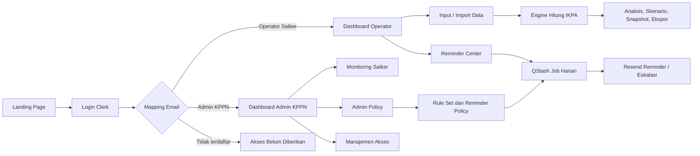
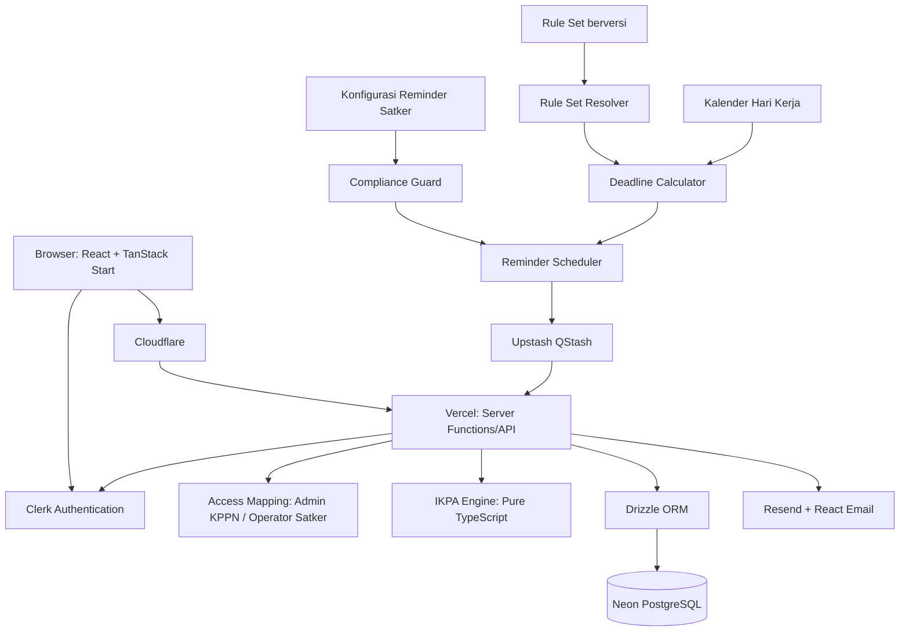
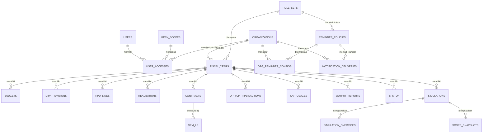

# PRD — Product Requirements Document

**Produk:** Simulator Penilaian IKPA Satker  
**Versi:** 1.3 Final — MVP Akses Sederhana, Reminder Terkonfigurasi, dan Regulasi Dinamis  
**Tanggal:** 31 Agustus 2026  
**Status:** Final untuk desain dan implementasi MVP  
**Stack yang ditetapkan:** TanStack Start + React + Tailwind CSS + shadcn/ui + PostgreSQL (NeonDB) + Drizzle ORM + Clerk Auth + Upstash QStash + Resend + React Email + Recharts  
**Deploy:** Vercel + Cloudflare

> **Status penilaian:** Aplikasi adalah alat bantu simulasi dan pengendalian internal. Hasilnya bukan nilai resmi OMSPAN/KPPN. Rumus, parameter, deadline, dan kebijakan notifikasi diberi versi per tahun anggaran agar dapat diselaraskan dengan ketentuan IKPA yang berlaku.

---

## 1. Overview

### Latar belakang

Simulator Penilaian IKPA Satker adalah aplikasi pengendalian internal untuk memproyeksikan nilai IKPA sebelum hasil resmi tersedia pada sistem pemerintah. Pengguna memasukkan data aktual atau rencana; sistem menghitung nilai sementara secara real-time, membandingkannya dengan target, menunjukkan risiko dan gap, serta memberikan rekomendasi tindakan.

Pada MVP, aplikasi menggunakan satu halaman login dan dua area dashboard berdasarkan jenis akses email: **Operator Satker** dan **Admin KPPN**. Tidak ada pembagian role operasional seperti PPK, Bendahara, Perencana, KPA, atau Policy Manager pada tahap awal. Seluruh pengguna dengan akses Operator Satker memiliki hak yang sama dalam satker masing-masing. Seluruh pengguna dengan akses Admin KPPN memiliki hak administratif yang sama, termasuk pengelolaan policy. 

Aplikasi juga menjalankan pengendalian proaktif melalui reminder dan notifikasi. Konfigurasi reminder harus mengikuti kebijakan yang dapat berubah per tahun anggaran, tetapi dalam batas yang ditetapkan Admin KPPN.

### Masalah yang diselesaikan

- Nilai IKPA sering diketahui setelah periode berjalan sehingga tindakan korektif terlambat.
- Rumus IKPA mencakup periode bulanan, triwulanan, semesteran, proporsi pagu, hari kerja, dan ketentuan yang sulit dikendalikan dengan spreadsheet.
- Data pagu, RPD, realisasi, kontrak, tagihan, UP/TUP, KKP, output, dan SPM tersebar di banyak dokumen.
- Risiko tagihan mendekati batas 17 hari kerja, keterlambatan pelaporan output, dan penumpukan SPM akhir tahun tidak selalu terdeteksi dini.
- Ketentuan IKPA dapat berubah antar tahun anggaran; aplikasi tidak boleh mengunci rumus, deadline, bobot, atau kebijakan notifikasi secara permanen dalam kode.

### Ruang lingkup penilaian

Aplikasi menghitung tujuh indikator berbobot dan satu komponen pengurang. Nilai dan parameter operasional dibaca dari `rule_set` aktif untuk tahun anggaran terkait.

| No. | Indikator | Bobot terhadap IKPA |
|---:|---|---:|
| 1 | Revisi DIPA | 10% |
| 2 | Deviasi Halaman III DIPA | 15% |
| 3 | Penyerapan Anggaran | 20% |
| 4 | Belanja Kontraktual | 10% |
| 5 | Penyelesaian Tagihan | 10% |
| 6 | Pengelolaan UP dan TUP | 10% |
| 7 | Capaian Output | 25% |
| — | Dispensasi SPM | Pengurang nilai akhir |

\[
Nilai\ IKPA\ akhir = \sum_{i=1}^{7}(Nilai\ indikator_i \times Bobot_i) - Pengurang\ dispensasi\ SPM
\]

### Tujuan produk

- Memberikan proyeksi IKPA yang transparan dan dapat ditelusuri hingga input, formula, parameter, dan versi aturan.
- Mendukung simulasi *what-if* sebelum tindakan operasional dilakukan.
- Mengidentifikasi gap target, risiko tenggat, dan kontribusi masing-masing indikator terhadap nilai akhir.
- Menyediakan riwayat, snapshot, audit trail, dan laporan untuk rapat pengendalian.
- Mengirim reminder sebelum tenggat berdasarkan policy aktif dan konfigurasi organisasi yang valid.
- Memungkinkan perubahan policy tanpa deploy aplikasi serta tanpa mengubah konsistensi snapshot historis.

### Non-goals MVP

- Tidak menggantikan OMSPAN, SAKTI, SPAN, atau penetapan nilai resmi KPPN.
- Tidak mengintegrasikan API resmi OMSPAN/SPAN pada MVP; data berasal dari input manual dan import CSV/XLSX.
- Tidak mencakup penilaian agregat nasional atau kementerian/lembaga pada MVP.
- Tidak membangun aplikasi mobile native pada MVP.
- Tidak membagi akses operator menjadi PPK, Bendahara, Perencana, KPA, atau Viewer pada MVP.
- Tidak membagi akses admin KPPN menjadi Policy Manager, Approver, atau role turunan lain pada MVP.

---

## 2. Requirements

### Kebutuhan fungsional

- **Akurasi perhitungan:** Sistem menghitung indikator berdasarkan `rule_set` tahun anggaran. Pengguna dapat melihat nilai, rumus, periode, bobot, input pembentuk, asumsi, dan versi rule set.
- **Rule set versioned:** Bobot, target, ambang, tabel pengurang, kalender kerja, daftar kode revisi, parameter formula, deadline, dan kebijakan reminder disimpan sebagai konfigurasi per tahun; tidak di-hardcode.
- **Perhitungan real-time:** Perubahan form atau skenario langsung memperbarui nilai indikator dan nilai IKPA.
- **Simulasi dan target:** Operator Satker dapat menetapkan target IKPA, menyimpan skenario, mengubah asumsi, dan membandingkan actual, forecast, serta scenario.
- **Rekomendasi terarah:** Sistem memberikan tindakan berdasarkan indikator, gap, tenggat, urgensi, dan dampak bobot.
- **Riwayat dan audit:** Hasil tersimpan dapat dibuka, dibandingkan, dihapus secara lunak, dan dipulihkan sebagai skenario baru. Perubahan data sensitif, policy, konfigurasi reminder, snapshot, dan delivery notifikasi dicatat.
- **Visualisasi:** Dashboard menampilkan tren, kontribusi berbobot, target gap, data belum lengkap, dan indikator berisiko.
- **Reminder berbasis kebijakan:** Sistem membedakan reminder `mandatory`, `recommended`, dan `optional`.
- **Notifikasi:** Sistem mengirim email reminder, eskalasi, dan digest mingguan dari policy aktif serta konfigurasi satker yang valid.
- **Edukasi:** Sistem menyediakan panduan indikator, tooltip rumus, istilah, contoh, dasar rule, dan praktik pengendalian IKPA.

### Model akses MVP

Sistem menggunakan satu mekanisme login. Setelah berhasil login, sistem membaca mapping email pengguna dan mengarahkan pengguna ke dashboard yang sesuai.

| Jenis akses | Pengguna | Hak akses |
|---|---|---|
| Operator Satker | Satu atau beberapa email yang terdaftar pada satker | Akses penuh pada seluruh data, input, simulasi, reminder, riwayat, laporan, dan pengaturan untuk satker sendiri |
| Admin KPPN | Satu atau beberapa email yang terdaftar sebagai admin | Akses penuh monitoring seluruh satker dalam cakupan KPPN, laporan agregat, aturan IKPA, reminder policy, kalender kerja, audit, dan manajemen email admin |

Ketentuan akses MVP:

- Setiap email hanya memiliki akses sesuai mapping yang diberikan Admin KPPN.
- Beberapa email dapat menjadi Admin KPPN dengan keleluasaan yang sama.
- Semua Admin KPPN dapat menambah, mengubah, atau menghapus akses email Admin KPPN lain; aktivitas wajib dicatat dalam audit log.
- Semua Operator Satker dalam satker yang sama memiliki keleluasaan yang sama terhadap data satker tersebut.
- Operator Satker tidak dapat melihat data satker lain, data lintas satker, atau menu Admin Policy.
- Admin KPPN dapat memantau semua satker dalam cakupan yang ditetapkan, tetapi tidak boleh mengubah data operasional satker tanpa fitur/izin khusus di fase berikutnya.
- Pada MVP, Clerk digunakan untuk autentikasi dan organisasi dapat direpresentasikan oleh satker. Otorisasi aplikasi ditentukan oleh tabel mapping akses internal, bukan role operasional yang kompleks.

### Kebijakan reminder dan regulasi

Reminder menggunakan dua lapisan.

| Lapisan | Pengelola MVP | Tanggung jawab |
|---|---|---|
| Regulatory policy layer | Admin KPPN | Menentukan deadline regulasi, formula deadline, jenis hari, eligibility, kategori reminder, batas konfigurasi, penerima wajib, dan dasar regulasi melalui `rule_set` berversi |
| Organization delivery layer | Operator Satker | Mengatur strategi pengiriman yang masih sesuai policy: lead time, jam, penerima tambahan, kanal, eskalasi, digest, dan pesan internal tambahan |

Prinsip utama: **Admin KPPN menentukan aturan dan deadline; Operator Satker menentukan strategi pengingat sebelum deadline dalam batas aturan.**

#### Ketentuan konfigurasi reminder

- Deadline, sumber regulasi, jenis hari, parameter penilaian, penerima wajib, dan status mandatory hanya dapat diubah oleh Admin KPPN melalui `rule_set` aktif.
- Operator Satker dapat mengatur reminder sebelum deadline: lead time, titik reminder, jam kirim, penerima tambahan, kanal, eskalasi, digest, dan pesan internal.
- Operator Satker tidak dapat mengubah deadline regulasi, mengubah hari kerja menjadi hari kalender, menonaktifkan event mandatory, menghapus penerima wajib, atau menjadwalkan reminder mandatory sesudah deadline.
- Admin KPPN menerbitkan versi rule set baru bila terjadi perubahan peraturan. Rule set memuat tahun berlaku, versi, tanggal efektif, sumber regulasi, catatan perubahan, pembuat, dan waktu publikasi.
- Sistem menyimpan `rule_set_version` pada snapshot, hasil perhitungan, audit log, dan delivery notifikasi.
- Rule set yang telah dipakai snapshot historis tidak dapat diedit; perubahan dibuat sebagai versi baru.
- Event `mandatory` hanya diberlakukan apabila Admin KPPN menetapkannya secara eksplisit berdasarkan ketentuan yang berlaku.

#### Validasi konfigurasi

- `lead_days` harus positif dan berada pada rentang `minLeadDays` sampai `maxLeadDays` dari policy.
- Event berbasis hari kerja memakai kalender kerja aktif pada rule set.
- Eskalasi regulasi harus dikirim sebelum atau tepat pada deadline. Tindak lanjut pasca-deadline dimodelkan sebagai event terpisah.
- Sistem menolak konfigurasi yang melanggar policy dan menampilkan alasan penolakan.
- Required recipient yang ditetapkan policy tidak dapat dihapus Operator Satker.
- Setiap perubahan menampilkan preview jadwal berikutnya berdasarkan timezone satker; default `Asia/Jakarta`.

### Kebutuhan non-fungsional

| Aspek | Kebutuhan |
|---|---|
| Kinerja | Perhitungan satu satker/tahun kurang dari 500 ms untuk volume normal; import besar diproses asinkron |
| Keamanan | Clerk Auth, isolasi data per satker, validasi Zod, HTTPS, secret hanya di server, signed webhook QStash |
| Ketersediaan | Vercel untuk aplikasi, NeonDB untuk database, QStash untuk job latar belakang |
| Audit | Perubahan input, policy, konfigurasi reminder, akses admin, snapshot, dan delivery notifikasi direkam |
| Aksesibilitas | Kontras minimum dan navigasi keyboard dasar sesuai WCAG AA |
| Bahasa | Antarmuka Indonesia; format mata uang Rupiah dan angka `id-ID` |
| Presisi | Perhitungan internal terstandar; tampilan dua desimal dan aturan pembulatan terdokumentasi |
| Idempotensi | Setiap delivery notifikasi memiliki idempotency key untuk mencegah email duplikat |
| Kompatibilitas regulasi | Rule set dapat diterbitkan tanpa deploy; snapshot lama mempertahankan versi aturan asal |

---

## 3. Core Features

### Area publik — Landing page dan login

- **Landing page:** Menjelaskan tujuan Simulator IKPA, manfaat utama, disclaimer bahwa hasil bukan nilai resmi, ringkasan fitur, serta tombol Login.
- **Login tunggal:** Clerk menangani login, sesi, reset password, dan MFA bila diaktifkan.
- **Routing berdasarkan akses:** Setelah login, sistem memeriksa mapping email. Operator Satker diarahkan ke Dashboard Operator Satker; Admin KPPN diarahkan ke Dashboard Admin KPPN.
- **Akses tidak terdaftar:** Jika email berhasil autentikasi tetapi belum memiliki mapping akses, tampilkan halaman “Akses belum diberikan” beserta instruksi menghubungi Admin KPPN.

### Area Operator Satker

#### Dashboard Operator Satker

- Nilai IKPA terakhir, target, gap, status kesehatan, dan periode aktif.
- Tujuh kartu indikator, pengurang dispensasi, data belum lengkap, dan lima tindakan prioritas.
- Ringkasan deadline dan reminder terdekat.
- Tren nilai YTD dan perubahan dibanding snapshot sebelumnya.

#### Simulasi IKPA

- Pilih tahun anggaran, periode, target nilai, status BLU, dan mode actual/forecast/scenario.
- Perhitungan real-time untuk seluruh indikator dan pengurang dispensasi.
- Tampilkan kontribusi berbobot, jejak perhitungan, warning, asumsi, dan rule set version.
- Simpan actual, forecast, atau skenario bernama tanpa menimpa data sumber.

#### Input Data

Semua menu input dapat diakses penuh oleh setiap Operator Satker pada satker sendiri.

- **Pagu & Revisi DIPA:** Pagu 51/52/53/57, histori revisi, kode revisi, dan perubahan pagu.
- **RPD & Realisasi:** RPD dan realisasi bulanan per jenis belanja.
- **Kontrak & Tagihan:** Kontrak, nilai, tanggal tanda tangan, jenis pembayaran, SP2D, BAST/BAPP, dan penerimaan/konversi KPPN.
- **UP/TUP & KKP:** UP, TUP, GUP, GUP nihil, PTUP, setoran TUP, dan penggunaan KKP.
- **Capaian Output:** RO, volume DIPA, RVRO, PCRO, TPCRO, tanggal lapor, dan status konfirmasi.
- **SPM Dispensasi:** SPM Q4 dan penanda dispensasi.
- **Import CSV/XLSX:** Template per domain, validasi per baris, pratinjau perubahan, dan laporan error.

#### Skenario, analisis, dan laporan

- **Skenario & Riwayat:** Daftar simulasi, periode, nilai, target, status, pembuat, waktu pembaruan, dan rule set version.
- **Analisis & Rekomendasi:** Urutkan tindakan berdasarkan bobot × gap × urgensi deadline.
- **Visualisasi:** Grafik garis nilai IKPA/indikator, batang realisasi versus RPD, radar nilai versus target, waterfall kontribusi, dan pie/donut yang relevan.
- **Laporan & Ekspor:** Ekspor tabel/grafik XLSX dan ringkasan PDF untuk kebutuhan rapat.

#### Reminder Center

- Menampilkan daftar event reminder, indikator, deadline, sumber regulasi, kategori, default policy, konfigurasi satker, penerima, status aktif, dan rule set version.
- Menampilkan alasan rule, preview jadwal, dan audit perubahan konfigurasi.
- Operator Satker mengatur lead time, titik reminder, jam kirim, penerima tambahan, digest, eskalasi, dan pesan internal dalam batas policy.
- Tombol **Kembalikan ke default policy** hanya tersedia untuk field yang dapat diubah Operator Satker.

#### Panduan dan pengaturan

- **Panduan IKPA:** Definisi, bobot, periode, rumus, contoh, istilah, dan praktik pengendalian setiap indikator.
- **Pengaturan Satker:** Profil satker, kode satker, KPPN, status BLU, target default, timezone, dan preferensi reminder yang diizinkan.

### Area Admin KPPN

#### Dashboard Monitoring

- Nilai dan tren agregat satker dalam cakupan KPPN.
- Daftar satker berdasarkan status risiko, target gap, indikator terendah, data belum lengkap, dan deadline terdekat.
- Ringkasan reminder mandatory/recommended serta delivery yang gagal.
- Perubahan rule set aktif dan dampaknya terhadap satker.

#### Daftar dan detail satker

- **Daftar Satker:** Pencarian, filter, status kelengkapan data, skor terakhir, risiko, dan deadline.
- **Detail Satker:** Tampilan read-only atas dashboard, data ringkasan, hasil simulasi, indikator, riwayat snapshot, dan reminder satker.
- Admin KPPN tidak mengubah data operasional satker pada MVP.

#### Risiko, laporan, dan audit

- **Monitoring Risiko & Reminder:** Risiko lintas satker, event mendekati deadline, delivery status, kegagalan email, dan eskalasi.
- **Laporan Agregat & Ekspor:** Rekap indikator, tren, target gap, risiko, dan daftar satker ke XLSX/PDF.
- **Audit Log:** Aktivitas perubahan policy, akses, konfigurasi reminder, rule set version, dan delivery notifikasi.

#### Admin Policy

Semua Admin KPPN memiliki keleluasaan yang sama pada menu ini.

- **Rule Set IKPA:** Buat draft, edit, bandingkan versi, dan publish rule set per tahun anggaran.
- **Reminder Policy:** Kelola event type, indikator, kategori `mandatory/recommended/optional`, formula deadline, tipe hari, range lead time, default schedule, dan required recipients.
- **Kalender Hari Kerja:** Kelola tanggal libur dan hari kerja yang digunakan untuk perhitungan deadline berbasis hari kerja.
- **Publish & Riwayat Versi:** Publikasikan versi baru, catat sumber regulasi, catatan perubahan, tanggal efektif, dan dampak ke jadwal mendatang.
- **Audit Policy:** Lihat siapa mengubah atau mempublikasikan policy, nilai sebelum/sesudah, serta rule set version yang digunakan.

#### Manajemen Admin KPPN dan akses satker

- Tambah, ubah, atau hapus email yang memiliki akses sebagai Admin KPPN.
- Semua email Admin KPPN memiliki hak yang sama; tidak ada role turunan pada MVP.
- Kelola mapping email Operator Satker ke satker yang bersangkutan.
- Catat seluruh perubahan akses dalam audit log.

### Engine penilaian IKPA

Engine harus berupa modul TypeScript murni yang tidak bergantung pada UI/database. Engine menerima input tervalidasi dan rule set, lalu menghasilkan breakdown skor, warning, rekomendasi, serta jejak perhitungan.

- **Revisi DIPA (10%):** Per semester, non-kumulatif. Default 2026: 0–1 revisi = 110; 2 = 100; ≥3 = 50. Nilai tahun = 50% semester I + 50% semester II.
- **Deviasi Halaman III DIPA (15%):** Januari–November, per jenis belanja, tertimbang proporsi pagu. Nilai maksimal jika rata-rata deviasi ≤5%; kurva nilai di atas ambang dibaca dari rule set.
- **Penyerapan Anggaran (20%):** Triwulanan, kumulatif, per jenis belanja, nilai maksimal 100. Target default 2026: 51 = 20/50/75/95%; 52 = 15/50/70/90%; 53 = 10/40/70/90%; 57 = 25/50/75/95%.
- **Belanja Kontraktual (10%):** Distribusi akselerasi kontrak 20%, kontrak dini 40%, dan akselerasi kontrak belanja modal 53 sebesar 40%.
- **Penyelesaian Tagihan (10%):** Persentase SPM-LS kontraktual non-pegawai yang diterima/dikonversi KPPN maksimal 17 hari kerja sejak BAST/BAPP.
- **Pengelolaan UP/TUP (10%):** 90% UP/TUP tunai dan 10% penggunaan UP KKP.
- **Capaian Output (25%):** 30% ketepatan waktu laporan dan 70% capaian output; laporan harus terkonfirmasi.
- **Dispensasi SPM:** Pengurang berdasarkan rasio permil SPM dispensasi terhadap SPM Q4. Default 2026: 0 = 0; 0,01–0,09‰ = 0,25; 0,10–0,99‰ = 0,50; 1,00–4,99‰ = 0,75; ≥5‰ = 1,00.

### Konfigurasi default reminder 2026

| Event | Indikator | Jenis hari | Kategori default | Default delivery | Batas Operator Satker |
|---|---|---|---|---|---|
| Pemutakhiran RPD | Deviasi Halaman III DIPA | Hari kerja | Recommended | H-10, H-3 | H-1 sampai H-20 |
| Gap target penyerapan | Penyerapan Anggaran | Hari kalender | Recommended | H-14, H-7 sebelum akhir triwulan | H-1 sampai H-30 |
| Kontrak dini | Belanja Kontraktual | Hari kalender | Optional/Recommended | H-30, H-14 sebelum 31 Maret | H-1 sampai H-90 |
| Kontrak modal 53 belum selesai | Belanja Kontraktual | Hari kalender | Recommended | H-14 sebelum akhir triwulan | H-1 sampai H-30 |
| BAST/BAPP menuju batas SPM | Penyelesaian Tagihan | Hari kerja | Mandatory bila ditetapkan Admin KPPN | H-5, H-2, H-0 dari batas H+17 | H-1 sampai H-16; H-0/penerima wajib terkunci jika mandatory |
| GUP/PTUP mendekati satu bulan | UP/TUP | Hari kerja | Recommended | H-5, H-2 | H-1 sampai H-20 |
| Setoran TUP | UP/TUP | Sesuai rule set | Recommended | H-10, H-3 | Sesuai policy |
| Target penggunaan KKP | UP/TUP | Hari kalender | Optional | H-14 sebelum akhir triwulan | H-1 sampai H-30 |
| Pelaporan capaian output | Capaian Output | Hari kerja | Mandatory bila ditetapkan Admin KPPN | H-3, H-1, H-0 | H-1 sampai H-5; penerima wajib terkunci jika mandatory |
| Risiko dispensasi SPM | Dispensasi SPM | Hari kalender | Recommended | H-30, H-14, H-7 periode akhir tahun | H-1 sampai H-60 |
| Revisi mencapai ambang | Revisi DIPA | Event-based | Optional | Saat revisi objek ke-1/ke-2 | Aktif/nonaktif dan penerima |
| Digest IKPA | Semua | Jadwal | Optional | Senin 07.00 WIB | Hari, jam, penerima |

---

## 4. User Flow

1. **Buka landing page:** Pengunjung melihat penjelasan produk dan memilih Login.
2. **Login tunggal:** Pengguna login melalui Clerk.
3. **Pemeriksaan akses:** Sistem membaca mapping email pengguna.
4. **Routing dashboard:** Email Operator Satker diarahkan ke Dashboard Operator Satker; email Admin KPPN diarahkan ke Dashboard Admin KPPN; email tanpa mapping melihat halaman akses belum diberikan.
5. **Onboarding satker:** Operator Satker memilih tahun anggaran, mengisi profil, status BLU, pagu, UP/KKP, kalender kerja, dan memastikan rule set aktif.
6. **Konfigurasi reminder:** Operator membuka Reminder Center, melihat batas policy, mengatur delivery yang diizinkan, memeriksa preview, lalu menyimpan konfigurasi yang valid.
7. **Input atau import data:** Operator mengisi seluruh domain data atau mengimpor CSV/XLSX.
8. **Perhitungan dan analisis:** Sistem menghitung skor, menampilkan breakdown, gap target, risiko deadline, rekomendasi, serta data belum lengkap.
9. **Skenario dan snapshot:** Operator membuat skenario what-if, membandingkan dampak, menyimpan snapshot, dan mengekspor laporan.
10. **Monitoring KPPN:** Admin KPPN melihat risiko dan tren seluruh satker, membuka detail satker secara read-only, serta mengekspor laporan agregat.
11. **Administrasi policy:** Admin KPPN membuat/mengubah draft rule set atau reminder policy, mengatur kalender kerja, lalu mempublikasikan versi baru.
12. **Re-evaluasi jadwal:** Saat policy baru dipublikasikan, sistem menghitung ulang reminder yang belum terkirim tanpa mengubah snapshot historis.
13. **Job harian:** QStash memanggil endpoint aman; aplikasi memilih rule set yang berlaku, menghitung deadline, mengevaluasi data satker, membaca konfigurasi reminder, dan mengirim email melalui Resend dengan idempotency key.
14. **Manajemen akses:** Admin KPPN menambahkan/menghapus email Admin KPPN atau memetakan email Operator Satker; sistem merekam perubahan dalam audit log.



---

## 5. Architecture

### Arsitektur aplikasi

TanStack Start digunakan sebagai aplikasi full-stack: React untuk UI, server functions/API routes untuk mutasi dan perhitungan aman, serta rendering hybrid SSR/CSR. Tailwind dan shadcn/ui menangani UI; Recharts digunakan untuk visualisasi.

Engine IKPA adalah modul TypeScript murni. Policy dan reminder menjadi modul domain terpisah: deadline, kategori, batas konfigurasi, dan penerima wajib dibaca dari rule set aktif. Konfigurasi satker hanya dapat menghasilkan jadwal delivery yang lolos Compliance Guard.



### Policy & Reminder module

- **Rule Set Resolver:** Memilih rule set berdasarkan tahun anggaran dan tanggal efektif.
- **Deadline Calculator:** Menghitung deadline dari formula policy dan kalender hari kerja.
- **Reminder Scheduler:** Menghasilkan waktu kirim dari default policy dan override satker yang valid.
- **Compliance Guard:** Menolak konfigurasi yang menonaktifkan event mandatory, menghapus required recipient, menjadwalkan setelah deadline, atau melanggar lead time.
- **Policy Migration Handler:** Saat Admin KPPN menerbitkan rule set baru, mengevaluasi jadwal reminder belum terkirim; snapshot lama tetap menggunakan versi sebelumnya.
- **Access Resolver:** Membaca mapping email untuk menentukan dashboard dan scope satker/KPPN pengguna.

### Pembagian tanggung jawab

| Lapisan | Teknologi | Tanggung jawab |
|---|---|---|
| UI publik | React, TanStack Start, Tailwind, shadcn/ui | Landing page, login, halaman akses belum diberikan |
| UI operator | React, Recharts, shadcn/ui | Dashboard satker, input, simulasi, reminder, laporan |
| UI admin | React, Recharts, shadcn/ui | Monitoring satker, admin policy, kalender, audit, akses email |
| Server | TanStack Start server functions/routes | Otorisasi, validasi, CRUD, perhitungan, export, endpoint job |
| Logika domain | TypeScript + Zod | Formula IKPA, rule set, deadline, hari kerja, rekomendasi, compliance |
| Database | Neon PostgreSQL + Drizzle | Data satker, skenario, snapshot, akses, policy, konfigurasi, delivery log |
| Auth | Clerk | Login, sesi, reset password, MFA opsional |
| Job | Upstash QStash | Cron, import besar, kalkulasi asinkron, scheduler notifikasi |
| Email | Resend + React Email | Reminder, eskalasi, digest, log delivery |
| Infrastruktur | Cloudflare | DNS, CDN, WAF, rate limit; R2 opsional untuk import besar |

### Keamanan dan akses data

- Semua route aplikasi dilindungi middleware Clerk.
- Setelah autentikasi, server selalu memeriksa jenis akses dan scope organisasi dari mapping email internal.
- Operator Satker hanya dapat membaca dan memutasi data dengan `org_id` satkernya sendiri.
- Admin KPPN dapat membaca data agregat dan detail satker dalam cakupan KPPN, mengelola policy, serta mengelola mapping akses; perubahan data operasional satker dibatasi pada MVP.
- Semua tabel bisnis menggunakan `org_id` jika relevan; seluruh query di-scope di server.
- Endpoint QStash dan webhook Clerk wajib memverifikasi signature.
- Import divalidasi berdasarkan ukuran, tipe, header, dan isi sebelum penulisan database.
- Secret hanya disimpan pada environment server Vercel.
- Semua email memiliki idempotency key unik.

### Deploy

| Komponen | Platform | Catatan |
|---|---|---|
| Aplikasi | Vercel | TanStack Start, preview deployment, environment terpisah |
| Database | NeonDB | Pooled connection runtime, unpooled connection migrasi |
| Domain dan proteksi | Cloudflare | DNS proxy, WAF, SSL/TLS, rate limiting |
| Auth | Clerk | Login dan session; mapping akses disimpan di aplikasi |
| Jobs | Upstash QStash | Signed request ke endpoint job Vercel |
| Email | Resend | Domain terverifikasi dan template React Email |

---

## 6. Database Schema

### Prinsip skema

- Gunakan PostgreSQL pada NeonDB dengan Drizzle ORM.
- Gunakan UUID sebagai primary key dan `org_id` pada data yang dimiliki satker.
- Nominal disimpan sebagai `numeric(18,2)` atau integer Rupiah; jangan menggunakan float untuk uang.
- Skor disimpan sebagai `numeric(8,4)` dan ditampilkan dua desimal.
- Actual dan overlay skenario dipisahkan.
- Policy, formula, deadline, dan reminder disimpan versioned.
- Snapshot dan delivery log menyimpan `rule_set_version` untuk audit historis.
- Mapping akses email disimpan di database aplikasi agar routing dan scope dapat dikendalikan tanpa role operasional yang kompleks.

### Tabel inti

| Tabel | Kolom kunci | Fungsi |
|---|---|---|
| `organizations` | `id`, `clerk_org_id`, `kode_satker`, `kppn`, `is_blu`, `timezone` | Profil satker |
| `users` | `id`, `clerk_user_id`, `email`, `name` | Referensi pengguna dan audit |
| `user_accesses` | `id`, `user_id`, `access_type`, `org_id`, `kppn_scope_id`, `created_by`, `active` | Mapping akses `operator_satker` atau `admin_kppn` |
| `kppn_scopes` | `id`, `code`, `name` | Cakupan monitoring Admin KPPN |
| `fiscal_years` | `id`, `org_id`, `year`, `active_rule_set_id` | Konteks data dan aturan per tahun |
| `rule_sets` | `id`, `year`, `version`, `effective_from`, `status`, `source_regulation`, `change_notes`, `config_json`, `created_by`, `published_at` | Parameter IKPA dan kebijakan reminder berversi |
| `reminder_policies` | `id`, `rule_set_id`, `event_type`, `indicator_key`, `category`, `deadline_formula`, `day_type`, `min_lead_days`, `max_lead_days`, `required_recipients_json` | Policy event reminder |
| `workdays` | `id`, `year`, `date`, `is_holiday`, `description` | Kalender hari kerja |
| `budgets` | `id`, `fiscal_year_id`, `account_code`, `amount`, `effective_at` | Pagu 51/52/53/57 |
| `dipa_revisions` | `id`, `fiscal_year_id`, `revision_date`, `revision_code`, `pagu_before`, `pagu_after` | Revisi DIPA |
| `rpd_lines` | `id`, `fiscal_year_id`, `month`, `account_code`, `amount` | RPD bulanan |
| `realizations` | `id`, `fiscal_year_id`, `month`, `account_code`, `amount` | Realisasi bulanan |
| `contracts` | `id`, `fiscal_year_id`, `account_code`, `value`, `signed_at`, `is_termin`, `sp2d_at` | Data kontrak |
| `spm_ls` | `id`, `contract_id`, `bast_bapp_date`, `received_at_kppn`, `is_pegawai` | Data penyelesaian tagihan |
| `up_tup_transactions` | `id`, `fiscal_year_id`, `type`, `amount`, `sp2d_at`, `reference_sp2d_at` | UP/TUP/GUP/PTUP/setoran |
| `kkp_usages` | `id`, `fiscal_year_id`, `month`, `amount` | Penggunaan KKP |
| `output_reports` | `id`, `fiscal_year_id`, `ro_code`, `month`, `rvro`, `volume_dipa`, `pcro`, `tpcro`, `reported_at`, `confirmed` | Capaian output |
| `spm_q4` | `id`, `fiscal_year_id`, `issued_at`, `is_dispensasi` | SPM Q4 dan dispensasi |
| `simulations` | `id`, `fiscal_year_id`, `name`, `type`, `target_score`, `parent_snapshot_id` | Actual, forecast, dan scenario |
| `simulation_overrides` | `id`, `simulation_id`, `entity_type`, `entity_id`, `patch_json` | Asumsi scenario tanpa mengubah actual |
| `score_snapshots` | `id`, `simulation_id`, `period_end`, `total_score`, `breakdown_json`, `rule_set_version` | Hasil hitung yang dapat diaudit |
| `org_reminder_configs` | `id`, `org_id`, `fiscal_year_id`, `reminder_policy_id`, `enabled`, `schedule_json`, `additional_recipients_json`, `custom_message`, `timezone`, `updated_by`, `updated_at` | Konfigurasi delivery reminder satker |
| `notification_deliveries` | `id`, `org_id`, `reminder_policy_id`, `rule_set_version`, `entity_type`, `entity_id`, `scheduled_for`, `sent_at`, `status`, `idempotency_key`, `payload_json` | Log jadwal dan pengiriman notifikasi |
| `audit_logs` | `id`, `org_id`, `actor_id`, `entity_type`, `entity_id`, `action`, `before_json`, `after_json`, `rule_set_version`, `policy_id` | Audit data, policy, akses, dan reminder |

### Struktur akses MVP

#### `user_accesses`

| Kolom | Tipe | Keterangan |
|---|---|---|
| `id` | UUID | Primary key |
| `user_id` | UUID | FK ke `users` |
| `access_type` | enum | `operator_satker` atau `admin_kppn` |
| `org_id` | UUID nullable | Wajib untuk Operator Satker |
| `kppn_scope_id` | UUID nullable | Wajib untuk Admin KPPN |
| `active` | boolean | Status akses |
| `created_by` | UUID | Admin KPPN pembuat mapping |
| `created_at` | timestamptz | Waktu dibuat |
| `updated_at` | timestamptz | Waktu perubahan terakhir |

Validasi:

- `operator_satker` wajib memiliki `org_id` dan tidak boleh memiliki akses lintas satker kecuali dibuat mapping terpisah.
- `admin_kppn` wajib memiliki `kppn_scope_id`.
- Semua Admin KPPN memiliki hak administratif yang sama pada scope-nya.
- Perubahan `user_accesses` wajib dicatat di `audit_logs`.

### Struktur tabel reminder

#### `rule_sets`

| Kolom | Tipe | Keterangan |
|---|---|---|
| `id` | UUID | Primary key |
| `year` | integer | Tahun anggaran |
| `version` | text | Contoh `2026.1` |
| `effective_from` | timestamptz | Mulai berlaku |
| `status` | enum | `draft`, `published`, `retired` |
| `source_regulation` | text | Referensi aturan atau dokumen |
| `change_notes` | text | Ringkasan perubahan |
| `config_json` | jsonb | Formula, bobot, deadline, event policy |
| `created_by` | UUID | Admin KPPN pembuat |
| `published_at` | timestamptz | Waktu publish |

#### `reminder_policies`

| Kolom | Tipe | Keterangan |
|---|---|---|
| `id` | UUID | Primary key |
| `rule_set_id` | UUID | FK ke rule set |
| `event_type` | text | ID event stabil, misalnya `output_report_due` |
| `indicator_key` | text | Indikator terkait atau `global` |
| `category` | enum | `mandatory`, `recommended`, `optional` |
| `deadline_formula` | jsonb | Formula deadline atau trigger event |
| `day_type` | enum | `workday`, `calendar_day`, `event_based`, `schedule` |
| `min_lead_days` | integer | Lead time terdekat yang diizinkan |
| `max_lead_days` | integer | Lead time terjauh yang diizinkan |
| `default_schedule_json` | jsonb | Titik reminder default |
| `required_recipients_json` | jsonb | Role/email yang tidak dapat dihapus |
| `allow_disable` | boolean | Selalu `false` untuk mandatory |
| `allow_recipient_override` | boolean | Aturan penerima non-wajib |
| `is_active` | boolean | Status event aktif |

### Relasi utama



### Validasi penting

- `account_code` hanya 51, 52, 53, atau 57 untuk perhitungan terkait.
- Kontrak akselerasi 53 hanya eligible jika akun 53, nilai Rp50–200 juta, dan bukan termin.
- Tagihan tepat waktu dihitung dari kalender `workdays`, bukan selisih kalender.
- Capaian output bernilai nol bila laporan belum terkonfirmasi atau terlambat sesuai rule set.
- Policy reminder wajib memiliki event type stabil, kategori, tipe hari, serta rentang lead time yang valid.
- Delivery reminder wajib mempunyai idempotency key unik dan rule set version.
- Rule set dapat menandai parameter yang belum diverifikasi; UI wajib menampilkan warning.

---

## 7. Tech Stack

| Area | Teknologi | Penerapan |
|---|---|---|
| Framework full-stack | TanStack Start + React + TypeScript | SSR/CSR hybrid, routing, server functions, form workflow |
| Styling | Tailwind CSS | Sistem desain responsif dan utility-first |
| Komponen UI | shadcn/ui + Radix primitives | Form, dialog, tabel, tab, sheet, toast, date picker |
| Grafik | Recharts | Line, bar, radar, waterfall, pie/donut |
| Database | PostgreSQL — NeonDB | Relasional, serverless Postgres, environment preview/production |
| ORM | Drizzle ORM + drizzle-kit | Schema type-safe, migration, query terstruktur |
| Validasi | Zod | Form, import, server functions, input engine, policy, reminder, access mapping |
| Autentikasi | Clerk Auth | Login, session, reset password, MFA opsional |
| Otorisasi | Access mapping internal | Routing dan scope `operator_satker` / `admin_kppn` |
| Job/queue | Upstash QStash | Cron, email reminder, import/recalculation asinkron |
| Email | Resend + React Email | Template versioned, preview/test, delivery log |
| Hosting | Vercel | CI/CD, preview, server runtime, environment variable |
| Edge/security | Cloudflare | DNS, SSL, CDN, WAF, rate limiting, R2 opsional |
| Testing | Vitest + Testing Library + Playwright | Unit engine, deadline calculator, compliance guard, access guard, UI, E2E |
| Observability | Vercel Logs; Sentry opsional | Error tracking dan monitoring produksi |

### Konvensi implementasi policy dan reminder

| Kebutuhan | Implementasi |
|---|---|
| Validasi policy dan konfigurasi | Zod schema untuk `RuleSet`, `ReminderPolicy`, dan `OrgReminderConfig` |
| Penghitungan hari kerja | Utility domain berbasis tabel `workdays`; tidak bergantung pada library tanggal umum tanpa kalender lokal |
| Admin Policy | Halaman terlindungi yang hanya dapat diakses Admin KPPN; draft dan publish sederhana pada MVP |
| Manajemen akses | Halaman terlindungi Admin KPPN untuk mapping email Operator Satker dan Admin KPPN |
| Scheduler | Upstash QStash cron + signed webhooks + idempotency key di Neon |
| Email preview | React Email preview/test dan log delivery di database |
| Test | Vitest untuk engine, deadline calculator, compliance guard, dan access guard; Playwright untuk routing dashboard serta mandatory lock |

### Struktur repositori usulan

```text
apps/
  web/
    src/routes/
      public/                  # landing page dan login
      operator/                # dashboard dan fitur satker
      admin-kppn/              # monitoring, policy, akses
    src/components/            # UI shadcn dan fitur
    src/server/                # server functions, access guard, QStash handlers
    src/emails/                # React Email template
packages/
  ikpa-engine/                 # formula, tipe rule set, golden test
  policy-reminder/             # resolver, deadline calculator, scheduler, guard
  access-control/              # access mapping dan scope guard
  db/                          # Drizzle schema, migration, query helpers
  ui/                          # shared UI opsional
```

### Environment variables

```text
DATABASE_URL=
DATABASE_URL_UNPOOLED=
CLERK_PUBLISHABLE_KEY=
CLERK_SECRET_KEY=
CLERK_WEBHOOK_SIGNING_SECRET=
QSTASH_TOKEN=
QSTASH_CURRENT_SIGNING_KEY=
QSTASH_NEXT_SIGNING_KEY=
RESEND_API_KEY=
EMAIL_FROM=
APP_URL=
```

### Acceptance criteria MVP

1. Tersedia landing page publik dan satu halaman login.
2. Setelah login, pengguna diarahkan berdasarkan mapping email ke Dashboard Operator Satker atau Dashboard Admin KPPN.
3. Email tanpa mapping akses melihat halaman akses belum diberikan dan tidak dapat membuka data aplikasi.
4. Operator Satker dapat mengakses seluruh menu input tanpa pembagian PPK, Bendahara, Perencana, KPA, atau role turunan lain.
5. Operator Satker hanya dapat mengakses data satker sendiri.
6. Admin KPPN dapat memantau seluruh satker dalam scope KPPN, membuka detail satker secara read-only, dan mengekspor laporan agregat.
7. Beberapa email dapat menjadi Admin KPPN dan semuanya memiliki keleluasaan administratif yang sama.
8. Admin KPPN dapat menambah, mengubah, dan menghapus mapping email Admin KPPN maupun Operator Satker; setiap perubahan tercatat di audit log.
9. Sistem menghitung tujuh indikator dan pengurang dispensasi dengan breakdown, input sumber, dan rule set version.
10. Golden test lulus untuk contoh default: revisi DIPA tahunan 80; penyerapan Q1 92,67; tagihan 86,67; dispensasi 4,62‰ menghasilkan pengurang 0,75.
11. Operator dapat menetapkan target, menyimpan simulasi, membuka riwayat, dan membandingkan skenario dengan actual.
12. Dashboard Operator menampilkan tren, target gap, kontribusi indikator, kelengkapan data, deadline, dan rekomendasi prioritas.
13. Admin KPPN dapat membuat dan mempublikasikan rule set baru tanpa deploy aplikasi.
14. Operator Satker dapat mengatur lead time, jam, penerima tambahan, digest, dan eskalasi dalam batas policy.
15. Operator Satker tidak dapat menonaktifkan reminder mandatory atau menghapus penerima wajib.
16. Sistem menghitung reminder H-n berdasarkan kalender hari kerja aktif untuk event bertipe `workday`.
17. Saat rule set berubah, jadwal mendatang disesuaikan; snapshot lama mempertahankan versi aturan asal.
18. Setiap email memiliki idempotency key, policy ID, dan rule set version pada delivery log.
19. Reminder Center menjelaskan alasan event mandatory dan batas konfigurasi yang berlaku.
20. QStash tidak mengirim notifikasi duplikat untuk organisasi, event, entitas, dan jadwal yang sama.

### Catatan implementasi aturan

Sebelum *go-live*, detail berikut perlu diverifikasi formal terhadap PER-5 dan Ketentuan IKPA Tahun 2026: daftar 14 kode revisi yang dihitung, kurva penurunan nilai deviasi di atas 5%, bucket distribusi kontrak di bawah 50%, metode agregasi kontrak dini, perlakuan akhir satker BLU, serta event reminder yang harus ditetapkan mandatory.

Semua detail yang belum tervalidasi wajib dicatat dalam `rule_sets` sebagai parameter atau asumsi yang dapat ditinjau, diberi sumber dan status verifikasi, serta ditampilkan pada layar hasil. Mandatory lock hanya boleh diterapkan pada event yang ditetapkan secara eksplisit oleh Admin KPPN berdasarkan policy yang berlaku.
