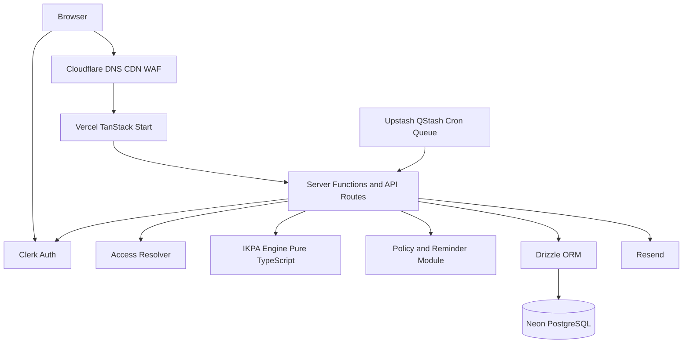
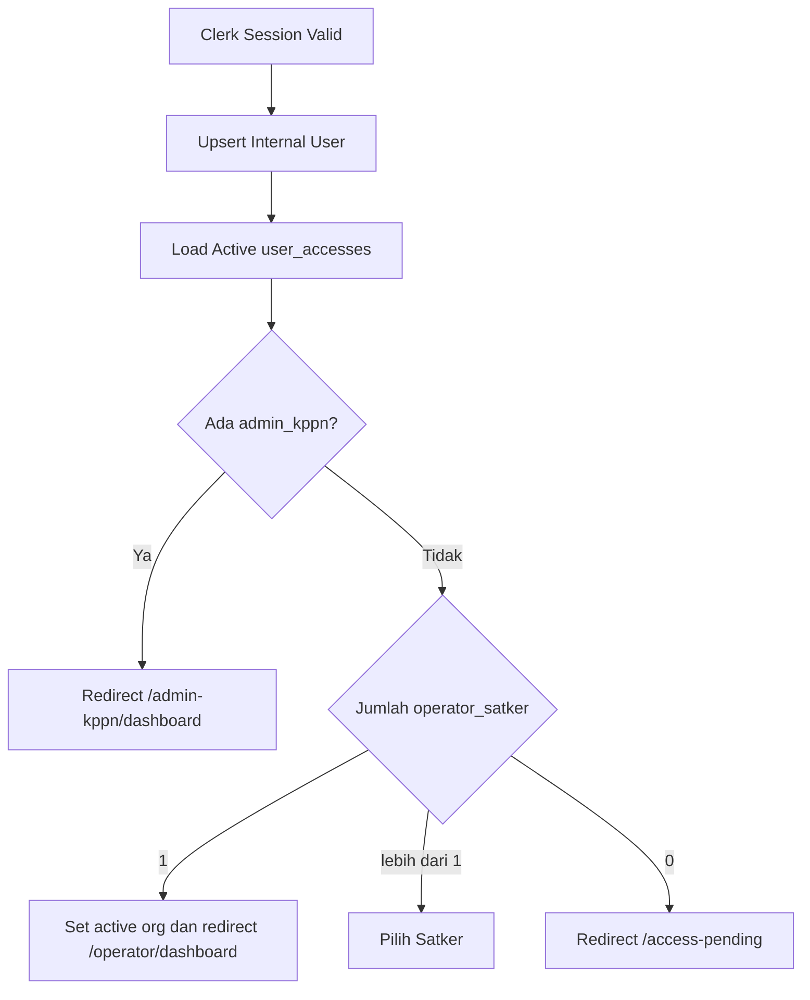

# TSD — Technical Specification Document

**Produk:** Simulator Penilaian IKPA Satker  
**Basis:** PRD Final v1.3 dan FSD MVP v1.0  
**Versi dokumen:** 1.0  
**Tanggal:** 31 Agustus 2026  
**Status:** Siap untuk desain teknis dan implementasi MVP  
**Bahasa UI:** Indonesia  
**Timezone default:** `Asia/Jakarta`

> **Disclaimer:** Sistem adalah simulator dan alat pengendalian internal, bukan sumber nilai IKPA resmi OMSPAN/KPPN. Perhitungan, tenggat, dan reminder wajib menggunakan rule set berversi yang dapat diaudit.

---

## 1. Ringkasan Teknis

### 1.1 Tujuan teknis

Membangun aplikasi web multi-satker untuk:

- Mengautentikasi pengguna melalui satu login.
- Mengarahkan pengguna berdasarkan mapping email ke area **Operator Satker** atau **Admin KPPN**.
- Mengelola input pelaksanaan anggaran dan menghitung simulasi IKPA secara deterministik.
- Menyimpan skenario dan snapshot dengan versi rule set yang dipakai.
- Menyediakan monitoring read-only lintas satker untuk Admin KPPN.
- Menjalankan reminder email yang patuh terhadap policy, kalender hari kerja, dan konfigurasi delivery satker.
- Mendukung penerbitan rule set/policy baru tanpa deploy aplikasi.

### 1.2 Arsitektur target



### 1.3 Prinsip desain

- **Server-authoritative:** Otorisasi, validasi, scope organisasi, perhitungan, publish policy, dan pengiriman email dilakukan serta diverifikasi di server.
- **Pure domain logic:** Engine IKPA dan modul policy/reminder tidak mengakses HTTP, database, atau komponen React secara langsung.
- **Versioned regulation:** Semua formula, parameter, deadline, dan reminder policy diambil dari rule set versioned.
- **Auditability:** Snapshot skor, publish policy, konfigurasi reminder, mutasi data penting, mapping akses, dan delivery email memiliki audit trail.
- **Tenant isolation:** Operator Satker hanya bisa memutasi data satker yang dipetakan; Admin KPPN hanya dapat membaca data satker dalam cakupan KPPN serta mengelola policy/akses pada scope-nya.
- **Idempotent jobs:** Setiap delivery email memiliki idempotency key yang unik dan dilindungi unique constraint.
- **No hidden recalculation:** Snapshot historis tidak dihitung ulang otomatis ketika rule set baru dipublikasikan.

---

## 2. Stack dan Struktur Proyek

### 2.1 Stack

| Area | Teknologi | Versi/konvensi |
|---|---|---|
| Framework | TanStack Start + React + TypeScript | Strict TypeScript; SSR/CSR hybrid |
| UI | Tailwind CSS + shadcn/ui + Radix UI | Komponen aksesibel dan responsif |
| Data visualisasi | Recharts | Client-only untuk grafik interaktif |
| Database | PostgreSQL pada NeonDB | Serverless PostgreSQL |
| ORM | Drizzle ORM + drizzle-kit | Schema, migration, query helper |
| Validasi | Zod | Shared schema pada form/server/domain boundary |
| Auth | Clerk | Email login, session, MFA opsional |
| Job/queue | Upstash QStash | Cron harian, queue import dan notifikasi |
| Email | Resend + React Email | Email transaksional dan template |
| Hosting | Vercel | Server runtime, preview deployment, CI/CD |
| Edge/security | Cloudflare | DNS, CDN, WAF, TLS, rate limiting |
| Testing | Vitest + Testing Library + Playwright | Unit, component, E2E |
| Observability | Vercel Logs; Sentry opsional | Monitoring error dan request |

### 2.2 Monorepo usulan

```text
apps/
  web/
    src/
      routes/
        __root.tsx
        index.tsx
        sign-in.tsx
        access-pending.tsx
        operator/
          dashboard.tsx
          simulation.tsx
          data/
          history.tsx
          analysis.tsx
          reports.tsx
          reminders.tsx
          guides.tsx
          settings.tsx
        admin-kppn/
          dashboard.tsx
          satker/
          monitoring/
          reports.tsx
          policy/
          audit-logs.tsx
          access.tsx
      components/
        layout/
        dashboard/
        forms/
        data-tables/
        charts/
        reminders/
        policy/
      server/
        auth/
        actions/
        queries/
        jobs/
        exports/
      emails/
        reminder-email.tsx
        digest-email.tsx
        escalation-email.tsx
      lib/
        format.ts
        constants.ts
        date.ts
        route-guards.ts
packages/
  ikpa-engine/
    src/
      calculate.ts
      indicators/
      recommendation.ts
      types.ts
      schemas.ts
      __tests__/
  policy-reminder/
    src/
      rule-set-resolver.ts
      deadline-calculator.ts
      compliance-guard.ts
      reminder-scheduler.ts
      types.ts
      schemas.ts
      __tests__/
  access-control/
    src/
      access-resolver.ts
      scope-guard.ts
      types.ts
      __tests__/
  db/
    src/
      schema/
      queries/
      migrations/
      client.ts
  ui/
    src/
      components/
      styles/
```

### 2.3 Konvensi kode

- Gunakan TypeScript strict mode (`strict: true`).
- Gunakan `zod` untuk validasi input dan parsing konfigurasi JSONB.
- Semua nominal Rupiah memakai `numeric` di database dan `Decimal` atau integer Rupiah pada domain; jangan menggunakan JavaScript floating point untuk kalkulasi uang.
- Semua waktu disimpan sebagai `timestamptz` UTC; tampilan dikonversi ke timezone satker, default `Asia/Jakarta`.
- Tanggal bisnis berbasis hari kerja diolah sebagai tanggal lokal (`YYYY-MM-DD`) dengan kalender `workdays`.
- Semua mutasi menggunakan server action/function dan mengembalikan error terstruktur.
- Semua query bisnis wajib memakai helper scope, bukan `org_id` bebas dari input klien.

---

## 3. Identity, Access, dan Routing

### 3.1 Model autentikasi

Clerk mengelola login, logout, reset password, verifikasi email, session, dan MFA opsional. Aplikasi menyimpan profil internal pada tabel `users` dan mapping otorisasi pada `user_accesses`.

Aplikasi tidak menggunakan role operasional Clerk sebagai sumber otorisasi utama. Clerk menjadi identity provider; akses domain ditentukan oleh mapping internal aplikasi.

### 3.2 Tipe akses

```ts
export const accessTypeSchema = z.enum([
  'operator_satker',
  'admin_kppn',
])

export type AccessType = z.infer<typeof accessTypeSchema>
```

| Akses | Scope | Kemampuan |
|---|---|---|
| `operator_satker` | Satu `org_id` per mapping | CRUD seluruh data operasional satker, simulasi, reminder configuration, ekspor, dan pengaturan satker |
| `admin_kppn` | Satu `kppn_scope_id` per mapping | Read-only monitoring satker dalam scope, CRUD rule set/policy/workdays/access mapping, ekspor agregat, retry delivery gagal |

### 3.3 Resolusi akses setelah login



### 3.4 Access resolver interface

```ts
export type ResolvedAccess =
  | {
      kind: 'operator_satker'
      userId: string
      orgId: string
      clerkUserId: string
      email: string
    }
  | {
      kind: 'admin_kppn'
      userId: string
      kppnScopeId: string
      clerkUserId: string
      email: string
    }

export async function requireAccess(
  expected: AccessType | AccessType[],
): Promise<ResolvedAccess>
```

### 3.5 Route guard

- Semua route `/operator/*` memanggil `requireAccess('operator_satker')` di loader/server function.
- Semua route `/admin-kppn/*` memanggil `requireAccess('admin_kppn')`.
- API/server function tidak mempercayai `orgId`, `accessType`, atau `kppnScopeId` dari browser tanpa mengecek hasil resolver.
- Untuk Admin KPPN, query satker harus menggunakan `assertOrgInKppnScope(orgId, kppnScopeId)`.
- Untuk Operator Satker, query dan mutasi menggunakan `resolvedAccess.orgId`; client tidak boleh menentukan `org_id` lain.

### 3.6 Proteksi admin terakhir

Pada mutasi `user_accesses` untuk Admin KPPN:

1. Jalankan transaksi database.
2. Kunci atau hitung akses admin aktif dalam `kppn_scope_id` terkait.
3. Tolak nonaktifkan/hapus mapping apabila tersisa nol Admin KPPN aktif.
4. Simpan audit log sebelum transaksi selesai.

---

## 4. Domain Model dan Database

### 4.1 Enum inti

```sql
CREATE TYPE access_type AS ENUM ('operator_satker', 'admin_kppn');
CREATE TYPE rule_set_status AS ENUM ('draft', 'published', 'retired');
CREATE TYPE reminder_category AS ENUM ('mandatory', 'recommended', 'optional');
CREATE TYPE reminder_day_type AS ENUM ('workday', 'calendar_day', 'event_based', 'schedule');
CREATE TYPE notification_status AS ENUM ('scheduled', 'sent', 'skipped', 'failed');
CREATE TYPE simulation_type AS ENUM ('actual', 'forecast', 'scenario');
CREATE TYPE import_status AS ENUM ('uploaded', 'validating', 'ready', 'processing', 'completed', 'failed', 'cancelled');
```

### 4.2 Tabel akses dan scope

```sql
CREATE TABLE kppn_scopes (
  id uuid PRIMARY KEY DEFAULT gen_random_uuid(),
  code text NOT NULL UNIQUE,
  name text NOT NULL,
  created_at timestamptz NOT NULL DEFAULT now(),
  updated_at timestamptz NOT NULL DEFAULT now()
);

CREATE TABLE users (
  id uuid PRIMARY KEY DEFAULT gen_random_uuid(),
  clerk_user_id text NOT NULL UNIQUE,
  email text NOT NULL UNIQUE,
  name text,
  created_at timestamptz NOT NULL DEFAULT now(),
  updated_at timestamptz NOT NULL DEFAULT now()
);

CREATE TABLE user_accesses (
  id uuid PRIMARY KEY DEFAULT gen_random_uuid(),
  user_id uuid NOT NULL REFERENCES users(id),
  access_type access_type NOT NULL,
  org_id uuid REFERENCES organizations(id),
  kppn_scope_id uuid REFERENCES kppn_scopes(id),
  active boolean NOT NULL DEFAULT true,
  created_by uuid REFERENCES users(id),
  created_at timestamptz NOT NULL DEFAULT now(),
  updated_at timestamptz NOT NULL DEFAULT now(),
  CHECK (
    (access_type = 'operator_satker' AND org_id IS NOT NULL AND kppn_scope_id IS NULL)
    OR
    (access_type = 'admin_kppn' AND org_id IS NULL AND kppn_scope_id IS NOT NULL)
  )
);

CREATE UNIQUE INDEX user_accesses_active_unique
  ON user_accesses (user_id, access_type, org_id, kppn_scope_id)
  WHERE active = true;
```

### 4.3 Organisasi dan tahun anggaran

```sql
CREATE TABLE organizations (
  id uuid PRIMARY KEY DEFAULT gen_random_uuid(),
  clerk_org_id text UNIQUE,
  kppn_scope_id uuid NOT NULL REFERENCES kppn_scopes(id),
  kode_satker text NOT NULL UNIQUE,
  name text NOT NULL,
  kppn_name text,
  is_blu boolean NOT NULL DEFAULT false,
  timezone text NOT NULL DEFAULT 'Asia/Jakarta',
  created_at timestamptz NOT NULL DEFAULT now(),
  updated_at timestamptz NOT NULL DEFAULT now()
);

CREATE TABLE fiscal_years (
  id uuid PRIMARY KEY DEFAULT gen_random_uuid(),
  org_id uuid NOT NULL REFERENCES organizations(id),
  year integer NOT NULL CHECK (year BETWEEN 2020 AND 2100),
  active_rule_set_id uuid,
  created_at timestamptz NOT NULL DEFAULT now(),
  updated_at timestamptz NOT NULL DEFAULT now(),
  UNIQUE (org_id, year)
);
```

### 4.4 Rule set dan policy reminder

```sql
CREATE TABLE rule_sets (
  id uuid PRIMARY KEY DEFAULT gen_random_uuid(),
  year integer NOT NULL CHECK (year BETWEEN 2020 AND 2100),
  version text NOT NULL,
  effective_from timestamptz NOT NULL,
  status rule_set_status NOT NULL DEFAULT 'draft',
  source_regulation text NOT NULL,
  change_notes text NOT NULL,
  config_json jsonb NOT NULL,
  created_by uuid NOT NULL REFERENCES users(id),
  published_at timestamptz,
  retired_at timestamptz,
  created_at timestamptz NOT NULL DEFAULT now(),
  updated_at timestamptz NOT NULL DEFAULT now(),
  UNIQUE (year, version)
);

CREATE INDEX rule_sets_resolver_idx
  ON rule_sets (year, status, effective_from DESC);

CREATE TABLE reminder_policies (
  id uuid PRIMARY KEY DEFAULT gen_random_uuid(),
  rule_set_id uuid NOT NULL REFERENCES rule_sets(id) ON DELETE CASCADE,
  event_type text NOT NULL,
  indicator_key text NOT NULL,
  category reminder_category NOT NULL,
  deadline_formula jsonb NOT NULL,
  day_type reminder_day_type NOT NULL,
  min_lead_days integer NOT NULL CHECK (min_lead_days >= 1),
  max_lead_days integer NOT NULL CHECK (max_lead_days >= min_lead_days),
  default_schedule_json jsonb NOT NULL,
  required_recipients_json jsonb NOT NULL DEFAULT '[]'::jsonb,
  allow_disable boolean NOT NULL DEFAULT true,
  allow_recipient_override boolean NOT NULL DEFAULT true,
  is_active boolean NOT NULL DEFAULT true,
  created_at timestamptz NOT NULL DEFAULT now(),
  updated_at timestamptz NOT NULL DEFAULT now(),
  UNIQUE (rule_set_id, event_type),
  CHECK (category <> 'mandatory' OR allow_disable = false)
);

ALTER TABLE fiscal_years
  ADD CONSTRAINT fiscal_years_active_rule_set_fk
  FOREIGN KEY (active_rule_set_id) REFERENCES rule_sets(id);
```

### 4.5 Kalender kerja

```sql
CREATE TABLE workdays (
  id uuid PRIMARY KEY DEFAULT gen_random_uuid(),
  year integer NOT NULL CHECK (year BETWEEN 2020 AND 2100),
  date date NOT NULL,
  is_holiday boolean NOT NULL DEFAULT false,
  description text,
  created_by uuid REFERENCES users(id),
  created_at timestamptz NOT NULL DEFAULT now(),
  updated_at timestamptz NOT NULL DEFAULT now(),
  UNIQUE (year, date)
);

CREATE INDEX workdays_year_date_idx ON workdays (year, date);
```

### 4.6 Tabel input IKPA

```sql
CREATE TABLE budgets (
  id uuid PRIMARY KEY DEFAULT gen_random_uuid(),
  fiscal_year_id uuid NOT NULL REFERENCES fiscal_years(id),
  account_code text NOT NULL CHECK (account_code IN ('51', '52', '53', '57')),
  amount numeric(18,2) NOT NULL CHECK (amount >= 0),
  effective_at date NOT NULL,
  created_by uuid REFERENCES users(id),
  deleted_at timestamptz,
  created_at timestamptz NOT NULL DEFAULT now(),
  updated_at timestamptz NOT NULL DEFAULT now()
);

CREATE TABLE dipa_revisions (
  id uuid PRIMARY KEY DEFAULT gen_random_uuid(),
  fiscal_year_id uuid NOT NULL REFERENCES fiscal_years(id),
  revision_date date NOT NULL,
  revision_code text NOT NULL,
  pagu_before numeric(18,2) NOT NULL CHECK (pagu_before >= 0),
  pagu_after numeric(18,2) NOT NULL CHECK (pagu_after >= 0),
  notes text,
  created_by uuid REFERENCES users(id),
  deleted_at timestamptz,
  created_at timestamptz NOT NULL DEFAULT now(),
  updated_at timestamptz NOT NULL DEFAULT now()
);

CREATE TABLE rpd_lines (
  id uuid PRIMARY KEY DEFAULT gen_random_uuid(),
  fiscal_year_id uuid NOT NULL REFERENCES fiscal_years(id),
  month smallint NOT NULL CHECK (month BETWEEN 1 AND 12),
  account_code text NOT NULL CHECK (account_code IN ('51', '52', '53', '57')),
  amount numeric(18,2) NOT NULL CHECK (amount >= 0),
  created_by uuid REFERENCES users(id),
  deleted_at timestamptz,
  created_at timestamptz NOT NULL DEFAULT now(),
  updated_at timestamptz NOT NULL DEFAULT now(),
  UNIQUE NULLS NOT DISTINCT (fiscal_year_id, month, account_code, deleted_at)
);

CREATE TABLE realizations (
  id uuid PRIMARY KEY DEFAULT gen_random_uuid(),
  fiscal_year_id uuid NOT NULL REFERENCES fiscal_years(id),
  month smallint NOT NULL CHECK (month BETWEEN 1 AND 12),
  account_code text NOT NULL CHECK (account_code IN ('51', '52', '53', '57')),
  amount numeric(18,2) NOT NULL CHECK (amount >= 0),
  created_by uuid REFERENCES users(id),
  deleted_at timestamptz,
  created_at timestamptz NOT NULL DEFAULT now(),
  updated_at timestamptz NOT NULL DEFAULT now(),
  UNIQUE NULLS NOT DISTINCT (fiscal_year_id, month, account_code, deleted_at)
);

CREATE TABLE contracts (
  id uuid PRIMARY KEY DEFAULT gen_random_uuid(),
  fiscal_year_id uuid NOT NULL REFERENCES fiscal_years(id),
  contract_number text,
  account_code text NOT NULL CHECK (account_code IN ('51', '52', '53', '57')),
  value numeric(18,2) NOT NULL CHECK (value > 0),
  signed_at date NOT NULL,
  payment_type text NOT NULL CHECK (payment_type IN ('sekaligus', 'termin')),
  sp2d_at date,
  created_by uuid REFERENCES users(id),
  deleted_at timestamptz,
  created_at timestamptz NOT NULL DEFAULT now(),
  updated_at timestamptz NOT NULL DEFAULT now(),
  UNIQUE NULLS NOT DISTINCT (fiscal_year_id, contract_number, deleted_at)
);

CREATE TABLE spm_ls (
  id uuid PRIMARY KEY DEFAULT gen_random_uuid(),
  fiscal_year_id uuid NOT NULL REFERENCES fiscal_years(id),
  contract_id uuid NOT NULL REFERENCES contracts(id),
  reference_number text,
  bast_bapp_date date NOT NULL,
  received_at_kppn date,
  is_pegawai boolean NOT NULL DEFAULT false,
  created_by uuid REFERENCES users(id),
  deleted_at timestamptz,
  created_at timestamptz NOT NULL DEFAULT now(),
  updated_at timestamptz NOT NULL DEFAULT now()
);

CREATE TABLE up_tup_transactions (
  id uuid PRIMARY KEY DEFAULT gen_random_uuid(),
  fiscal_year_id uuid NOT NULL REFERENCES fiscal_years(id),
  type text NOT NULL CHECK (type IN ('UP', 'TUP', 'GUP', 'GUP_NIHIL', 'PTUP', 'SETORAN_TUP')),
  amount numeric(18,2) NOT NULL CHECK (amount > 0),
  sp2d_at date NOT NULL,
  reference_sp2d_at date,
  created_by uuid REFERENCES users(id),
  deleted_at timestamptz,
  created_at timestamptz NOT NULL DEFAULT now(),
  updated_at timestamptz NOT NULL DEFAULT now()
);

CREATE TABLE kkp_usages (
  id uuid PRIMARY KEY DEFAULT gen_random_uuid(),
  fiscal_year_id uuid NOT NULL REFERENCES fiscal_years(id),
  month smallint NOT NULL CHECK (month BETWEEN 1 AND 12),
  amount numeric(18,2) NOT NULL CHECK (amount >= 0),
  created_by uuid REFERENCES users(id),
  deleted_at timestamptz,
  created_at timestamptz NOT NULL DEFAULT now(),
  updated_at timestamptz NOT NULL DEFAULT now(),
  UNIQUE NULLS NOT DISTINCT (fiscal_year_id, month, deleted_at)
);

CREATE TABLE output_reports (
  id uuid PRIMARY KEY DEFAULT gen_random_uuid(),
  fiscal_year_id uuid NOT NULL REFERENCES fiscal_years(id),
  ro_code text NOT NULL,
  month smallint NOT NULL CHECK (month BETWEEN 1 AND 12),
  rvro numeric(18,4) NOT NULL CHECK (rvro >= 0),
  volume_dipa numeric(18,4) NOT NULL CHECK (volume_dipa > 0),
  pcro numeric(8,4) NOT NULL CHECK (pcro BETWEEN 0 AND 100),
  tpcro numeric(8,4) NOT NULL CHECK (tpcro BETWEEN 0 AND 100),
  reported_at timestamptz NOT NULL,
  confirmed boolean NOT NULL DEFAULT false,
  created_by uuid REFERENCES users(id),
  deleted_at timestamptz,
  created_at timestamptz NOT NULL DEFAULT now(),
  updated_at timestamptz NOT NULL DEFAULT now(),
  UNIQUE NULLS NOT DISTINCT (fiscal_year_id, ro_code, month, deleted_at)
);

CREATE TABLE spm_q4 (
  id uuid PRIMARY KEY DEFAULT gen_random_uuid(),
  fiscal_year_id uuid NOT NULL REFERENCES fiscal_years(id),
  reference_number text,
  issued_at date NOT NULL,
  is_dispensasi boolean NOT NULL DEFAULT false,
  created_by uuid REFERENCES users(id),
  deleted_at timestamptz,
  created_at timestamptz NOT NULL DEFAULT now(),
  updated_at timestamptz NOT NULL DEFAULT now(),
  UNIQUE NULLS NOT DISTINCT (fiscal_year_id, reference_number, deleted_at)
);
```

> Implementasi Drizzle perlu menyesuaikan sintaks indeks unik partial/`NULLS NOT DISTINCT` dengan versi PostgreSQL yang digunakan. Bila portability menjadi pertimbangan, gunakan kolom `is_deleted` atau constraint unik di lapisan aplikasi plus indeks partial PostgreSQL.

### 4.7 Simulasi, snapshot, reminder, audit, dan import

```sql
CREATE TABLE simulations (
  id uuid PRIMARY KEY DEFAULT gen_random_uuid(),
  fiscal_year_id uuid NOT NULL REFERENCES fiscal_years(id),
  name text NOT NULL,
  type simulation_type NOT NULL,
  target_score numeric(8,4),
  parent_snapshot_id uuid,
  created_by uuid NOT NULL REFERENCES users(id),
  deleted_at timestamptz,
  created_at timestamptz NOT NULL DEFAULT now(),
  updated_at timestamptz NOT NULL DEFAULT now()
);

CREATE TABLE simulation_overrides (
  id uuid PRIMARY KEY DEFAULT gen_random_uuid(),
  simulation_id uuid NOT NULL REFERENCES simulations(id) ON DELETE CASCADE,
  entity_type text NOT NULL,
  entity_id uuid,
  patch_json jsonb NOT NULL,
  created_at timestamptz NOT NULL DEFAULT now(),
  updated_at timestamptz NOT NULL DEFAULT now()
);

CREATE TABLE score_snapshots (
  id uuid PRIMARY KEY DEFAULT gen_random_uuid(),
  simulation_id uuid NOT NULL REFERENCES simulations(id),
  period_end date NOT NULL,
  total_score numeric(8,4),
  breakdown_json jsonb NOT NULL,
  rule_set_version text NOT NULL,
  rule_set_id uuid NOT NULL REFERENCES rule_sets(id),
  input_hash text NOT NULL,
  created_by uuid NOT NULL REFERENCES users(id),
  created_at timestamptz NOT NULL DEFAULT now()
);

CREATE TABLE org_reminder_configs (
  id uuid PRIMARY KEY DEFAULT gen_random_uuid(),
  org_id uuid NOT NULL REFERENCES organizations(id),
  fiscal_year_id uuid NOT NULL REFERENCES fiscal_years(id),
  reminder_policy_id uuid NOT NULL REFERENCES reminder_policies(id),
  enabled boolean NOT NULL DEFAULT true,
  schedule_json jsonb NOT NULL,
  additional_recipients_json jsonb NOT NULL DEFAULT '[]'::jsonb,
  custom_message text,
  timezone text NOT NULL DEFAULT 'Asia/Jakarta',
  updated_by uuid NOT NULL REFERENCES users(id),
  created_at timestamptz NOT NULL DEFAULT now(),
  updated_at timestamptz NOT NULL DEFAULT now(),
  UNIQUE (org_id, fiscal_year_id, reminder_policy_id)
);

CREATE TABLE notification_deliveries (
  id uuid PRIMARY KEY DEFAULT gen_random_uuid(),
  org_id uuid NOT NULL REFERENCES organizations(id),
  reminder_policy_id uuid NOT NULL REFERENCES reminder_policies(id),
  rule_set_version text NOT NULL,
  entity_type text,
  entity_id uuid,
  scheduled_for timestamptz NOT NULL,
  sent_at timestamptz,
  status notification_status NOT NULL DEFAULT 'scheduled',
  attempt_count integer NOT NULL DEFAULT 0,
  idempotency_key text NOT NULL UNIQUE,
  payload_json jsonb NOT NULL,
  error_message text,
  created_at timestamptz NOT NULL DEFAULT now(),
  updated_at timestamptz NOT NULL DEFAULT now()
);

CREATE INDEX notification_deliveries_pending_idx
  ON notification_deliveries (status, scheduled_for)
  WHERE status IN ('scheduled', 'failed');

CREATE TABLE import_jobs (
  id uuid PRIMARY KEY DEFAULT gen_random_uuid(),
  org_id uuid NOT NULL REFERENCES organizations(id),
  fiscal_year_id uuid NOT NULL REFERENCES fiscal_years(id),
  domain text NOT NULL,
  filename text NOT NULL,
  storage_key text,
  status import_status NOT NULL DEFAULT 'uploaded',
  total_rows integer NOT NULL DEFAULT 0,
  valid_rows integer NOT NULL DEFAULT 0,
  invalid_rows integer NOT NULL DEFAULT 0,
  error_report_json jsonb,
  created_by uuid NOT NULL REFERENCES users(id),
  created_at timestamptz NOT NULL DEFAULT now(),
  updated_at timestamptz NOT NULL DEFAULT now()
);

CREATE TABLE audit_logs (
  id uuid PRIMARY KEY DEFAULT gen_random_uuid(),
  org_id uuid REFERENCES organizations(id),
  actor_id uuid REFERENCES users(id),
  actor_access_type access_type,
  entity_type text NOT NULL,
  entity_id uuid,
  action text NOT NULL,
  before_json jsonb,
  after_json jsonb,
  rule_set_version text,
  policy_id uuid REFERENCES reminder_policies(id),
  request_id text,
  created_at timestamptz NOT NULL DEFAULT now()
);

CREATE INDEX audit_logs_org_created_idx ON audit_logs (org_id, created_at DESC);
CREATE INDEX audit_logs_entity_idx ON audit_logs (entity_type, entity_id, created_at DESC);
```

### 4.8 Indeks tambahan

- `fiscal_years(org_id, year)` unique.
- `budgets(fiscal_year_id, account_code, effective_at)`.
- `rpd_lines(fiscal_year_id, month, account_code)`.
- `realizations(fiscal_year_id, month, account_code)`.
- `contracts(fiscal_year_id, signed_at)` dan `contracts(fiscal_year_id, account_code)`.
- `spm_ls(fiscal_year_id, bast_bapp_date)` dan `spm_ls(contract_id)`.
- `output_reports(fiscal_year_id, month, ro_code)`.
- `score_snapshots(simulation_id, period_end DESC)`.
- `org_reminder_configs(org_id, fiscal_year_id)`.
- `notification_deliveries(org_id, scheduled_for DESC)`.

---

## 5. Rule Set dan Engine IKPA

### 5.1 Struktur rule set

`rule_sets.config_json` wajib divalidasi oleh schema Zod sebelum draft disimpan dan sebelum publish.

```ts
const ruleSetConfigSchema = z.object({
  scoring: z.object({
    indicatorWeights: z.object({
      dipaRevision: z.number().min(0).max(1),
      rpdDeviation: z.number().min(0).max(1),
      absorption: z.number().min(0).max(1),
      contractual: z.number().min(0).max(1),
      invoiceTimeliness: z.number().min(0).max(1),
      upTup: z.number().min(0).max(1),
      outputAchievement: z.number().min(0).max(1),
    }),
    rounding: z.object({
      scale: z.number().int().min(0).max(4),
      mode: z.enum(['HALF_UP', 'HALF_EVEN', 'DOWN']),
    }),
  }),
  dipaRevision: z.object({
    eligibleRevisionCodes: z.array(z.string()),
    semesterScores: z.object({
      zeroOrOne: z.number(),
      two: z.number(),
      threeOrMore: z.number(),
    }),
  }),
  rpdDeviation: z.object({
    maxScoreDeviationThreshold: z.number().min(0).max(1),
    scoreCurve: z.array(z.object({
      minDeviation: z.number(),
      maxDeviation: z.number().nullable(),
      score: z.number(),
    })),
  }),
  absorption: z.object({
    targets: z.record(z.enum(['51', '52', '53', '57']), z.array(z.number().min(0).max(1)).length(4)),
  }),
  contractual: z.object({
    minimumContractValue: z.string(),
    distributionBuckets: z.array(z.unknown()),
    earlyContractRules: z.array(z.unknown()),
    capital53Rules: z.object({
      minValue: z.string(),
      maxValue: z.string(),
      allowedPaymentType: z.literal('sekaligus'),
      scoreByQuarter: z.record(z.enum(['1', '2', '3', '4']), z.number()),
    }),
  }),
  invoiceTimeliness: z.object({
    maximumWorkdays: z.number().int().positive(),
  }),
  upTup: z.object({
    cashWeight: z.number().min(0).max(1),
    kkpWeight: z.number().min(0).max(1),
    kkpTargets: z.array(z.number().min(0).max(1)).length(4),
  }),
  outputAchievement: z.object({
    timelinessWeight: z.number().min(0).max(1),
    achievementWeight: z.number().min(0).max(1),
    reportDeadlineWorkdays: z.number().int().positive(),
  }),
  dispensation: z.object({
    deductionBuckets: z.array(z.object({
      minPermille: z.number().min(0),
      maxPermille: z.number().nullable(),
      deduction: z.number().min(0),
    })),
  }),
  verification: z.object({
    assumptions: z.array(z.object({
      key: z.string(),
      description: z.string(),
      status: z.enum(['verified', 'needs_verification']),
      source: z.string().optional(),
    })),
  }),
})
```

Validasi publish tambahan:

- Jumlah tujuh bobot indikator harus sama dengan 1, dengan toleransi decimal yang ditetapkan.
- `cashWeight + kkpWeight = 1`.
- `timelinessWeight + achievementWeight = 1`.
- Bucket tidak boleh saling tumpang tindih dan harus memiliki cakupan yang valid.
- Parameter `numeric` untuk uang diparsing sebagai Decimal/string, bukan `number` untuk kalkulasi keuangan.

### 5.2 Kontrak engine

```ts
export type IkpaCalculationInput = {
  fiscalYear: number
  periodEnd: string
  isBlu: boolean
  ruleSet: RuleSetConfig
  workdays: Workday[]
  data: IkpaSourceData
  scenarioOverrides?: SimulationOverride[]
}

export type IkpaCalculationResult = {
  totalScore: Decimal | null
  indicators: IndicatorResult[]
  dispensationDeduction: Decimal
  recommendations: Recommendation[]
  missingData: MissingDataItem[]
  ruleSetId: string
  ruleSetVersion: string
  calculatedAt: string
}
```

### 5.3 Urutan proses engine

1. Validasi input domain dengan Zod.
2. Terapkan overlay `simulation_overrides` tanpa menulis ke data actual.
3. Tentukan periode yang eligible untuk setiap indikator.
4. Hitung hasil indikator satu per satu.
5. Tandai indikator sebagai `complete`, `warning`, atau `incomplete`.
6. Hitung kontribusi berbobot hanya untuk indikator dengan nilai valid sesuai policy perhitungan.
7. Hitung pengurang dispensasi.
8. Bentuk nilai total dan flag estimasi bila terdapat data incomplete.
9. Hasilkan formula trace dan rekomendasi.
10. Pembulatan dilakukan pada tahap yang didefinisikan rule set, bukan tersebar di komponen UI.

### 5.4 Modul indikator

```text
packages/ikpa-engine/src/indicators/
  dipa-revision.ts
  rpd-deviation.ts
  absorption.ts
  contractual.ts
  invoice-timeliness.ts
  up-tup.ts
  output-achievement.ts
  spm-dispensation.ts
```

Setiap modul mengembalikan struktur seragam:

```ts
export type IndicatorResult = {
  key: string
  score: Decimal | null
  weight: Decimal
  weightedContribution: Decimal | null
  status: 'complete' | 'incomplete' | 'warning'
  inputs: Record<string, unknown>
  formulaTrace: string[]
  warnings: string[]
}
```

### 5.5 Perhitungan hari kerja

```ts
export type WorkdayCalendar = {
  isWorkday(date: LocalDate): boolean
  addWorkdays(startDate: LocalDate, days: number): LocalDate
  subtractWorkdays(startDate: LocalDate, days: number): LocalDate
  countWorkdaysInclusiveOrExclusive(
    startDate: LocalDate,
    endDate: LocalDate,
    mode: 'exclusive_start' | 'inclusive_start',
  ): number
}
```

Konvensi bisnis yang harus dikunci melalui test:

- Definisikan dengan eksplisit apakah tanggal BAST/BAPP dihitung sebagai hari ke-0 atau hari ke-1 pada aturan H+17.
- Definisikan dengan eksplisit apakah H-0 berarti dikirim pada tanggal deadline dan jam pengiriman yang berlaku.
- Hari libur berasal dari `workdays.is_holiday=true`; akhir pekan diperlakukan sebagai bukan hari kerja kecuali kalender menyatakan sebaliknya.
- Perubahan interpretasi aturan harus diimplementasikan melalui rule set atau versioned calculator option, bukan perubahan diam-diam.

### 5.6 Golden tests minimum

- Revisi DIPA: Semester I 1 revisi dan Semester II 3 revisi menghasilkan nilai tahunan 80.
- Penyerapan Q1: dataset contoh menghasilkan nilai 92,67 sesuai pembulatan rule set.
- Penyelesaian tagihan: 13 dari 15 SPM tepat waktu menghasilkan 86,67.
- Dispensasi: 24 dari 5.200 SPM Q4 menghasilkan 4,62‰ dan pengurang 0,75.
- Output tidak terkonfirmasi menghasilkan nilai nol sesuai policy.
- Kontrak akun 53 bernilai Rp50–200 juta dan bukan termin mendapatkan eligibility akselerasi; kontrak termin tidak eligible.

---

## 6. Policy, Reminder, dan Scheduler

### 6.1 Model policy dua lapisan

| Lapisan | Sumber data | Diubah oleh | Isi |
|---|---|---|---|
| Regulatory policy layer | `rule_sets`, `reminder_policies`, `workdays` | Admin KPPN | Event, formula deadline, kategori, type hari, lead-time limit, default schedule, required recipient |
| Organization delivery layer | `org_reminder_configs` | Operator Satker | Enabled bila diizinkan, lead days, jam, penerima tambahan, eskalasi, digest, pesan internal |

### 6.2 Tipe event stabil

```ts
export const reminderEventTypes = [
  'rpd_update_due',
  'absorption_gap_due',
  'early_contract_due',
  'capital_53_contract_due',
  'invoice_timeliness_due',
  'gup_ptup_due',
  'tup_deposit_due',
  'kkp_target_due',
  'output_report_due',
  'spm_dispensation_risk',
  'dipa_revision_threshold',
  'ikpa_weekly_digest',
] as const
```

### 6.3 Schema policy reminder

```ts
const reminderPolicySchema = z.object({
  eventType: z.string().min(1),
  indicatorKey: z.string().min(1),
  category: z.enum(['mandatory', 'recommended', 'optional']),
  deadlineFormula: z.record(z.unknown()),
  dayType: z.enum(['workday', 'calendar_day', 'event_based', 'schedule']),
  minLeadDays: z.number().int().min(1),
  maxLeadDays: z.number().int().min(1),
  defaultSchedule: z.array(z.object({
    leadDays: z.number().int().min(0),
    sendTime: z.string().regex(/^\d{2}:\d{2}$/),
    escalation: z.boolean().default(false),
  })).min(1),
  requiredRecipients: z.array(z.object({
    type: z.enum(['role', 'user', 'email_group']),
    value: z.string().min(1),
  })),
  allowDisable: z.boolean(),
  allowRecipientOverride: z.boolean(),
  isActive: z.boolean(),
}).superRefine((value, ctx) => {
  if (value.maxLeadDays < value.minLeadDays) {
    ctx.addIssue({ code: z.ZodIssueCode.custom, message: 'maxLeadDays harus lebih besar atau sama dengan minLeadDays' })
  }
  if (value.category === 'mandatory' && value.allowDisable) {
    ctx.addIssue({ code: z.ZodIssueCode.custom, message: 'Reminder mandatory tidak boleh di-disable' })
  }
})
```

### 6.4 Schema konfigurasi satker

```ts
const orgReminderConfigSchema = z.object({
  enabled: z.boolean(),
  timezone: z.string().min(1),
  schedule: z.array(z.object({
    leadDays: z.number().int().min(0),
    sendTime: z.string().regex(/^\d{2}:\d{2}$/),
    escalation: z.boolean().default(false),
  })).min(1),
  additionalRecipients: z.array(z.object({
    type: z.enum(['user', 'email_group']),
    value: z.string().min(1),
  })),
  customMessage: z.string().max(1000).optional(),
})
```

### 6.5 Compliance Guard

```ts
export function validateOrgReminderConfig(
  policy: ReminderPolicy,
  config: OrgReminderConfig,
): ValidationResult {
  // 1. Mandatory must remain enabled.
  // 2. Every leadDays must stay within policy minimum/maximum.
  // 3. Schedule must resolve at or before deadline.
  // 4. Required recipients remain part of final recipient set.
  // 5. Only permitted recipient changes are accepted.
}
```

Aturan yang diterapkan:

- Jika policy `mandatory`, `enabled` dipaksa `true` dan request `false` ditolak.
- Semua lead time Operator harus berada pada interval policy.
- Schedule dengan H-0 diizinkan bila policy mengizinkan `leadDays=0`; batas `minLeadDays` berlaku pada pengaturan override sesuai semantik policy. Untuk menghindari ambiguitas, field policy dapat diperluas menjadi `allowedLeadDays` pada versi berikutnya.
- Operator tidak dapat mengubah `deadlineFormula`, `dayType`, `category`, `requiredRecipients`, atau source regulation.
- Schedule wajib dihitung ulang untuk memastikan semua waktu kirim tidak melewati deadline.
- Final recipients = required recipients + recipients valid dari konfigurasi organisasi.

### 6.6 Deadline Calculator

`Deadline Calculator` menerima policy, entitas domain, kalender kerja, dan timezone organisasi.

```ts
export type DeadlineContext = {
  orgId: string
  fiscalYearId: string
  timezone: string
  now: Date
  entity: Record<string, unknown>
  workdayCalendar: WorkdayCalendar
}

export type DeadlineResult = {
  deadlineAt: Date | null
  triggerMatched: boolean
  reason: string
}
```

Contoh formula yang didukung pada MVP:

| Event | Input entitas | Formula |
|---|---|---|
| `invoice_timeliness_due` | `bast_bapp_date` | Tambah 17 hari kerja atau parameter policy |
| `output_report_due` | bulan laporan | Hari kerja ke-N bulan berikutnya |
| `rpd_update_due` | periode/triwulan | Tanggal policy pada awal triwulan |
| `absorption_gap_due` | triwulan | H-N dari akhir triwulan |
| `ikpa_weekly_digest` | jadwal | Hari dan jam mingguan policy/config |
| `dipa_revision_threshold` | event revisi | Trigger saat hitungan revisi eligible memenuhi threshold |

Formula disimpan sebagai JSON DSL yang terbatas, bukan JavaScript bebas. Contoh:

```json
{
  "kind": "add_workdays",
  "sourceField": "bast_bapp_date",
  "days": 17,
  "deadlineTime": "17:00"
}
```

### 6.7 Scheduler dan idempotensi

Idempotency key:

```text
sha256(
  orgId + ':' + reminderPolicyId + ':' + entityType + ':' + entityId + ':' +
  scheduledForISOString + ':' + ruleSetVersion
)
```

Proses:

1. Job harian memuat semua rule set published yang efektif.
2. Untuk setiap satker/tahun aktif, muat event policy aktif dan konfigurasi satker.
3. Evaluasi eligibility entitas dan deadline.
4. Hitung jadwal kirim dalam timezone satker, lalu normalisasi ke UTC.
5. Insert `notification_deliveries` menggunakan `ON CONFLICT (idempotency_key) DO NOTHING`.
6. Kirim hanya delivery berstatus `scheduled` dengan `scheduled_for <= now()`.
7. Setelah Resend berhasil, update menjadi `sent` dan isi `sent_at`.
8. Jika gagal, update menjadi `failed`, tambah `attempt_count`, dan simpan error aman.

### 6.8 QStash endpoint

| Endpoint | Method | Pengirim | Fungsi |
|---|---|---|---|
| `/api/jobs/reminders/daily` | POST | QStash Cron | Evaluasi jadwal dan enqueue delivery |
| `/api/jobs/reminders/send` | POST | QStash | Kirim satu batch delivery email |
| `/api/jobs/import/process` | POST | QStash | Memproses import besar |
| `/api/webhooks/clerk` | POST | Clerk | Sinkronisasi identity user bila diperlukan |

Semua endpoint job:

- Wajib memverifikasi signature QStash/Clerk.
- Menolak request tanpa signature valid.
- Menggunakan request ID untuk logging.
- Bersifat idempotent.

---

## 7. API dan Server Functions

### 7.1 Konvensi API

- Untuk TanStack Start, gunakan server functions untuk operasi UI internal dan route API untuk webhook/job/download apabila diperlukan.
- Semua payload divalidasi Zod.
- Semua respons error memakai bentuk konsisten:

```ts
type ApiError = {
  code: string
  message: string
  fieldErrors?: Record<string, string[]>
  requestId?: string
}
```

- Mutasi harus menulis audit log dalam transaksi yang sama jika memungkinkan.

### 7.2 Auth dan access

| Fungsi/endpoint | Akses | Tujuan |
|---|---|---|
| `getCurrentAccess` | Login | Membaca resolved access untuk routing/layout |
| `listOperatorOrganizations` | Operator | Memilih satker aktif bila memiliki lebih dari satu mapping |
| `listAccessMappings` | Admin KPPN | Menampilkan mapping email dalam scope |
| `createAccessMapping` | Admin KPPN | Menambah Operator/Admin KPPN |
| `updateAccessMapping` | Admin KPPN | Mengaktifkan/nonaktifkan atau mengubah scope mapping |
| `deleteAccessMapping` | Admin KPPN | Menghapus mapping, dengan guard admin terakhir |

### 7.3 Operator data functions

| Domain | Query | Mutasi |
|---|---|---|
| Dashboard | `getOperatorDashboard` | — |
| Simulation | `calculateSimulation`, `getSimulation` | `createSimulation`, `updateSimulation`, `createSnapshot`, `duplicateScenario`, `softDeleteSimulation` |
| Budget/Revisi | `listBudgets`, `listDipaRevisions` | `upsertBudget`, `upsertDipaRevision`, `deleteBudget`, `deleteDipaRevision` |
| RPD/Realisasi | `getRpdRealizationGrid` | `upsertRpdLines`, `upsertRealizations` |
| Kontrak/Tagihan | `listContracts`, `listSpmLs` | `upsertContract`, `upsertSpmLs`, `deleteContract`, `deleteSpmLs` |
| UP/TUP/KKP | `listUpTupTransactions`, `listKkpUsages` | `upsertUpTupTransaction`, `upsertKkpUsage`, delete equivalents |
| Output | `listOutputReports` | `upsertOutputReport`, `deleteOutputReport` |
| SPM Q4 | `listSpmQ4` | `upsertSpmQ4`, `deleteSpmQ4` |
| Reminder | `listOrgReminderConfigs`, `getReminderPreview` | `upsertOrgReminderConfig`, `resetReminderConfig` |
| Reports | `getSatkerReportData` | `exportSatkerXlsx`, `generateSatkerPdf` |
| Import | `getImportTemplates`, `getImportJob` | `createImportJob`, `validateImport`, `commitImport`, `cancelImport` |

### 7.4 Admin KPPN functions

| Domain | Query | Mutasi |
|---|---|---|
| Monitoring | `getAdminDashboard`, `listSatkerMonitoring`, `getSatkerDetailReadOnly` | — |
| Reminder monitoring | `listNotificationDeliveries`, `getDeliveryDetail` | `retryFailedDelivery` |
| Reports | `getAggregateReportData` | `exportAggregateXlsx`, `generateAggregatePdf` |
| Rule set | `listRuleSets`, `getRuleSet`, `compareRuleSets` | `createRuleSetDraft`, `updateRuleSetDraft`, `publishRuleSet`, `retireRuleSet` |
| Reminder policy | `listReminderPolicies`, `getReminderPolicy` | `upsertReminderPolicy`, `deleteReminderPolicy` |
| Workdays | `listWorkdays` | `upsertWorkday`, `bulkImportWorkdays` |
| Policy history | `getPolicyHistory` | — |
| Audit | `listAuditLogs` | — |
| Access | `listAccessMappings` | `createAccessMapping`, `updateAccessMapping`, `deleteAccessMapping` |

### 7.5 Contoh command server

```ts
const upsertContractInput = z.object({
  id: z.string().uuid().optional(),
  fiscalYearId: z.string().uuid(),
  contractNumber: z.string().trim().max(100).optional(),
  accountCode: z.enum(['51', '52', '53', '57']),
  value: z.string().regex(/^\d+(\.\d{1,2})?$/),
  signedAt: z.string().date(),
  paymentType: z.enum(['sekaligus', 'termin']),
  sp2dAt: z.string().date().optional(),
})

export const upsertContract = createServerFn({ method: 'POST' })
  .inputValidator(upsertContractInput)
  .handler(async ({ data }) => {
    const access = await requireAccess('operator_satker')
    const fiscalYear = await requireFiscalYearForOrg(data.fiscalYearId, access.orgId)
    const parsed = upsertContractInput.parse(data)

    return db.transaction(async (tx) => {
      const before = parsed.id ? await getContractForUpdate(tx, parsed.id, fiscalYear.id) : null
      const record = await saveContract(tx, parsed, access.userId)
      await writeAuditLog(tx, {
        orgId: access.orgId,
        actorId: access.userId,
        actorAccessType: access.kind,
        entityType: 'contract',
        entityId: record.id,
        action: before ? 'update' : 'create',
        beforeJson: before,
        afterJson: record,
      })
      return record
    })
  })
```

---

## 8. UI, State, dan Data Fetching

### 8.1 Layout

- `PublicLayout`: landing page, login, access pending.
- `OperatorLayout`: top bar satker/periode, sidebar Operator, user menu.
- `AdminKppnLayout`: top bar KPPN scope/periode, sidebar Admin KPPN, user menu.
- Layout memanggil access resolver dari server dan menolak akses tidak sesuai sebelum render data sensitif.

### 8.2 State management

- URL search params untuk filter: tahun, periode, satker, indikator, risiko, dan status.
- Form lokal menggunakan React Hook Form + Zod resolver atau form primitives TanStack yang tervalidasi Zod.
- Cache query menggunakan TanStack Query bila sesuai integrasi TanStack Start; query key harus mencakup `orgId`/`kppnScopeId`, fiscal year, dan filter.
- Jangan menyimpan data akses sensitif secara permanen di localStorage.
- Scenario override dikelola di state form sampai pengguna menyimpan; perhitungan dapat dipanggil dengan payload override tanpa mutasi actual.

### 8.3 Komponen reusable

```text
components/
  layout/
    public-header.tsx
    operator-sidebar.tsx
    admin-kppn-sidebar.tsx
    access-aware-layout.tsx
  dashboard/
    score-card.tsx
    indicator-card.tsx
    deadline-list.tsx
    recommendation-list.tsx
    completeness-checklist.tsx
  forms/
    currency-input.tsx
    account-code-select.tsx
    fiscal-year-select.tsx
    import-dropzone.tsx
  data-tables/
    server-data-table.tsx
    audit-log-table.tsx
  policy/
    rule-set-editor.tsx
    reminder-policy-editor.tsx
    workday-calendar.tsx
    rule-set-version-badge.tsx
  reminders/
    reminder-config-form.tsx
    reminder-schedule-preview.tsx
    delivery-status-badge.tsx
```

### 8.4 UX states wajib

- Loading skeleton pada dashboard dan tabel.
- Empty state dengan CTA input saat belum ada data.
- Incomplete state dengan daftar data wajib yang kurang.
- Error state dengan request ID bila gagal server.
- Confirm dialog sebelum soft delete, publish rule set, retire rule set, commit import, dan perubahan akses.
- Warning banner jika snapshot memakai rule set lama.
- Warning field jika reminder configuration melebihi batas policy.

---

## 9. Import dan Export

### 9.1 Import pipeline

1. Operator memilih domain dan mengunduh template.
2. Operator mengunggah CSV/XLSX.
3. Server memvalidasi file dasar: ukuran, ekstensi, MIME, header, dan jumlah baris.
4. Buat `import_jobs` dengan status `validating`.
5. File kecil diproses sinkron untuk preview; file besar disimpan sementara dan job QStash dipanggil.
6. Parser melakukan validasi baris dengan Zod dan validasi referensial terhadap fiscal year/satker.
7. Simpan `total_rows`, `valid_rows`, `invalid_rows`, dan error report.
8. Operator meninjau preview dan menjalankan `commitImport`.
9. Commit memakai transaksi per batch; semua write menggunakan `org_id` dari resolved access.
10. Simpan audit log dengan ringkasan import.

### 9.2 Batas import awal

- CSV dan XLSX.
- Maksimum ukuran awal: 10 MB per file.
- Maksimum 10.000 baris sinkron; di atas batas diproses asinkron.
- Maksimum 1.000 error baris ditampilkan dalam UI; keseluruhan error tersedia di laporan unduhan jika diperlukan.

### 9.3 Export

- XLSX dibangun di server dari query scoped.
- PDF dibangun di server; harus memuat disclaimer, nama satker/KPPN, periode, waktu cetak, filter, dan rule set version.
- File export memakai nama deterministik, misalnya `ikpa-{kode_satker}-{tahun}-{periode}-{timestamp}.xlsx`.
- Jangan membuat URL publik permanen untuk export sensitif; gunakan response download terautentikasi atau object storage signed URL berumur pendek bila R2 dipakai.

---

## 10. Keamanan, Privasi, dan Operasional

### 10.1 Keamanan aplikasi

- Wajib HTTPS melalui Cloudflare/Vercel.
- Terapkan Clerk middleware untuk route terproteksi.
- Terapkan authorization guard server-side pada setiap query/mutasi.
- Validasi Zod untuk semua input eksternal, termasuk CSV/XLSX hasil parsing.
- Gunakan prepared queries Drizzle; jangan membangun SQL dari string input pengguna.
- Terapkan rate limit Cloudflare terutama untuk login path, upload, export, dan endpoint webhook/job.
- Verifikasi signature Clerk webhook dan QStash request.
- Simpan secret hanya pada Vercel environment variables; tidak pada source control atau browser.
- Batasi ukuran upload dan lakukan validasi MIME/header.
- Sanitasi pesan internal reminder dan konten export untuk mencegah formula injection pada CSV/XLSX serta XSS pada rendering.

### 10.2 Isolasi tenant

- Seluruh data satker terhubung ke `fiscal_years.org_id` atau memiliki `org_id` langsung.
- Semua helper query menerima `orgId` dari access resolver, bukan dari request body.
- Query monitoring Admin KPPN menggunakan join `organizations.kppn_scope_id = resolvedAccess.kppnScopeId`.
- Uji negatif wajib memastikan operator tidak dapat membaca/mengubah resource org lain melalui ID yang ditebak.

### 10.3 Audit dan retensi

- Simpan audit log append-only bagi mutasi penting.
- Soft delete digunakan untuk entitas operasional; record aktif difilter melalui `deleted_at IS NULL`.
- Snapshot dan notification delivery tidak dihapus melalui UI MVP kecuali kebijakan retensi resmi ditetapkan.
- Tetapkan kebijakan retensi detail sebelum produksi; default MVP: simpan audit/snapshot minimal sepanjang tahun berjalan dan periode evaluasi yang ditetapkan organisasi.

### 10.4 Observability

- Log terstruktur: request ID, actor ID ter-hash/terbatas, org ID, route, latency, status, error code.
- Jangan memasukkan nominal lengkap, data personal, token, atau payload email penuh ke log aplikasi kecuali diperlukan dan dilindungi.
- Dashboard monitoring minimum: gagal job QStash, gagal delivery Resend, error rate server, durasi kalkulasi, dan import job stuck.
- Alert awal: job harian gagal, tingkat delivery gagal melewati threshold, atau publish rule set gagal validasi.

---

## 11. Testing dan Quality Gate

### 11.1 Unit test — Vitest

- Seluruh modul indikator IKPA.
- Kalkulator hari kerja dan deadline.
- Rule set resolver berdasarkan tahun/tanggal efektif.
- Compliance Guard mandatory/recommended/optional.
- Scheduler dan pembentukan idempotency key.
- Access resolver dan scope guard.
- Parser import per domain.

### 11.2 Golden tests engine

| Kasus | Expected |
|---|---|
| Revisi DIPA | Smt I 1 revisi, Smt II 3 revisi = 80 |
| Penyerapan Q1 | Dataset referensi = 92,67 |
| Penyelesaian tagihan | 13/15 tepat waktu = 86,67 |
| Dispensasi SPM | 24/5.200 = 4,62‰; pengurang 0,75 |
| Output belum dikonfirmasi | Nilai sesuai policy = 0 |
| Kontrak 53 termin | Tidak eligible akselerasi 53 |
| Hari kerja | Libur/weekend tidak menambah hitungan H+17 |

### 11.3 Integration test

- Mutasi Operator Satker hanya menulis record dalam org yang dipetakan.
- Admin KPPN hanya melihat satker pada scope-nya.
- Publish rule set membuat versi aktif yang ter-resolve pada periode efektif.
- Publish rule set memicu re-evaluasi reminder belum terkirim.
- Konfigurasi mandatory tidak dapat dinonaktifkan.
- Unique idempotency key mencegah delivery ganda.
- Commit import menghasilkan record dan audit log secara atomik per batch yang didefinisikan.

### 11.4 E2E — Playwright

1. Login email Operator → Dashboard Operator → input data → hitung → simpan snapshot → export.
2. Login email Admin KPPN → Dashboard Monitoring → buka detail satker read-only → export agregat.
3. Admin KPPN → tambah Operator Satker → login operator baru → akses dashboard sesuai mapping.
4. Admin KPPN → tambah Admin KPPN → admin baru memiliki menu policy yang sama.
5. Coba nonaktifkan admin terakhir → sistem menolak.
6. Operator → reminder mandatory → coba disable/hapus penerima wajib → sistem menolak.
7. Admin KPPN → publish rule set baru → jadwal reminder pending dievaluasi ulang, snapshot lama tidak berubah.
8. QStash job dipanggil ulang → tidak ada delivery email duplikat.

### 11.5 Quality gate sebelum merge

- Typecheck lulus.
- Lint lulus.
- Unit test dan golden test lulus.
- Migration diuji pada database kosong dan salinan data staging.
- E2E kritis lulus.
- Tidak ada secret pada repository.
- Semua endpoint mutasi memiliki auth, scope guard, validasi Zod, dan audit log jika tergolong sensitif.

---

## 12. Deployment dan Konfigurasi

### 12.1 Environment

| Environment | Tujuan | Database | Clerk | Email |
|---|---|---|---|---|
| Local | Pengembangan | Neon branch/local compatible | Dev instance | Resend test mode |
| Preview | Review PR | Neon branch per preview | Dev/staging instance | Email dibatasi/test recipient |
| Staging | UAT | Neon staging | Staging instance | Domain staging/verifikasi terbatas |
| Production | Operasional | Neon production | Production instance | Domain produksi terverifikasi |

### 12.2 Environment variables

```text
DATABASE_URL=
DATABASE_URL_UNPOOLED=
CLERK_PUBLISHABLE_KEY=
CLERK_SECRET_KEY=
CLERK_WEBHOOK_SIGNING_SECRET=
QSTASH_TOKEN=
QSTASH_CURRENT_SIGNING_KEY=
QSTASH_NEXT_SIGNING_KEY=
RESEND_API_KEY=
EMAIL_FROM=
APP_URL=
SENTRY_DSN=
```

### 12.3 Urutan deployment awal

1. Provision Neon database dan buat branch staging/production.
2. Jalankan migration Drizzle.
3. Konfigurasi Clerk instance, domain, redirect URL, dan webhook bila digunakan.
4. Konfigurasi Resend domain dan alamat pengirim.
5. Konfigurasi QStash cron dan signed callback URL.
6. Konfigurasi Cloudflare DNS, TLS, WAF, dan rate limits.
7. Deploy Vercel dengan environment variables per lingkungan.
8. Seed `kppn_scopes`, Admin KPPN awal, satker awal, kalender hari kerja, dan rule set awal.
9. Jalankan smoke test auth, access mapping, kalkulasi, dan job reminder.

### 12.4 Seed minimum

- Satu `kppn_scope`.
- Minimal dua akun Admin KPPN untuk menghindari risiko admin terakhir.
- Satu atau lebih organisasi/satker.
- Mapping Operator Satker untuk tiap satker uji.
- Rule set 2026 dengan status `published`.
- Reminder policy default 2026.
- Kalender kerja tahun 2026.

---

## 13. Acceptance Mapping ke PRD

| Kebutuhan PRD v1.3 | Implementasi teknis |
|---|---|
| Satu login, dua akses | Clerk + `user_accesses` + `Access Resolver` |
| Operator mengakses seluruh input | Route guard `operator_satker`, CRUD scoped `org_id` |
| Admin KPPN setara | `admin_kppn` tanpa sub-role; `kppn_scope_id` untuk scope |
| Monitoring satker read-only | Query Admin KPPN scoped KPPN; tidak ada mutation endpoint data operasional |
| Rule set tanpa deploy | `rule_sets.config_json` + publish flow + Rule Set Resolver |
| Reminder policy dan mandatory lock | `reminder_policies` + Compliance Guard |
| Reminder H-n berbasis hari kerja | `workdays` + Deadline Calculator |
| Snapshot historis konsisten | `score_snapshots.rule_set_id` dan `rule_set_version` |
| Tidak ada email duplikat | `notification_deliveries.idempotency_key` unique + job idempotent |
| Audit mutasi penting | `audit_logs` append-only melalui helper transaksi |

---

## 14. Risiko Teknis dan Keputusan Terbuka

| Risiko/keputusan | Dampak | Mitigasi |
|---|---|---|
| Parameter regulasi belum seluruhnya tervalidasi | Hasil simulasi dapat tidak sesuai ketentuan final | Simpan sebagai `needs_verification` pada rule set, tampilkan warning, verifikasi sebelum go-live |
| Ambiguitas H+17 hari kerja dan H-0 | Perbedaan deadline/reminder | Kunci interpretasi melalui domain test dan dokumentasikan dalam rule set |
| Semua Admin KPPN setara | Risiko perubahan policy/akses tidak disengaja | Audit log lengkap, confirm dialog, minimal dua admin aktif, preview perubahan sebelum publish |
| Import data beragam kualitas | Risiko data invalid | Template ketat, preview, validasi per baris, commit eksplisit, audit |
| Kalkulasi decimal di JavaScript | Risiko presisi nilai | Gunakan Decimal/integer Rupiah, tidak memakai float |
| Perubahan kalender kerja | Mengubah deadline mendatang | Versioning/audit, re-evaluasi reminder pending, jangan mengubah snapshot historis |
| Email penerima grup | Risiko salah tujuan/pengiriman | Validasi format email/group, batasi domain bila diperlukan, delivery log |

### Keputusan terbuka sebelum implementasi produksi

1. Tetapkan library decimal standar, misalnya `decimal.js`, dan aturan pembulatan final.
2. Tetapkan library parser XLSX dan metode penyimpanan file sementara; gunakan Cloudflare R2 bila kebutuhan file besar meningkat.
3. Tetapkan format JSON DSL final untuk `deadline_formula` dan rule set scoring yang dapat divalidasi.
4. Verifikasi formal seluruh parameter aturan IKPA tahun 2026, termasuk kode revisi, kurva deviasi, bucket kontrak, perlakuan BLU, serta event mandatory.
5. Tetapkan kebijakan retensi data, audit, snapshot, import file, dan notification delivery.
6. Putuskan apakah satu email yang menjadi Admin KPPN sekaligus Operator Satker memerlukan switcher konteks pada MVP atau ditunda ke fase berikutnya.

---

## 15. Definition of Done Teknis

Sebuah fitur dinyatakan selesai apabila:

- Schema database dan migration tersedia serta diuji.
- Route/UI memiliki guard akses server-side yang benar.
- Input tervalidasi Zod di server.
- Query/mutasi telah scoped ke organisasi atau KPPN scope.
- Mutasi sensitif menulis audit log.
- Unit/integration test relevan lulus.
- Empty/loading/error/incomplete state tersedia di UI.
- Dokumentasi route, payload, dan error state tersedia.
- Tidak menambah parameter regulasi hardcoded di UI atau QStash job.
- Fitur telah diuji pada environment staging dengan rule set, kalender kerja, dan access mapping yang representatif.
