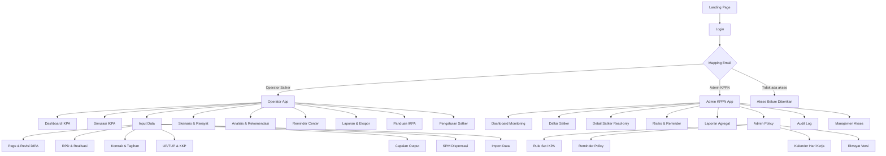
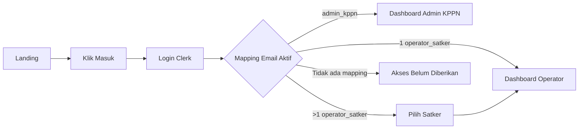
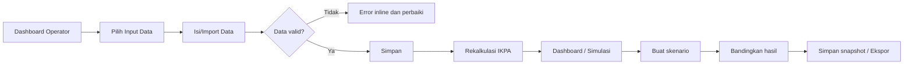
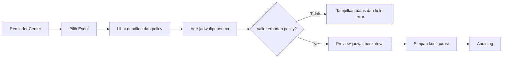
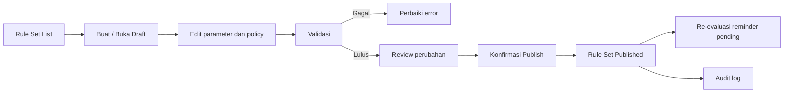

# UI/UX Wireframes — Simulator Penilaian IKPA Satker

**Basis:** PRD Final v1.3, FSD MVP v1.0, TSD MVP v1.0, ERD MVP v1.0, dan UI/UX Design System v1.0  
**Versi:** 1.0  
**Tanggal:** 31 Agustus 2026  
**Status:** Low-fidelity wireframe specification untuk UI/UX Designer Agent dan Frontend Agent  
**Target:** Mobile-first, responsive, desktop dan mobile

> Wireframe ini mendefinisikan struktur informasi, hierarchy, navigasi, state, dan interaksi utama. Ini bukan desain visual final. Seluruh keputusan warna, typography, component variants, aksesibilitas, dan responsive behavior mengikuti **UI/UX Design System & Product Design Rules v1.0**.

---

## 1. Prinsip dan Legenda

### 1.1 Prinsip wireframe

- Desain dimulai dari mobile, lalu diperluas ke tablet dan desktop.
- Satu login mengarahkan pengguna berdasarkan mapping email: **Operator Satker** atau **Admin KPPN**.
- Operator Satker memperoleh seluruh menu operasional satker tanpa pembagian role PPK/Bendahara/Perencana/KPA.
- Admin KPPN memperoleh monitoring read-only satker, Admin Policy, kalender hari kerja, audit, dan manajemen akses.
- Konteks satker/KPPN, tahun anggaran, periode, dan rule set version harus selalu dapat dikenali pada layar kerja.
- Risiko, deadline, data incomplete, dan policy lock harus selalu disertai penjelasan serta tindakan yang jelas.

### 1.2 Legenda

```text
[ ... ]       Komponen atau area antarmuka
( ... )       Tombol, chip, tab, atau aksi
< ... >       Field/input/dropdown
{ ... }       Informasi status/dinamis
→             Aksi navigasi atau hasil interaksi
*             Informasi wajib
🔒            Field/aksi dikunci oleh policy
⚠             Warning/risk
✓             Status sukses/lengkap
```

### 1.3 Breakpoint

| Mode | Lebar | Karakter layout |
|---|---:|---|
| Mobile | `<640 px` | Satu kolom, bottom navigation, drawer/sheet untuk filter dan detail |
| Tablet | `640–1023 px` | Grid dua kolom selektif, sidebar dapat collapse |
| Desktop | `≥1024 px` | Sidebar tetap, topbar konteks, tabel penuh, panel detail |

---

## 2. Sitemap dan Navigasi

### 2.1 Sitemap umum



### 2.2 Navigasi desktop

**Operator Satker — sidebar**

```text
┌──────────────────────────────┐
│ [Logo] Simulator IKPA        │
│ Satker: {Nama Satker}        │
│ Tahun: {2026}                │
├──────────────────────────────┤
│ ◉ Dashboard IKPA             │
│ ◌ Simulasi IKPA              │
│                              │
│ Input Data                   │
│   ◌ Pagu & Revisi DIPA       │
│   ◌ RPD & Realisasi          │
│   ◌ Kontrak & Tagihan        │
│   ◌ UP/TUP & KKP             │
│   ◌ Capaian Output            │
│   ◌ SPM Dispensasi           │
│   ◌ Import Data              │
│                              │
│ ◌ Skenario & Riwayat         │
│ ◌ Analisis & Rekomendasi     │
│ ◌ Reminder Center            │
│ ◌ Laporan & Ekspor           │
│ ◌ Panduan IKPA               │
│ ◌ Pengaturan Satker          │
├──────────────────────────────┤
│ [Avatar] Nama Pengguna       │
│ Operator Satker              │
│ (Keluar)                     │
└──────────────────────────────┘
```

**Admin KPPN — sidebar**

```text
┌──────────────────────────────┐
│ [Logo] Simulator IKPA        │
│ KPPN: {Nama KPPN}            │
│ Tahun: {2026}                │
├──────────────────────────────┤
│ ◉ Dashboard Monitoring       │
│                              │
│ Satker                       │
│   ◌ Daftar Satker            │
│   ◌ Risiko & Reminder        │
│                              │
│ ◌ Laporan Agregat            │
│                              │
│ Admin Policy                 │
│   ◌ Rule Set IKPA            │
│   ◌ Reminder Policy          │
│   ◌ Kalender Hari Kerja      │
│   ◌ Riwayat Versi            │
│                              │
│ ◌ Audit Log                  │
│ ◌ Manajemen Akses            │
├──────────────────────────────┤
│ [Avatar] Nama Pengguna       │
│ Admin KPPN                   │
│ (Keluar)                     │
└──────────────────────────────┘
```

### 2.3 Navigasi mobile

**Bottom navigation Operator Satker**

```text
┌──────────────────────────────────────┐
│ [Dashboard] [Simulasi] [Input]        │
│ [Reminder] [Lainnya]                  │
└──────────────────────────────────────┘
```

Menu **Lainnya** membuka sheet berisi: Skenario & Riwayat, Analisis, Laporan, Panduan, Pengaturan, pilihan tahun/periode, dan Keluar.

**Bottom navigation Admin KPPN**

```text
┌──────────────────────────────────────┐
│ [Dashboard] [Satker] [Risiko]         │
│ [Policy] [Lainnya]                    │
└──────────────────────────────────────┘
```

Menu **Lainnya** membuka sheet berisi: Laporan Agregat, Audit Log, Manajemen Akses, pilihan tahun/periode, dan Keluar.

---

## 3. Alur Kunci

### 3.1 Alur login dan routing



### 3.2 Alur input hingga simulasi



### 3.3 Alur konfigurasi reminder



### 3.4 Alur Admin Policy



---

## 4. Wireframe Publik dan Akses

### WF-01 — Landing Page

**Tujuan:** Menjelaskan manfaat aplikasi dan membawa pengguna ke login.

#### Desktop

```text
┌───────────────────────────────────────────────────────────────────────────────┐
│ [Logo Simulator IKPA]                                      (Masuk)             │
├───────────────────────────────────────────────────────────────────────────────┤
│                                                                               │
│  SIMULATOR PENILAIAN IKPA SATKER                                              │
│  Kendalikan kinerja pelaksanaan anggaran lebih awal.                          │
│  Simulasikan nilai, pantau risiko, dan kelola tenggat penting IKPA.           │
│                                                                               │
│  (Masuk ke Simulator)                                                         │
│  * Hasil merupakan simulasi internal, bukan nilai resmi OMSPAN/KPPN.          │
│                                                                               │
│                                      ┌──────────────────────────────────┐     │
│                                      │ [Mockup dashboard sederhana]     │     │
│                                      │ Nilai IKPA 94,20                 │     │
│                                      │ ⚠ 3 tindakan prioritas           │     │
│                                      └──────────────────────────────────┘     │
├───────────────────────────────────────────────────────────────────────────────┤
│ [Simulasi real-time] [Risiko & rekomendasi] [Reminder deadline] [Monitoring] │
├───────────────────────────────────────────────────────────────────────────────┤
│ Indikator yang dipantau                                                       │
│ [Revisi] [Deviasi] [Penyerapan] [Kontraktual] [Tagihan] [UP/TUP] [Output]     │
│ [Dispensasi SPM]                                                              │
├───────────────────────────────────────────────────────────────────────────────┤
│ Footer: versi aplikasi | disclaimer | bantuan                                 │
└───────────────────────────────────────────────────────────────────────────────┘
```

#### Mobile

```text
┌───────────────────────────────┐
│ [Logo]              (Masuk)   │
├───────────────────────────────┤
│ SIMULATOR PENILAIAN IKPA      │
│ Kendalikan pelaksanaan        │
│ anggaran lebih awal.          │
│                               │
│ (Masuk ke Simulator)          │
│ * Simulasi internal, bukan    │
│   nilai resmi.                │
│                               │
│ [Nilai IKPA 94,20]            │
│ [⚠ 3 tindakan prioritas]      │
├───────────────────────────────┤
│ [Simulasi]                    │
│ [Risiko & rekomendasi]        │
│ [Reminder deadline]           │
│ [Monitoring KPPN]             │
├───────────────────────────────┤
│ Indikator yang dipantau       │
│ [Revisi] [Deviasi]            │
│ [Penyerapan] [Kontraktual]    │
│ [Tagihan] [UP/TUP]            │
│ [Output] [Dispensasi]         │
└───────────────────────────────┘
```

**Interaksi:**

- Tombol `Masuk` dan `Masuk ke Simulator` membuka halaman Login.
- Mockup dashboard bersifat dekoratif/informatif; tidak interaktif pada MVP.

---

### WF-02 — Login

**Tujuan:** Satu pintu autentikasi untuk semua akses.

```text
┌───────────────────────────────────────┐
│ [←] Kembali ke beranda                 │
│                                       │
│ [Logo] Simulator IKPA                 │
│ Masuk ke akun Anda                    │
│                                       │
│ ┌───────────────────────────────────┐ │
│ │ Komponen Login Clerk               │ │
│ │ <Email>                            │ │
│ │ <Password / SSO bila tersedia>     │ │
│ │ (Masuk)                            │ │
│ │ Lupa kata sandi?                   │ │
│ └───────────────────────────────────┘ │
│                                       │
│ Setelah masuk, akses dashboard        │
│ ditentukan sesuai email terdaftar.    │
└───────────────────────────────────────┘
```

**State:**

- Loading autentikasi.
- Error login dari Clerk.
- Login sukses → proses routing akses tanpa layar kosong.

---

### WF-03 — Akses Belum Diberikan

**Tujuan:** Menangani pengguna yang berhasil login tetapi tidak memiliki mapping akses aktif.

```text
┌───────────────────────────────────────┐
│ [Logo] Simulator IKPA                 │
├───────────────────────────────────────┤
│              [Ikon Lock]              │
│                                       │
│ Akses belum diberikan                 │
│ Email Anda telah berhasil masuk,      │
│ tetapi belum terdaftar sebagai        │
│ Operator Satker atau Admin KPPN.      │
│                                       │
│ Email: user@contoh.go.id              │
│                                       │
│ Hubungi Admin KPPN untuk memperoleh   │
│ akses aplikasi.                       │
│                                       │
│ (Keluar)                              │
└───────────────────────────────────────┘
```

---

### WF-04 — Pilih Satker

**Kondisi:** Email memiliki lebih dari satu mapping `operator_satker`.

```text
┌───────────────────────────────────────┐
│ [Logo] Simulator IKPA                 │
├───────────────────────────────────────┤
│ Pilih satker                          │
│ Anda memiliki akses ke beberapa       │
│ satker. Pilih konteks kerja.          │
│                                       │
│ ┌───────────────────────────────────┐ │
│ │ 123456 — Satker A                 │ │
│ │ KPPN: {Nama KPPN}          (Pilih)│ │
│ └───────────────────────────────────┘ │
│ ┌───────────────────────────────────┐ │
│ │ 789012 — Satker B                 │ │
│ │ KPPN: {Nama KPPN}          (Pilih)│ │
│ └───────────────────────────────────┘ │
└───────────────────────────────────────┘
```

---

## 5. Wireframe Operator Satker

### WF-OPS-01 — Dashboard IKPA

**Tujuan:** Menunjukkan kondisi IKPA, deadline, risiko, dan tindakan paling penting.

#### Desktop

```text
┌─────────────── SIDEBAR ──────────────┬───────────────────────────────────────────────┐
│ Logo / Menu Operator                 │ Topbar: {Satker} | <Tahun 2026> <Agustus> 🔔  │
│                                      ├───────────────────────────────────────────────┤
│ ◉ Dashboard                          │ Dashboard IKPA                                │
│ ○ Simulasi                           │ Pembaruan terakhir: 31 Agu 2026, 15.00 WIB    │
│ Input Data ...                       │ [Rule Set 2026.1] [Simulasi internal]         │
│ ○ Skenario                           │                         (Input Data) (Simulasi)│
│ ○ Analisis                           ├───────────────────────────────────────────────┤
│ ○ Reminder                           │ ┌─────────────────────┐ ┌───────────────────┐ │
│ ○ Laporan                            │ │ Nilai IKPA           │ │ Deadline terdekat  │ │
│ ○ Panduan                            │ │ 94,20                │ │ ⚠ Tagihan A        │ │
│ ○ Pengaturan                         │ │ Target 95,00         │ │ 2 hari kerja lagi  │ │
│                                      │ │ Gap −0,80            │ │ (Buka tagihan)     │ │
│                                      │ │ {Data estimasi}      │ └───────────────────┘ │
│                                      │ └─────────────────────┘                       │
│                                      ├───────────────────────────────────────────────┤
│                                      │ Indikator                                      │
│                                      │ [Revisi 100] [Deviasi 92] [Serap 88] [Kontrak]│
│                                      │ [Tagihan ⚠] [UP/TUP 96] [Output 90] [Disp. −] │
│                                      ├───────────────────────────┬───────────────────┤
│                                      │ Tindakan prioritas        │ Tren IKPA         │
│                                      │ 1. ⚠ Proses tagihan ...   │ [Line chart]      │
│                                      │    2 hari kerja tersisa   │                   │
│                                      │    (Buka data tagihan)    │                   │
│                                      │ 2. Realisasi 52 Q2 ...    │                   │
│                                      │ 3. Konfirmasi output ...  │                   │
│                                      ├───────────────────────────┴───────────────────┤
│                                      │ Kelengkapan Data | Realisasi vs RPD            │
│                                      │ [✓ Pagu] [✓ RPD] [⚠ Output 2 belum konfirmasi]│
└──────────────────────────────────────┴───────────────────────────────────────────────┘
```

#### Mobile

```text
┌──────────────────────────────────┐
│ {Nama Satker}              [☰]   │
│ <2026> <Agustus>                 │
├──────────────────────────────────┤
│ Dashboard IKPA                    │
│ [Rule Set 2026.1] [Estimasi]      │
│ ┌──────────────────────────────┐ │
│ │ Nilai IKPA                   │ │
│ │ 94,20                         │ │
│ │ Target 95,00 · Gap −0,80     │ │
│ │ Simulasi internal             │ │
│ └──────────────────────────────┘ │
│                                  │
│ ⚠ DEADLINE TERDEKAT              │
│ Tagihan A — 2 hari kerja lagi    │
│ (Buka Tagihan)                   │
│                                  │
│ Tindakan prioritas               │
│ [1] Proses tagihan ...       [→] │
│ [2] Realisasi belanja 52 ... [→] │
│ [3] Konfirmasi output ...    [→] │
│                                  │
│ Indikator                         │
│ [Revisi 100] [Deviasi 92]        │
│ [Serapan 88] [Kontrak 90]        │
│ [Tagihan ⚠] [UP/TUP 96]          │
│ [Output 90] [Disp. −0,75]        │
│                                  │
│ [Tren IKPA ringkas]              │
│                                  │
│ Kelengkapan data             [→] │
│ ⚠ 2 laporan output belum ...     │
├──────────────────────────────────┤
│ [Dash] [Sim] [Input] [Rem] [⋯]   │
└──────────────────────────────────┘
```

**Interaksi utama:**

- Klik kartu indikator → detail indikator/drawer atau halaman Simulasi dengan indikator disorot.
- Klik tindakan → halaman input relevan dengan filter entitas terkait.
- Klik deadline → halaman Kontrak & Tagihan atau Capaian Output sesuai event.
- Klik `Input Data` → buka menu input/halaman terakhir yang dipakai.
- Klik `Simulasi` → buka mode actual periode aktif.

**State wajib:** loading skeleton, belum ada data, data incomplete, error fetch, rule set versi lama pada snapshot, tanpa deadline mendekat.

---

### WF-OPS-02 — Simulasi IKPA

**Tujuan:** Menghitung nilai, melakukan what-if, serta memahami breakdown score.

#### Desktop

```text
┌──────── SIDEBAR ────────┬───────────────────────────────────────────────────────────┐
│                         │ Simulasi IKPA                                               │
│                         │ <Actual | Forecast | Skenario> [Rule Set 2026.1]            │
│                         ├───────────────────────────────┬───────────────────────────┤
│                         │ PANEL INPUT                   │ PANEL HASIL (sticky)      │
│                         │ <Tahun 2026> <Periode Agustus>│ ┌───────────────────────┐ │
│                         │ <Target 95,00>                │ │ Nilai IKPA 94,20      │ │
│                         │                                │ │ Target 95,00          │ │
│                         │ [Accordion Indikator]          │ │ Gap −0,80             │ │
│                         │ ▾ Revisi DIPA             [→] │ │ {Data estimasi}       │ │
│                         │ ▾ Deviasi Hal. III DIPA   [→] │ └───────────────────────┘ │
│                         │ ▾ Penyerapan              [→] │ Breakdown                │
│                         │ ▾ Belanja Kontraktual      [→] │ Revisi             10,00 │
│                         │ ▾ Penyelesaian Tagihan     [→] │ Deviasi             13,80 │
│                         │ ▾ UP/TUP & KKP             [→] │ ...                      │
│                         │ ▾ Capaian Output           [→] │ Dispensasi         −0,75 │
│                         │ ▾ Dispensasi SPM            [→] │                         │
│                         │                                │ Rekomendasi             │
│                         │ [Reset perubahan]              │ ⚠ Proses Tagihan A [→] │
│                         │                                │ ⚠ Lengkapi output [→]  │
│                         ├───────────────────────────────┼───────────────────────────┤
│                         │ (Simpan) (Simpan sebagai       │ (Lihat formula lengkap) │
│                         │  Skenario) (Bandingkan)        │                           │
└─────────────────────────┴───────────────────────────────┴───────────────────────────┘
```

#### Mobile

```text
┌──────────────────────────────────┐
│ [←] Simulasi IKPA           [⋯]  │
│ <Actual | Forecast | Skenario>   │
│ <2026> <Agustus>                 │
├──────────────────────────────────┤
│ ┌──────────────────────────────┐ │
│ │ Nilai IKPA 94,20             │ │
│ │ Target 95,00 · Gap −0,80     │ │
│ │ (Lihat breakdown)            │ │
│ └──────────────────────────────┘ │
│                                  │
│ <Target IKPA 95,00>              │
│                                  │
│ ▾ Revisi DIPA               [→]  │
│ ▾ Deviasi Halaman III DIPA  [→]  │
│ ▾ Penyerapan Anggaran       [→]  │
│ ▾ Belanja Kontraktual       [→]  │
│ ▾ Penyelesaian Tagihan      [→]  │
│ ▾ UP/TUP & KKP              [→]  │
│ ▾ Capaian Output            [→]  │
│ ▾ Dispensasi SPM            [→]  │
│                                  │
│ Rekomendasi                       │
│ ⚠ Proses Tagihan A           [→] │
│ ⚠ Lengkapi output             [→]│
├──────────────────────────────────┤
│ (Simpan) (Jadikan Skenario)       │
└──────────────────────────────────┘
```

**Detail indikator (drawer/panel):**

```text
┌──────────────────────────────────┐
│ [×] Penyelesaian Tagihan          │
│ Bobot 10% · Nilai 86,67           │
│ [Rule Set 2026.1]                 │
├──────────────────────────────────┤
│ Rumus                              │
│ SPM tepat waktu / total SPM × 100 │
│                                  │
│ Input                              │
│ Tepat waktu: 13                   │
│ Total: 15                          │
│ Batas: 17 hari kerja               │
│                                  │
│ ⚠ 1 tagihan mendekati deadline    │
│ (Buka data tagihan)                │
│                                  │
│ [Lihat parameter aturan]           │
└──────────────────────────────────┘
```

**Interaksi dan state:**

- Mode `Actual` membaca data sumber; `Forecast` dapat memakai asumsi/proyeksi; `Skenario` menampilkan override.
- Field override pada scenario diberi badge `Diubah dalam skenario`.
- `Simpan sebagai Skenario` membuka dialog nama skenario dan snapshot sumber.
- `Bandingkan` membuka pemilih maksimal dua simulation/snapshot.
- Nilai incomplete menampilkan `—` atau label estimasi, tidak menyajikan angka seolah final.

---

### WF-OPS-03 — Pola Halaman Input Data

**Tujuan:** Menjadi pola reusable untuk Pagu/Revisi, RPD/Realisasi, Kontrak/Tagihan, UP/TUP/KKP, Output, dan SPM Dispensasi.

#### Desktop

```text
┌──────── SIDEBAR ────────┬───────────────────────────────────────────────────────────┐
│                         │ Breadcrumb: Input Data / {Nama Domain}                     │
│                         │ {Nama Domain}                                               │
│                         │ Deskripsi singkat fungsi data dan dampak IKPA.              │
│                         │ <Tahun 2026>                           (Import) (+ Tambah) │
│                         ├───────────────────────────────────────────────────────────┤
│                         │ [Ringkasan domain: Total ... | Status ... | ⚠ Warning ...] │
│                         ├───────────────────────────────────────────────────────────┤
│                         │ <Cari> [Filter] [Kolom]              {n data}              │
│                         │ ┌───────────────────────────────────────────────────────┐ │
│                         │ │ Header tabel sticky                                   │ │
│                         │ │ Baris data                                            │ │
│                         │ │ Baris data                              [⋯ Aksi]       │ │
│                         │ │ ...                                                   │ │
│                         │ └───────────────────────────────────────────────────────┘ │
│                         │ [Pagination]                                              │
│                         ├───────────────────────────────────────────────────────────┤
│                         │ [Panduan singkat / dampak indikator]                       │
└─────────────────────────┴───────────────────────────────────────────────────────────┘
```

#### Mobile

```text
┌──────────────────────────────────┐
│ [←] {Nama Domain}           [⋯]  │
│ <Tahun 2026>                       │
│ Deskripsi ringkas                   │
│                                  │
│ [Ringkasan domain]                │
│ ⚠ Warning/kelengkapan jika ada    │
│                                  │
│ <Cari data> (Filter) (Import)     │
│                                  │
│ ┌──────────────────────────────┐ │
│ │ Data utama                   │ │
│ │ Label: nilai/status/tanggal  │ │
│ │ Metadata ringkas             │ │
│ │ (Lihat detail)          [⋯]  │ │
│ └──────────────────────────────┘ │
│ ┌──────────────────────────────┐ │
│ │ Data berikutnya ...           │ │
│ └──────────────────────────────┘ │
│                                  │
│ ( + Tambah Data )                │
│                                  │
│ [Panduan singkat]                │
├──────────────────────────────────┤
│ [Dash] [Sim] [Input] [Rem] [⋯]   │
└──────────────────────────────────┘
```

**Form tambah/edit:**

- Desktop: `Sheet` dari kanan untuk form medium atau `Dialog` untuk form pendek.
- Mobile: `Drawer` dari bawah/full-screen sheet.
- Tampilkan label, helper text, validasi inline, dan tombol `Batal` + `Simpan`.
- Jika form memengaruhi indikator, tampilkan dampak estimasi setelah simpan bila tersedia.

---

### WF-OPS-04 — RPD & Realisasi

**Tujuan:** Menginput data bulanan dan melihat deviasi/realisasi versus target.

#### Desktop

```text
┌─────────────────────────────────────────────────────────────────────────────────┐
│ RPD & Realisasi                           <Tahun 2026> (Import) (Simpan)         │
│ Deviasi Halaman III DIPA dan Penyerapan Anggaran                                 │
├─────────────────────────────────────────────────────────────────────────────────┤
│ [Deviasi rata-rata 6,2% ⚠] [Nilai deviasi 93,80] [Penyerapan Q2 88,40]           │
├─────────────────────────────────────────────────────────────────────────────────┤
│ Tab: [Grid Input] [Deviasi] [Penyerapan] [Grafik]                                │
├─────────────────────────────────────────────────────────────────────────────────┤
│ Grid Input                                                                     │
│ ┌────────┬────────────┬─────────────┬─────────────┬─────────────┐                │
│ │ Bulan  │ Akun       │ RPD         │ Realisasi   │ Status       │                │
│ ├────────┼────────────┼─────────────┼─────────────┼─────────────┤                │
│ │ Jan    │ 51         │ <Rp ...>    │ <Rp ...>    │ ✓            │                │
│ │ Jan    │ 52         │ <Rp ...>    │ <Rp ...>    │ ⚠ Deviasi    │                │
│ │ ...    │ ...        │ ...         │ ...         │ ...          │                │
│ └────────┴────────────┴─────────────┴─────────────┴─────────────┘                │
│ [Tambah baris] [Simpan perubahan]                                                │
├─────────────────────────────────────────────────────────────────────────────────┤
│ Panel bantuan: Target triwulanan 51/52/53/57 menurut Rule Set 2026.1             │
└─────────────────────────────────────────────────────────────────────────────────┘
```

#### Mobile

```text
┌──────────────────────────────────┐
│ [←] RPD & Realisasi              │
│ <Tahun 2026>                      │
├──────────────────────────────────┤
│ [Deviasi 6,2% ⚠] [Serapan 88,40] │
│ <Grid | Deviasi | Serapan>        │
│                                  │
│ Bulan: <Agustus>  Akun: <52>     │
│ <RPD Rp...>                       │
│ <Realisasi Rp...>                 │
│ {⚠ Deviasi 8,1%}                  │
│                                  │
│ (Simpan Bulan Ini)                │
│                                  │
│ [Lihat semua bulan →]             │
│ [Import data]                     │
│                                  │
│ ▾ Target triwulan dan panduan     │
└──────────────────────────────────┘
```

**Catatan UX:** Grid desktop harus mendukung navigasi keyboard; mobile memakai pola form per bulan/akun agar tidak memaksa spreadsheet horizontal yang sulit digunakan.

---

### WF-OPS-05 — Kontrak & Tagihan

**Tujuan:** Mengelola kontrak serta mendeteksi tagihan menuju batas H+17 hari kerja.

#### Desktop

```text
┌─────────────────────────────────────────────────────────────────────────────────┐
│ Kontrak & Tagihan                         <Tahun 2026> (+ Kontrak) (+ Tagihan)  │
│ [Kontrak] [Tagihan/ SPM-LS] [Risiko Deadline]                                    │
├─────────────────────────────────────────────────────────────────────────────────┤
│ [Kontrak eligible 14] [Tagihan tepat waktu 13/15] [⚠ 2 mendekati H+17]           │
├─────────────────────────────────────────────────────────────────────────────────┤
│ <Cari> [Filter Status] [Filter Akun] [Filter Periode]                            │
│ ┌─────────┬───────────┬────────────┬─────────┬──────────────┬────────┐           │
│ │ Kontrak │ Nilai     │ Tgl BAST   │ Deadline│ Status       │ Aksi   │           │
│ ├─────────┼───────────┼────────────┼─────────┼──────────────┼────────┤           │
│ │ K-001   │ Rp...     │ 12 Agu     │ 04 Sep  │ ⚠ H-2 kerja  │ [⋯]   │           │
│ │ K-002   │ Rp...     │ 02 Agu     │ 25 Agu  │ Terlambat    │ [⋯]   │           │
│ └─────────┴───────────┴────────────┴─────────┴──────────────┴────────┘           │
├─────────────────────────────────────────────────────────────────────────────────┤
│ [Panel: daftar risiko & rekomendasi]                                             │
└─────────────────────────────────────────────────────────────────────────────────┘
```

#### Detail tagihan (drawer)

```text
┌──────────────────────────────────┐
│ [×] Tagihan K-001                │
│ ⚠ Mendekati deadline             │
├──────────────────────────────────┤
│ Kontrak: K-001                    │
│ Nilai kontrak: Rp...              │
│ BAST/BAPP: 12 Agustus 2026        │
│ Batas policy: 17 hari kerja       │
│ Deadline: 04 September 2026       │
│ Sisa waktu: 2 hari kerja          │
│                                  │
│ Reminder                           │
│ ✓ H-5 terkirim                    │
│ ✓ H-2 dijadwalkan hari ini        │
│                                  │
│ <Tanggal diterima KPPN>           │
│ <Status belanja pegawai>          │
│ (Simpan Tagihan)                  │
│                                  │
│ [Lihat dasar aturan]               │
└──────────────────────────────────┘
```

#### Mobile

```text
┌──────────────────────────────────┐
│ [←] Kontrak & Tagihan       (+)  │
│ <Kontrak | Tagihan | Risiko>     │
├──────────────────────────────────┤
│ [Tepat waktu 13/15]              │
│ ⚠ 2 tagihan mendekati deadline   │
│                                  │
│ [⚠] K-001                        │
│ Rp... · Deadline 04 Sep          │
│ H-2 hari kerja                   │
│ (Buka detail)                    │
│                                  │
│ [!] K-002                        │
│ Rp... · Terlambat                │
│ (Buka detail)                    │
│                                  │
│ ( + Tambah Tagihan )             │
└──────────────────────────────────┘
```

---

### WF-OPS-06 — UP/TUP & KKP

**Tujuan:** Mengelola transaksi UP/TUP/KKP dan melihat proyeksi indikator.

```text
┌───────────────────────────────────────────────────────────────────────┐
│ UP/TUP & KKP                                  <Tahun 2026> (+ Transaksi)│
├───────────────────────────────────────────────────────────────────────┤
│ [Nilai UP/TUP 88,78] [Nilai KKP 107,50] [Nilai Indikator 90,65]       │
├───────────────────────────────────────────────────────────────────────┤
│ Tab: [Transaksi] [GUP/PTUP] [Setoran TUP] [KKP]                        │
│                                                                       │
│ ┌───────────────────────────────────────────────────────────────────┐ │
│ │ Tanggal | Tipe | Nilai | Referensi SP2D | Status | Aksi            │ │
│ │ 16 Mar  | GUP  | Rp... | 25 Feb          | ✓ Tepat waktu | [⋯]     │ │
│ │ ...                                                               │ │
│ └───────────────────────────────────────────────────────────────────┘ │
│                                                                       │
│ ⚠ GUP/PTUP mendekati satu bulan: {n} transaksi                        │
│ (Lihat risiko)                                                        │
└───────────────────────────────────────────────────────────────────────┘
```

**Mobile:** Gunakan tab horizontal scroll dan card list transaksi. Kartu ringkasan ditumpuk vertikal. Tombol tambah menggunakan floating/sticky action button yang aman.

---

### WF-OPS-07 — Capaian Output

**Tujuan:** Mengelola laporan output, status konfirmasi, serta deadline lima hari kerja bulan berikutnya.

```text
┌──────────────────────────────────────────────────────────────────────────┐
│ Capaian Output                               <Tahun 2026> (+ Laporan RO) │
│ [Nilai ketepatan waktu 100] [Nilai capaian 93,65] [Indikator 95,56]       │
├──────────────────────────────────────────────────────────────────────────┤
│ ⚠ 2 laporan belum terkonfirmasi / mendekati deadline                      │
│ <Cari RO> [Filter Bulan] [Filter Konfirmasi]                              │
│ ┌────────┬──────┬───────┬────────┬────────┬───────────────┬───────────┐ │
│ │ RO     │ Bulan│ PCRO  │ TPCRO  │ RVRO   │ Status         │ Aksi      │ │
│ ├────────┼──────┼───────┼────────┼────────┼───────────────┼───────────┤ │
│ │ RO-001 │ Agu  │ 100%  │ 100%   │ 2 / 2  │ ✓ Terkonfirmasi│ [⋯]      │ │
│ │ RO-002 │ Agu  │ 50%   │ 50%    │ 1 / 2  │ ⚠ Belum konf. │ [⋯]      │ │
│ └────────┴──────┴───────┴────────┴────────┴───────────────┴───────────┘ │
├──────────────────────────────────────────────────────────────────────────┤
│ [Panduan formula capaian output] [Lihat reminder pelaporan]               │
└──────────────────────────────────────────────────────────────────────────┘
```

**State detail laporan:** tampilkan tanggal lapor, deadline berdasarkan kalender kerja, konfirmasi, formula yang dipakai, dan dampak nilai. Bila belum konfirmasi, tampilkan status `Nilai belum eligible` dengan CTA memperbarui status.

---

### WF-OPS-08 — SPM Dispensasi

**Tujuan:** Menampilkan risiko pengurang IKPA akibat SPM dispensasi Q4.

```text
┌───────────────────────────────────────────────────────────────────┐
│ SPM Dispensasi                              <Tahun 2026> (+ SPM)  │
├───────────────────────────────────────────────────────────────────┤
│ ┌───────────────────────┐ ┌─────────────────────────────────────┐ │
│ │ Pengurang saat ini    │ │ Risiko akhir tahun                  │ │
│ │ −0,75                 │ │ ⚠ 24 SPM dispensasi dari 5.200 Q4  │ │
│ │ Rasio: 4,62‰          │ │ Bucket: 1,00–4,99‰                 │ │
│ └───────────────────────┘ └─────────────────────────────────────┘ │
├───────────────────────────────────────────────────────────────────┤
│ <Cari SPM> [Filter Dispensasi]                                    │
│ [Tabel/list SPM Q4: nomor | tanggal | dispensasi | aksi]          │
├───────────────────────────────────────────────────────────────────┤
│ ▾ Tabel bucket pengurang menurut Rule Set 2026.1                  │
└───────────────────────────────────────────────────────────────────┘
```

---

### WF-OPS-09 — Import Data

**Tujuan:** Mengimpor CSV/XLSX dengan proses aman: upload → validasi → preview → commit.

#### Step 1: Pilih domain dan file

```text
┌──────────────────────────────────┐
│ [←] Import Data                   │
│                                  │
│ 1. Pilih jenis data               │
│ <Pagu & Revisi DIPA ▼>            │
│ (Unduh Template)                  │
│                                  │
│ 2. Unggah file                    │
│ ┌──────────────────────────────┐ │
│ │ [Upload] Tarik CSV/XLSX      │ │
│ │ Maks. 10 MB                   │ │
│ └──────────────────────────────┘ │
│                                  │
│ (Validasi File)                  │
└──────────────────────────────────┘
```

#### Step 2: Validasi dan preview

```text
┌─────────────────────────────────────────────────────────────────┐
│ Import: Pagu & Revisi DIPA                [2/3 Validasi]         │
├─────────────────────────────────────────────────────────────────┤
│ [Total 120] [Valid 115 ✓] [Error 5 ⚠]                            │
│ Tab: [Data Valid 115] [Error 5]                                  │
│ ┌─────────────────────────────────────────────────────────────┐ │
│ │ Baris | Kolom | Nilai | Pesan error                         │ │
│ │ 16    | amount| abc   | Nominal harus berupa angka           │ │
│ └─────────────────────────────────────────────────────────────┘ │
│ (Kembali)                                   (Simpan Data Valid) │
└─────────────────────────────────────────────────────────────────┘
```

#### Step 3: Konfirmasi commit

```text
┌──────────────────────────────────────┐
│ Konfirmasi simpan data                │
│                                      │
│ 115 baris valid akan disimpan ke      │
│ Satker {Nama Satker}, Tahun 2026.     │
│ 5 baris invalid tidak akan disimpan.  │
│                                      │
│ (Batal)          (Simpan 115 Baris)  │
└──────────────────────────────────────┘
```

---

### WF-OPS-10 — Skenario & Riwayat

**Tujuan:** Mengelola actual/forecast/scenario dan score snapshot.

#### Desktop

```text
┌───────────────────────────────────────────────────────────────────────────┐
│ Skenario & Riwayat                             <Tahun 2026> (+ Skenario)  │
├───────────────────────────────────────────────────────────────────────────┤
│ <Cari> [Filter Tipe] [Filter Periode] [Filter Rule Set]                    │
│ ┌──────────────┬──────────┬──────────┬────────┬──────────┬─────────┐      │
│ │ Nama         │ Tipe     │ Periode  │ Nilai  │ Rule Set │ Aksi    │      │
│ ├──────────────┼──────────┼──────────┼────────┼──────────┼─────────┤      │
│ │ Actual Aug   │ Actual   │ Agu 2026 │ 94,20  │ 2026.1   │ [⋯]    │      │
│ │ Percepatan   │ Skenario │ Agu 2026 │ 95,75  │ 2026.1   │ [⋯]    │      │
│ │ Forecast Sep │ Forecast │ Sep 2026 │ 96,10  │ 2026.1   │ [⋯]    │      │
│ └──────────────┴──────────┴──────────┴────────┴──────────┴─────────┘      │
├───────────────────────────────────────────────────────────────────────────┤
│ [Pilih dua item untuk dibandingkan]                       (Bandingkan)    │
└───────────────────────────────────────────────────────────────────────────┘
```

#### Perbandingan scenario

```text
┌───────────────────────────────────────────────────────────────────────────┐
│ Bandingkan: Actual Agustus vs Skenario Percepatan                          │
│ [Actual 94,20] → [Skenario 95,75]  {+1,55 poin}                            │
├───────────────────────────────────────────────────────────────────────────┤
│ Indikator           Actual     Skenario      Perubahan                      │
│ Penyerapan          88,40      94,20         +5,80                         │
│ Tagihan             86,67      100,00        +13,33                        │
│ ...                                                                       │
├───────────────────────────────────────────────────────────────────────────┤
│ Perubahan asumsi                                                            │
│ • Tagihan K-001 diterima KPPN pada 02 Sep                                  │
│ • Realisasi akun 52 bertambah Rp...                                         │
│                                              (Duplikasi Skenario)           │
└───────────────────────────────────────────────────────────────────────────┘
```

---

### WF-OPS-11 — Analisis & Rekomendasi

**Tujuan:** Membantu operator memprioritaskan tindakan.

```text
┌─────────────────────────────────────────────────────────────────────────┐
│ Analisis & Rekomendasi                    <Tahun 2026> <Agustus>         │
│ [Semua indikator] [Semua prioritas] [Semua status]                        │
├─────────────────────────────────────────────────────────────────────────┤
│ Prioritas 1                                                         [Tinggi]│
│ ⚠ Penyelesaian Tagihan — Tagihan K-001 akan mencapai batas dalam 2 hari │
│ Dampak potensial: +0,89 poin | Deadline: 04 Sep 2026                      │
│ (Buka Tagihan)                                        (Tandai Ditinjau)  │
├─────────────────────────────────────────────────────────────────────────┤
│ Prioritas 2                                                         [Sedang]│
│ Penyerapan Anggaran — Realisasi akun 52 Q2 kurang Rp... dari target       │
│ Dampak potensial: +0,65 poin                                              │
│ (Buka RPD & Realisasi)                                                    │
├─────────────────────────────────────────────────────────────────────────┤
│ Prioritas 3                                                         [Sedang]│
│ Capaian Output — 2 RO belum terkonfirmasi                                 │
│ (Buka Capaian Output)                                                     │
└─────────────────────────────────────────────────────────────────────────┘
```

**Catatan:** Status `Tandai Ditinjau` bersifat catatan workflow ringan; tidak boleh diperlakukan sebagai bukti tugas regulasi selesai kecuali feature task management ditambahkan kemudian.

---

### WF-OPS-12 — Reminder Center

**Tujuan:** Menampilkan seluruh reminder, alasan policy, jadwal, dan konfigurasi yang diizinkan.

#### Desktop

```text
┌────────────────────────────────────────────────────────────────────────────────┐
│ Reminder Center                     <Tahun 2026> [Rule Set 2026.1]              │
│ Atur pengiriman pengingat sebelum deadline dalam batas policy KPPN.             │
├────────────────────────────────────────────────────────────────────────────────┤
│ <Cari event> [Kategori ▼] [Indikator ▼] [Status ▼]                              │
│ ┌────────────────┬───────────────┬──────────────┬────────────┬────────┬──────┐ │
│ │ Event          │ Deadline      │ Kategori     │ Jadwal     │ Status │ Aksi │ │
│ ├────────────────┼───────────────┼──────────────┼────────────┼────────┼──────┤ │
│ │ Tagihan H+17   │ 04 Sep 17.00  │ 🔒 Mandatory │ H-5,H-2,H0 │ Aktif  │ [→] │ │
│ │ Output Bulanan │ 07 Sep 17.00  │ Recommended  │ H-3,H-1    │ Aktif  │ [→] │ │
│ │ Digest IKPA    │ Senin 07.00   │ Optional     │ Senin      │ Aktif  │ [→] │ │
│ └────────────────┴───────────────┴──────────────┴────────────┴────────┴──────┘ │
└────────────────────────────────────────────────────────────────────────────────┘
```

#### Detail event mandatory — desktop panel/mobile drawer

```text
┌───────────────────────────────────────────────────────┐
│ [×] BAST/BAPP menuju batas SPM                         │
│ Penyelesaian Tagihan · 🔒 Mandatory                    │
│ [Rule Set 2026.1]                                      │
├───────────────────────────────────────────────────────┤
│ Deadline policy                                         │
│ Maks. 17 hari kerja sejak BAST/BAPP                     │
│ Jenis hari: Hari kerja                                  │
│ Alasan: Event wajib sesuai policy KPPN yang aktif.      │
│                                                       │
│ Konfigurasi organisasi                                  │
│ Status: [ON 🔒] Tidak dapat dinonaktifkan               │
│                                                       │
│ Titik reminder                                          │
│ H-5 hari kerja     <09:00>  [hapus bila diizinkan]      │
│ H-2 hari kerja     <09:00>  [hapus bila diizinkan]      │
│ H-0 hari kerja     <09:00>  🔒 default wajib            │
│ (+ Tambah titik reminder)                               │
│ Batas policy: H-1 sampai H-16; H-0 wajib dipertahankan. │
│                                                       │
│ Penerima                                                 │
│ Wajib: operator@... 🔒                                  │
│ Tambahan: <email/user> (+ Tambah)                       │
│                                                       │
│ Eskalasi                                                 │
│ [ ] Jika belum ditindaklanjuti pada H-2, tambah ...     │
│                                                       │
│ Preview jadwal berikutnya                                │
│ • Tagihan K-001: 29 Agu, 02 Sep, 04 Sep                 │
│                                                       │
│ <Pesan internal opsional>                               │
│ (Kembalikan ke default)                 (Simpan)        │
├───────────────────────────────────────────────────────┤
│ Riwayat perubahan                              (Lihat)  │
└───────────────────────────────────────────────────────┘
```

#### State invalid policy

```text
┌───────────────────────────────────────────────────────┐
│ ⚠ Tidak dapat menyimpan konfigurasi                    │
│ Lead time H-20 berada di luar batas policy H-1 sampai  │
│ H-16 untuk event ini.                                  │
│                                                       │
│ <Lead time H-20>  [Field error]                        │
└───────────────────────────────────────────────────────┘
```

---

### WF-OPS-13 — Laporan & Ekspor

```text
┌─────────────────────────────────────────────────────────────────┐
│ Laporan & Ekspor                         <Tahun 2026> <Agustus> │
├─────────────────────────────────────────────────────────────────┤
│ Pilih sumber data                                                 │
│ <Snapshot Actual Agustus 2026 ▼> [Rule Set 2026.1]                │
│                                                                   │
│ Pilih laporan                                                     │
│ ○ Ringkasan Eksekutif IKPA                                        │
│ ○ Detail Indikator dan Gap                                        │
│ ○ Risiko, Deadline, dan Rekomendasi                               │
│                                                                   │
│ Format                                                            │
│ (Ekspor XLSX)  (Ekspor PDF)                                       │
│                                                                   │
│ Preview isi laporan                                               │
│ [Nilai] [Target] [Indikator] [Risiko] [Disclaimer]                │
└─────────────────────────────────────────────────────────────────┘
```

**Dialog proses export:** menampilkan `Menyiapkan laporan…`, lalu tombol `Unduh` saat siap. Semua laporan memuat satker, periode, waktu cetak, disclaimer, dan rule set version.

---

### WF-OPS-14 — Panduan IKPA

```text
┌────────────────────────────────────────────────────────────────────┐
│ Panduan IKPA                        <Cari indikator atau istilah>  │
├─────────────────┬──────────────────────────────────────────────────┤
│ Daftar indikator│ Penyelesaian Tagihan                              │
│ ◉ Revisi DIPA   │ Bobot 10% · Periode ...                           │
│ ○ Deviasi       │                                                   │
│ ○ Penyerapan    │ Ringkasan                                         │
│ ○ Kontraktual   │ [Penjelasan singkat]                              │
│ ○ Tagihan       │                                                   │
│ ○ UP/TUP        │ Rumus                                             │
│ ○ Output        │ [Formula dengan penjelasan]                       │
│ ○ Dispensasi    │                                                   │
│                 │ Input yang dibutuhkan                             │
│                 │ [BAST/BAPP] [Tanggal diterima KPPN]               │
│                 │                                                   │
│                 │ Tips pengendalian                                 │
│                 │ [Daftar tindakan]                                 │
│                 │                                                   │
│                 │ [Rule Set 2026.1] [Sumber aturan]                 │
└─────────────────┴──────────────────────────────────────────────────┘
```

**Mobile:** daftar indikator tampil sebagai select/sheet; detail satu kolom.

---

### WF-OPS-15 — Pengaturan Satker

```text
┌───────────────────────────────────────────────────────────────┐
│ Pengaturan Satker                                               │
│ Tab: [Profil] [Target & Periode] [Notifikasi] [Akses Saya]     │
├───────────────────────────────────────────────────────────────┤
│ Profil Satker                                                   │
│ <Nama Satker>                                                   │
│ <Kode Satker>                                                   │
│ <KPPN> [read-only]                                              │
│ <Status BLU>                                                    │
│ <Timezone Asia/Jakarta>                                         │
│                                         (Simpan Perubahan)      │
├───────────────────────────────────────────────────────────────┤
│ Rule set aktif                                                  │
│ [2026.1] Berlaku sejak ...              (Lihat aturan)         │
├───────────────────────────────────────────────────────────────┤
│ Akses saya                                                      │
│ email@... · Operator Satker                                     │
│ Kelola akses melalui Admin KPPN.                                │
└───────────────────────────────────────────────────────────────┘
```

---

## 6. Wireframe Admin KPPN

### WF-ADM-01 — Dashboard Monitoring

**Tujuan:** Memberikan overview kinerja dan risiko lintas satker dalam scope KPPN.

#### Desktop

```text
┌──────── SIDEBAR ADMIN ───────┬──────────────────────────────────────────────────────┐
│                              │ Topbar: Admin KPPN | {Nama KPPN} | <2026> <Agustus> │
│ ◉ Dashboard Monitoring       ├──────────────────────────────────────────────────────┤
│ Satker                       │ Dashboard Monitoring                                │
│ ○ Daftar Satker              │ {n} satker dalam cakupan · Update: ...              │
│ ○ Risiko & Reminder          │ [Rule Set 2026.1]                                    │
│ ○ Laporan Agregat            ├──────────────────────────────────────────────────────┤
│ Admin Policy                 │ [Rata-rata IKPA] [Satker berisiko] [Data incomplete]│
│ ○ Rule Set                   │ [Deadline <7 hari] [Delivery gagal]                  │
│ ○ Reminder Policy            ├─────────────────────────────┬────────────────────────┤
│ ○ Kalender Kerja             │ Satker berisiko             │ Deadline terdekat      │
│ ○ Riwayat Versi              │ 1. Satker A 88,40 ⚠     [→] │ ⚠ Satker B: Tagihan... │
│ ○ Audit Log                  │ 2. Satker C 89,10 ⚠     [→] │ ⚠ Satker A: Output...  │
│ ○ Manajemen Akses            │ ...                         │ ...                    │
│                              ├─────────────────────────────┴────────────────────────┤
│                              │ Monitoring Satker                                    │
│                              │ <Cari> [Risiko] [Indikator] [Kelengkapan] (Lihat semua)│
│                              │ [Tabel ringkas satker]                                │
│                              ├─────────────────────────────┬────────────────────────┤
│                              │ Tren agregat                │ Perubahan policy        │
│                              │ [Line/Bar Chart]            │ Rule set 2026.1 aktif  │
└──────────────────────────────┴──────────────────────────────────────────────────────┘
```

#### Mobile

```text
┌──────────────────────────────────┐
│ Admin KPPN                  [☰]  │
│ {Nama KPPN} · <2026> <Agu>       │
├──────────────────────────────────┤
│ Dashboard Monitoring              │
│ [Rata-rata 92,40] [⚠ Risiko 8]    │
│ [Deadline <7 hari: 12]            │
│                                  │
│ Satker berisiko                   │
│ [Satker A · 88,40 · Tagihan] [→] │
│ [Satker C · 89,10 · Output]  [→] │
│                                  │
│ Deadline terdekat                 │
│ ⚠ Satker B · Tagihan H-2      [→]│
│ ⚠ Satker A · Output H-1       [→]│
│                                  │
│ Ringkasan tren                    │
│ [Chart ringkas]                   │
├──────────────────────────────────┤
│ [Dash] [Satker] [Risiko] [Policy]│
│ [⋯]                              │
└──────────────────────────────────┘
```

---

### WF-ADM-02 — Daftar Satker

```text
┌────────────────────────────────────────────────────────────────────────────┐
│ Daftar Satker                                      <Tahun> <Periode>        │
│ <Cari nama atau kode> [Risiko ▼] [Indikator ▼] [Kelengkapan ▼] (Ekspor)     │
├────────────────────────────────────────────────────────────────────────────┤
│ ┌────────┬────────────────┬────────┬────────┬──────────────┬─────────────┐ │
│ │ Kode   │ Satker         │ IKPA   │ Gap    │ Risiko utama  │ Deadline    │ │
│ ├────────┼────────────────┼────────┼────────┼──────────────┼─────────────┤ │
│ │ 123456 │ Satker A       │ 88,40  │ −6,60  │ Tagihan       │ H-2 kerja  │ │
│ │ 789012 │ Satker B       │ 94,20  │ −0,80  │ Output        │ H-1 kerja  │ │
│ └────────┴────────────────┴────────┴────────┴──────────────┴─────────────┘ │
│ [Pagination]                                                               │
└────────────────────────────────────────────────────────────────────────────┘
```

**Mobile card list:**

```text
┌──────────────────────────────┐
│ 123456 · Satker A       [→]  │
│ IKPA 88,40 · Gap −6,60       │
│ ⚠ Risiko: Tagihan            │
│ Deadline: H-2 hari kerja     │
└──────────────────────────────┘
```

---

### WF-ADM-03 — Detail Satker Read-only

**Tujuan:** Admin KPPN memahami kondisi satker tanpa dapat mengubah data operasional.

```text
┌──────────────────────────────────────────────────────────────────────────┐
│ [← Daftar Satker] 123456 — Nama Satker              [Read-only 🔒]        │
│ <Tahun 2026> <Agustus> [Rule Set 2026.1]              (Ekspor Detail)     │
├──────────────────────────────────────────────────────────────────────────┤
│ [Nilai IKPA 88,40] [Target 95,00] [Gap −6,60] [⚠ Risiko tinggi]          │
├──────────────────────────────────────────────────────────────────────────┤
│ [Kartu 7 indikator + dispensasi]                                          │
├──────────────────────────────────────┬───────────────────────────────────┤
│ Risiko dan deadline                  │ Kelengkapan data                   │
│ ⚠ Tagihan K-001 H-2             [→] │ ⚠ Output 2 belum konfirmasi        │
│ ⚠ Serapan 52 di bawah target    [→] │ ✓ Data pagu lengkap                 │
├──────────────────────────────────────┴───────────────────────────────────┤
│ Tab: [Tren] [Snapshot] [Reminder] [Audit Relevan]                         │
│ [Konten read-only]                                                         │
└──────────────────────────────────────────────────────────────────────────┘
```

**Aturan:** Seluruh tombol input/edit tidak ditampilkan. Link hanya membuka detail read-only. Badge `Read-only` selalu terlihat pada header desktop dan menu overflow mobile.

---

### WF-ADM-04 — Risiko & Reminder Monitoring

```text
┌────────────────────────────────────────────────────────────────────────────┐
│ Risiko & Reminder Monitoring                 <Tahun> [Kategori] [Status]  │
│ <Cari satker/event> [Indikator] [Rentang waktu]                             │
├────────────────────────────────────────────────────────────────────────────┤
│ [Total event 120] [Mandatory 24] [Gagal 3] [Jatuh tempo <7 hari 18]        │
├────────────────────────────────────────────────────────────────────────────┤
│ ┌───────────┬──────────────┬────────────┬────────────┬──────────┬────────┐│
│ │ Satker    │ Event        │ Deadline   │ Kategori   │ Delivery │ Aksi   ││
│ ├───────────┼──────────────┼────────────┼────────────┼──────────┼────────┤│
│ │ Satker A  │ Tagihan H+17 │ 04 Sep     │ Mandatory  │ ✓ Terkirim│[Detail]│
│ │ Satker B  │ Output       │ 07 Sep     │ Mandatory  │ ⚠ Gagal   │[Detail]│
│ └───────────┴──────────────┴────────────┴────────────┴──────────┴────────┘│
└────────────────────────────────────────────────────────────────────────────┘
```

#### Detail delivery gagal

```text
┌───────────────────────────────────────────────┐
│ [×] Delivery output report due                 │
│ Satker B · [Rule Set 2026.1]                   │
├───────────────────────────────────────────────┤
│ Jadwal: 06 Sep 2026, 09.00 WIB                 │
│ Status: Gagal                                  │
│ Percobaan: 2                                   │
│ Penerima: operator@...                         │
│ Error: {pesan aman}                            │
│ Idempotency key: {ringkas}                     │
│                                               │
│ (Coba Kirim Ulang)                             │
└───────────────────────────────────────────────┘
```

Klik `Coba Kirim Ulang` membuka AlertDialog yang menjelaskan event, satker, penerima, dan konsekuensi pengiriman ulang.

---

### WF-ADM-05 — Laporan Agregat

```text
┌──────────────────────────────────────────────────────────────────────────┐
│ Laporan Agregat                            <Tahun> <Periode>              │
├──────────────────────────────────────────────────────────────────────────┤
│ Pilih laporan                                                         │
│ ○ Rekap nilai dan target satker                                           │
│ ○ Indikator dan gap per satker                                            │
│ ○ Risiko dan deadline                                                     │
│ ○ Kelengkapan data                                                        │
│ ○ Status reminder dan delivery                                            │
│                                                                          │
│ <Filter satker> <Filter indikator> <Filter risiko>                       │
│ (Ekspor XLSX) (Ekspor PDF)                                               │
├──────────────────────────────────────────────────────────────────────────┤
│ Preview: [jumlah satker] [kolom utama] [disclaimer] [rule set version]   │
└──────────────────────────────────────────────────────────────────────────┘
```

---

### WF-ADM-06 — Rule Set IKPA List

**Tujuan:** Mengelola versi konfigurasi perhitungan IKPA.

```text
┌───────────────────────────────────────────────────────────────────────────┐
│ Rule Set IKPA                                      <Tahun 2026> (+ Draft)  │
│ Kelola parameter penilaian IKPA berversi tanpa deploy aplikasi.            │
├───────────────────────────────────────────────────────────────────────────┤
│ ┌─────────┬──────────────┬────────────┬──────────────┬──────────┬────────┐│
│ │ Versi   │ Status       │ Efektif    │ Sumber       │ Dibuat   │ Aksi   ││
│ ├─────────┼──────────────┼────────────┼──────────────┼──────────┼────────┤│
│ │ 2026.1  │ Published ✓  │ 01 Jan 26  │ PER-...      │ Admin A  │ [Lihat]│
│ │ 2026.2  │ Draft        │ 01 Sep 26  │ Addendum ... │ Admin B  │ [Edit] │
│ └─────────┴──────────────┴────────────┴──────────────┴──────────┴────────┘│
└───────────────────────────────────────────────────────────────────────────┘
```

**Mobile:** card list dengan versi/status/efektif dan tombol `Lihat` atau `Edit`.

---

### WF-ADM-07 — Rule Set Editor dan Publish

#### Desktop editor

```text
┌─────────────────────┬─────────────────────────────────────────────────────────────┐
│ Daftar Rule Set     │ Rule Set 2026.2 [Draft]                                      │
│ [2026.1 Published]  │ <Versi 2026.2> <Tanggal efektif>                            │
│ [2026.2 Draft]      │ <Sumber regulasi>                                            │
│                     │ <Catatan perubahan>                                          │
│                     ├─────────────────────────────────────────────────────────────┤
│                     │ Tab: [Bobot] [Parameter Indikator] [Dispensasi] [Reminder]  │
│                     │                                                              │
│                     │ Bobot indikator                                               │
│                     │ Revisi DIPA             <10%>                               │
│                     │ Deviasi                 <15%>                               │
│                     │ ...                                                          │
│                     │ Total bobot: 100% ✓                                          │
│                     │                                                              │
│                     │ [Status validasi]                                            │
│                     │ ✓ Semua schema valid                                         │
│                     │ ⚠ 2 parameter masih perlu verifikasi formal                  │
│                     ├─────────────────────────────────────────────────────────────┤
│                     │ (Simpan Draft) (Bandingkan Versi) (Publikasikan)             │
└─────────────────────┴─────────────────────────────────────────────────────────────┘
```

#### Dialog publish

```text
┌──────────────────────────────────────────────────────┐
│ Publikasikan Rule Set 2026.2?                         │
├──────────────────────────────────────────────────────┤
│ Setelah dipublikasikan:                               │
│ • Rule set ini dapat digunakan untuk periode efektif. │
│ • Jadwal reminder yang belum terkirim akan dievaluasi │
│   ulang.                                              │
│ • Snapshot historis tidak berubah.                    │
│                                                      │
│ Ringkasan perubahan:                                  │
│ • Deadline output berubah ...                         │
│ • Policy reminder tagihan diperbarui ...              │
│                                                      │
│ (Batal)                    (Publikasikan Rule Set)   │
└──────────────────────────────────────────────────────┘
```

**State published:** semua field read-only; tampilkan tombol `Buat Versi Baru` sebagai CTA utama, bukan edit langsung.

---

### WF-ADM-08 — Reminder Policy

```text
┌───────────────────────────────────────────────────────────────────────────┐
│ Reminder Policy                         <Rule Set 2026.2 Draft> (+ Event)  │
│ Kelola deadline, kategori, batas konfigurasi, dan penerima wajib.          │
├───────────────────────────────────────────────────────────────────────────┤
│ ┌────────────────────┬─────────────┬────────────┬────────────┬───────────┐│
│ │ Event              │ Indikator   │ Kategori   │ Day type   │ Aksi      ││
│ ├────────────────────┼─────────────┼────────────┼────────────┼───────────┤│
│ │ invoice_timeliness │ Tagihan     │ Mandatory  │ Workday    │ [Edit]    ││
│ │ output_report_due  │ Output      │ Recommended│ Workday    │ [Edit]    ││
│ │ ikpa_weekly_digest │ Semua       │ Optional   │ Schedule   │ [Edit]    ││
│ └────────────────────┴─────────────┴────────────┴────────────┴───────────┘│
└───────────────────────────────────────────────────────────────────────────┘
```

#### Editor event

```text
┌───────────────────────────────────────────────────────┐
│ [×] Edit Reminder Policy                               │
│ <Event type invoice_timeliness_due>                    │
│ <Indikator Penyelesaian Tagihan>                       │
│ <Kategori Mandatory ▼>                                 │
│ <Jenis hari Workday ▼>                                 │
│                                                        │
│ Deadline formula                                       │
│ [H+17 hari kerja sejak BAST/BAPP]                      │
│ (Edit Formula Terbatas)                                │
│                                                        │
│ Batas konfigurasi Operator                             │
│ <Min lead time 1> <Max lead time 16>                   │
│                                                        │
│ Default schedule                                       │
│ H-5 <09:00> [hapus]                                    │
│ H-2 <09:00> [hapus]                                    │
│ H-0 <09:00> [hapus]                                    │
│ (+ Tambah jadwal)                                      │
│                                                        │
│ Penerima wajib                                         │
│ <operator satker> (+ Tambah)                           │
│                                                        │
│ [Allow disable: OFF 🔒 untuk mandatory]                │
│ [Allow recipient override: ON]                          │
│                                                        │
│ (Batal)                                 (Simpan Event) │
└───────────────────────────────────────────────────────┘
```

**Validasi UX:** Jika kategori Mandatory dipilih, `Allow disable` otomatis `OFF`, disabled, dan diberi helper text. Invalid max/min lead time diberi error inline.

---

### WF-ADM-09 — Kalender Hari Kerja

**Tujuan:** Mengelola kalender yang dipakai oleh seluruh perhitungan deadline berbasis hari kerja.

#### Desktop

```text
┌──────────────────────────────────────────────────────────────────────┐
│ Kalender Hari Kerja                              <Tahun 2026>         │
│ Digunakan oleh deadline H+17 tagihan dan pelaporan output.            │
│ (Import Kalender) (+ Tambah Tanggal)                                  │
├───────────────────────────────┬──────────────────────────────────────┤
│ [Kalender bulan]              │ Detail tanggal                        │
│ Sen Sel Rab Kam Jum Sab Min   │ <Tanggal 17 Agustus 2026>             │
│ ...                           │ <Status Hari Libur ▼>                 │
│ [17 ditandai libur]           │ <Keterangan Hari Kemerdekaan>         │
│                               │                         (Simpan)      │
├───────────────────────────────┴──────────────────────────────────────┤
│ Preview dampak:                                                        │
│ <Tanggal BAST 12 Agu> → Deadline H+17 kerja: 04 Sep 2026              │
└──────────────────────────────────────────────────────────────────────┘
```

#### Mobile

```text
┌──────────────────────────────────┐
│ Kalender Hari Kerja       [＋]    │
│ <Tahun 2026>                      │
├──────────────────────────────────┤
│ [Calendar month view]             │
│                                  │
│ 17 Agu 2026                       │
│ Hari libur · Hari Kemerdekaan     │
│ (Ubah)                            │
│                                  │
│ (Import Kalender)                 │
│                                  │
│ ▾ Preview deadline                │
└──────────────────────────────────┘
```

---

### WF-ADM-10 — Riwayat Versi Policy

```text
┌─────────────────────────────────────────────────────────────────────────┐
│ Riwayat Versi Policy                           <Tahun 2026>              │
├─────────────────────────────────────────────────────────────────────────┤
│ [2026.2 Published]                                                     │
│ Efektif: 01 Sep 2026 · Dipublikasikan oleh Admin A                      │
│ Sumber: Addendum ...                                                     │
│ Perubahan: Deadline output ..., policy tagihan ...                       │
│ (Lihat detail) (Bandingkan 2026.1)                                       │
├─────────────────────────────────────────────────────────────────────────┤
│ [2026.1 Retired]                                                        │
│ Efektif: 01 Jan 2026                                                     │
└─────────────────────────────────────────────────────────────────────────┘
```

**Detail compare:** split view/tabel perubahan parameter dengan kolom `Versi Lama`, `Versi Baru`, `Dampak`.

---

### WF-ADM-11 — Audit Log

```text
┌────────────────────────────────────────────────────────────────────────────┐
│ Audit Log                                  [Aktor] [Entity] [Aksi] [Waktu] │
│ <Cari email, satker, ID, atau event>                                      │
├────────────────────────────────────────────────────────────────────────────┤
│ ┌────────────────┬───────────┬─────────────┬──────────────┬─────────────┐│
│ │ Waktu          │ Aktor     │ Aksi        │ Objek        │ Detail      ││
│ ├────────────────┼───────────┼─────────────┼──────────────┼─────────────┤│
│ │ 31 Agu 15.30   │ Admin A   │ publish     │ Rule Set ... │ [Lihat]     ││
│ │ 31 Agu 15.10   │ Operator B│ update      │ Tagihan K-001│ [Lihat]     ││
│ │ 31 Agu 14.55   │ Admin A   │ create      │ Akses user...│ [Lihat]     ││
│ └────────────────┴───────────┴─────────────┴──────────────┴─────────────┘│
└────────────────────────────────────────────────────────────────────────────┘
```

#### Detail audit (drawer)

```text
┌───────────────────────────────────────────────┐
│ [×] Detail Audit                              │
│ 31 Agu 2026, 15.30 WIB                        │
│ Admin A · Admin KPPN                           │
│ Aksi: Publish Rule Set 2026.2                 │
│                                                │
│ Rule set version: 2026.2                       │
│ Perubahan:                                     │
│ [Ringkasan mudah dibaca]                       │
│                                                │
│ ▾ Detail teknis before/after JSON              │
└───────────────────────────────────────────────┘
```

---

### WF-ADM-12 — Manajemen Akses

**Tujuan:** Mengelola mapping email Operator Satker dan Admin KPPN, tanpa role bertingkat lain.

#### Desktop

```text
┌─────────────────────────────────────────────────────────────────────────────┐
│ Manajemen Akses                                          (+ Tambah Akses)    │
│ Semua Admin KPPN memiliki keleluasaan administratif yang sama.               │
├─────────────────────────────────────────────────────────────────────────────┤
│ <Cari nama atau email> [Jenis Akses ▼] [Satker/KPPN Scope ▼] [Status ▼]     │
│ ┌──────────────┬──────────────────────┬──────────────────┬────────┬────────┐│
│ │ Nama         │ Email                │ Akses / Scope    │ Status │ Aksi   ││
│ ├──────────────┼──────────────────────┼──────────────────┼────────┼────────┤│
│ │ Admin A      │ admin.a@...          │ Admin KPPN / KPPN│ Aktif  │ [⋯]   ││
│ │ Operator B   │ operator.b@...       │ Operator / Satker│ Aktif  │ [⋯]   ││
│ └──────────────┴──────────────────────┴──────────────────┴────────┴────────┘│
└─────────────────────────────────────────────────────────────────────────────┘
```

#### Tambah akses

```text
┌─────────────────────────────────────────────────┐
│ Tambah Akses                                    │
├─────────────────────────────────────────────────┤
│ <Cari email atau pengguna>                      │
│ <Jenis akses: Operator Satker ▼>                │
│                                                 │
│ Jika Operator Satker:                           │
│ <Pilih Satker ▼>                                │
│                                                 │
│ Jika Admin KPPN:                                │
│ <Pilih KPPN Scope ▼>                            │
│                                                 │
│ Catatan: Semua Admin KPPN memiliki akses sama.  │
│                                                 │
│ (Batal)                         (Tambahkan)    │
└─────────────────────────────────────────────────┘
```

#### Nonaktifkan/hapus admin terakhir

```text
┌──────────────────────────────────────────────────────┐
│ ⚠ Akses tidak dapat dinonaktifkan                     │
│ Admin A adalah Admin KPPN aktif terakhir pada scope   │
│ {Nama KPPN}. Tambahkan atau aktifkan Admin KPPN lain  │
│ terlebih dahulu.                                      │
│                                                      │
│ (Tutup)                                              │
└──────────────────────────────────────────────────────┘
```

---

## 7. Wireframe State Sistem

### WF-STATE-01 — Loading

```text
┌──────────────────────────────────┐
│ [██████████] Judul skeleton      │
│ [████] [████] [████]             │
│ ┌──────────────┐                 │
│ │ ████████████ │                 │
│ │ ██████       │                 │
│ └──────────────┘                 │
│ ┌──────────────────────────────┐ │
│ │ ████████████████████████████ │ │
│ │ █████████████████            │ │
│ └──────────────────────────────┘ │
└──────────────────────────────────┘
```

- Gunakan skeleton, bukan spinner penuh halaman.
- Preserve layout untuk mengurangi layout shift.

### WF-STATE-02 — Empty data

```text
┌──────────────────────────────────────┐
│              [Ikon FolderOpen]       │
│ Belum ada data RPD & Realisasi        │
│ Mulai dengan menambahkan data manual  │
│ atau mengimpor template.              │
│                                      │
│ (Tambah Data)       (Import Template)│
└──────────────────────────────────────┘
```

### WF-STATE-03 — Data incomplete

```text
┌──────────────────────────────────────────────────────┐
│ ⚠ Nilai masih berupa estimasi                         │
│ Beberapa data belum lengkap sehingga nilai IKPA belum │
│ mencerminkan seluruh indikator.                       │
│                                                      │
│ • Capaian Output: 2 laporan belum dikonfirmasi [Buka] │
│ • RPD bulan Agustus akun 53 belum diisi       [Buka] │
└──────────────────────────────────────────────────────┘
```

### WF-STATE-04 — Rule set tidak tersedia

```text
┌──────────────────────────────────────────────────────┐
│ [Ikon CircleAlert] Rule set belum tersedia            │
│ Perhitungan tidak dapat dilakukan karena belum ada     │
│ rule set published yang berlaku untuk tahun 2026.      │
│                                                      │
│ Operator: Hubungi Admin KPPN.                          │
│ Admin KPPN: (Buka Rule Set IKPA)                       │
└──────────────────────────────────────────────────────┘
```

### WF-STATE-05 — Snapshot menggunakan rule set lama

```text
┌──────────────────────────────────────────────────────┐
│ ℹ Snapshot ini dihitung dengan Rule Set 2026.1.        │
│ Rule set aktif saat ini adalah 2026.2. Hasil historis  │
│ tidak diubah otomatis.                                 │
│                                                      │
│ (Lihat perbedaan aturan)                               │
└──────────────────────────────────────────────────────┘
```

### WF-STATE-06 — Policy locked

```text
┌──────────────────────────────────────────────────────┐
│ 🔒 Diatur oleh policy KPPN                              │
│ Reminder ini mandatory dan tidak dapat dinonaktifkan. │
│ Anda tetap dapat menambah pengingat lebih awal dalam  │
│ rentang H-1 hingga H-16 hari kerja.                    │
└──────────────────────────────────────────────────────┘
```

### WF-STATE-07 — Error server

```text
┌──────────────────────────────────────────────────────┐
│ [Ikon CircleAlert] Data tidak dapat dimuat             │
│ Terjadi kendala saat mengambil data. Coba lagi.       │
│ Request ID: req_...                                   │
│                                                      │
│ (Coba Lagi)                                           │
└──────────────────────────────────────────────────────┘
```

---

## 8. Interaksi dan Komponen Kritis

### 8.1 Header konteks

**Desktop:**

```text
[Logo] | {Nama halaman}                    {Satker/KPPN Scope} | <Tahun> <Periode> | 🔔 | Avatar
```

**Mobile:**

```text
{Nama Satker/KPPN} [☰]
<Tahun> <Periode>
```

Aturan:

- Tahun dan periode membuka popover/sheet selector.
- Mengubah konteks merefresh data halaman dan memperbarui URL search params.
- Jika ada perubahan form belum disimpan, tampilkan confirm dialog sebelum konteks berubah.

### 8.2 Filter bar

```text
<Cari...> [Filter] [Periode] [Reset]
```

- Desktop: filter inline.
- Mobile: tombol Filter membuka sheet dengan apply/reset.
- Filter aktif ditampilkan sebagai chips.

### 8.3 Konfirmasi tindakan berisiko

| Tindakan | Dialog wajib | Isi minimum |
|---|---:|---|
| Hapus data | Ya | Nama/nomor data, dampak, soft delete |
| Commit import | Ya | Jumlah valid/invalid, satker, tahun |
| Publish rule set | Ya | Versi, tanggal efektif, dampak reminder, snapshot tidak berubah |
| Retire rule set | Ya | Versi, pengaruh penggunaan mendatang |
| Nonaktifkan/hapus akses | Ya | Email, jenis akses, scope/satker |
| Retry email | Ya | Satker, event, penerima, jadwal, status gagal |

### 8.4 Format informasi

| Jenis | Format UI |
|---|---|
| Nilai IKPA | `94,20` |
| Selisih nilai | `+1,55 poin` atau `−0,80 poin` |
| Nominal | `Rp1.250.000` |
| Persentase | `88,40%` |
| Permil | `4,62‰` |
| Tanggal ringkas | `31 Agu 2026` |
| Waktu | `09.00 WIB` |
| Deadline | `2 hari kerja lagi` + tanggal absolut |
| Rule set | Badge `Rule Set 2026.1` |

---

## 9. Handoff UI/UX ke Frontend

### 9.1 Halaman prioritas implementasi

| Prioritas | Halaman | Alasan |
|---:|---|---|
| P0 | Login/routing akses | Pondasi dua akses aplikasi |
| P0 | Dashboard Operator | Halaman kerja utama satker |
| P0 | Pagu/Revisi, RPD/Realisasi, Kontrak/Tagihan, Output | Data inti nilai dan risiko utama |
| P0 | Simulasi IKPA | Nilai utama produk |
| P0 | Reminder Center | Requirement utama policy/reminder |
| P0 | Dashboard Admin KPPN dan Daftar/Detail Satker | Monitoring KPPN |
| P0 | Rule Set, Reminder Policy, Kalender Hari Kerja | Regulasi dinamis |
| P0 | Manajemen Akses | Mapping login Operator/Admin |
| P1 | UP/TUP & KKP | Domain indikator lengkap |
| P1 | SPM Dispensasi | Pengurang akhir tahun |
| P1 | Skenario & Riwayat | What-if dan audit penggunaan |
| P1 | Laporan & Ekspor | Kebutuhan rapat/pengendalian |
| P1 | Audit Log dan Riwayat Versi | Transparansi administrasi |
| P2 | Panduan IKPA | Edukasi dan pengayaan UX |

### 9.2 Artefak tambahan yang perlu dibuat designer

- Figma/design file desktop, tablet, dan mobile untuk halaman P0.
- Design token dan component library sesuai UI/UX Design System.
- Prototype clickable minimal untuk alur login, input data, simulasi, reminder mandatory, publish rule set, dan tambah akses.
- Spec state: default, hover, focus, selected, disabled, loading, empty, error, incomplete, success, policy-locked.
- Asset list untuk logo, favicon, ilustrasi empty state opsional, dan chart style.

### 9.3 Checklist review wireframe

- Apakah Operator dan Admin KPPN selalu melihat mode akses yang jelas?
- Apakah Operator tidak memiliki akses visual ke menu Admin Policy?
- Apakah Admin KPPN detail satker benar-benar read-only pada MVP?
- Apakah tahun, periode, satker/KPPN scope, dan rule set version tampak di konteks relevan?
- Apakah data incomplete dan risiko deadline terlihat sebelum grafik/secondary information?
- Apakah reminder mandatory menampilkan lock, alasan, dan batas konfigurasi?
- Apakah tabel dapat digunakan pada mobile tanpa horizontal scroll yang membingungkan?
- Apakah CTA utama per layar jelas dan tidak lebih dari satu yang dominan?
- Apakah semua aksi berisiko memakai dialog konfirmasi?
- Apakah warna bukan satu-satunya penanda status?

---

## 10. Ringkasan Keputusan Wireframe

1. Aplikasi memiliki landing page publik, satu login, dan routing otomatis berdasarkan mapping email.
2. Terdapat dua dashboard terpisah: Operator Satker dan Admin KPPN.
3. Operator Satker mendapat seluruh akses input dalam satker tanpa role operasional tambahan.
4. Admin KPPN memantau satker secara read-only, tetapi memiliki akses penuh untuk policy, kalender kerja, audit, dan mapping email.
5. Desain memprioritaskan skor IKPA, deadline, risiko, tindakan, kelengkapan data, dan rule set version.
6. Reminder Center memperlihatkan policy transparan serta mengunci konfigurasi mandatory yang tidak boleh diubah Operator.
7. Semua halaman dirancang mobile-first dengan navigasi bawah, sheet/filter, card list, dan detail drawer pada layar kecil.
8. Semua halaman mengikuti UI/UX Design System v1.0: clean, modern, minimalis, dominan putih, biru tua, Inter, `lucide-react`, dan shadcn/ui.
