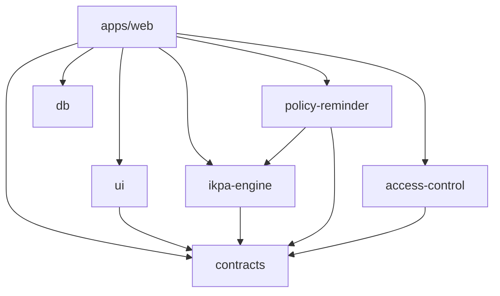

# ADR-005 — Struktur Repository dan Package Manager

**Status:** Accepted for implementation  
**Date:** 31 Agustus 2026  
**Decision owner:** Solution Architect  
**Related:** F0-07, F1-01, [ADR-004 — Resolver Versi Rule Set](ADR-004-rule-set-resolution.md)

## Context

Repo saat ini adalah satu aplikasi TanStack Start minimal di root:

```text
src/
  routes/
  router.tsx
  routeTree.gen.ts
  styles.css
vite.config.ts
tsr.config.json
tsconfig.json
package.json
package-lock.json
```

TSD menargetkan pemisahan aplikasi web dari modul domain dan persistence agar
engine IKPA, policy reminder, access control, kontrak, UI, dan database dapat
diuji serta digunakan tanpa saling mengimpor secara melingkar. F1-01 akan
memindahkan starter ke struktur tersebut; F0-07 hanya menetapkan keputusan dan
mapping sehingga migrasi tidak dilakukan secara diam-diam.

Bukti package manager saat ini adalah `package-lock.json` lockfile version 3.
Tidak ada `pnpm-lock.yaml`, `yarn.lock`, atau `bun.lockb`. Field `pnpm` pada
`package.json` saat ini hanya metadata starter untuk `onlyBuiltDependencies`
dan tidak cukup menjadi alasan untuk mengoperasikan dua package manager.

Dokumentasi TanStack Start yang diperiksa untuk keputusan ini tetap menempatkan
`src/routes`, konfigurasi Vite, router, dan `routeTree.gen.ts` di dalam satu
aplikasi. Dokumentasi npm mendukung deklarasi workspace melalui field
`workspaces` pada root `package.json` dan eksekusi script dengan `--workspace`/
`--workspaces`.

## Decision

### 1. npm workspaces

Project memakai **npm workspaces** dengan satu root `package-lock.json`.
Root `package.json` menjadi manifest workspace private:

```json
{
  "name": "simpatik-v0",
  "private": true,
  "workspaces": [
    "apps/web",
    "packages/*"
  ]
}
```

Nama root dipertahankan selama migrasi untuk menghindari perubahan yang tidak
dibutuhkan. Nama package workspace dapat memakai namespace `@simulator-ikpa/*`.
Tidak boleh ada lockfile atau instalasi dependency mandiri di dalam workspace.

Aturan operasi:

- developer menjalankan `npm install` dari root;
- CI memakai `npm ci` dari root;
- script aplikasi dijalankan dengan `npm run <script> --workspace apps/web`
  atau melalui convenience script root;
- script yang tersedia pada beberapa package dapat dijalankan dengan
  `npm run <script> --workspaces --if-present`;
- route generator hanya dijalankan pada workspace web; dan
- dependency yang hanya dipakai satu package dideklarasikan pada package itu,
  bukan otomatis di root.

Root boleh menyediakan script delegasi berikut tanpa memiliki source aplikasi:

```json
{
  "scripts": {
    "dev": "npm run dev --workspace apps/web",
    "build": "npm run build --workspace apps/web",
    "generate-routes": "npm run generate-routes --workspace apps/web",
    "check": "npm run check --workspaces --if-present"
  }
}
```

Script final dapat berkembang pada F1/F13, tetapi tidak boleh membuat package
menjalankan install atau lockfile sendiri.

### 2. Target tree

Struktur target minimum:

```text
.
├── apps/
│   └── web/
│       ├── package.json
│       ├── vite.config.ts
│       ├── tsr.config.json
│       ├── tsconfig.json
│       └── src/
│           ├── routes/
│           ├── router.tsx
│           ├── routeTree.gen.ts
│           └── styles.css
├── packages/
│   ├── contracts/
│   ├── ui/
│   ├── ikpa-engine/
│   ├── policy-reminder/
│   ├── access-control/
│   └── db/
├── biome.json
├── package.json
├── package-lock.json
└── README.md
```

`apps/web` adalah satu-satunya aplikasi deployable pada MVP. Package di bawah
`packages/` adalah unit library; masing-masing memiliki `package.json`, source,
dan test sesuai kebutuhan. Tidak perlu menambah package `config`, `shared`,
atau `utils` generik sebelum ada dua consumer nyata.

### 3. Mapping starter saat ini

| Saat ini | Target F1-01 | Aturan |
|---|---|---|
| `src/routes/**` | `apps/web/src/routes/**` | Tetap mengikuti file-based routing TanStack Start |
| `src/router.tsx` | `apps/web/src/router.tsx` | Router hanya milik aplikasi web |
| `src/routeTree.gen.ts` | `apps/web/src/routeTree.gen.ts` | Generated; tidak diedit manual |
| `src/styles.css` | `apps/web/src/styles.css` | CSS global aplikasi web |
| `vite.config.ts` | `apps/web/vite.config.ts` | Konfigurasi build/development web |
| `tsr.config.json` | `apps/web/tsr.config.json` | Target route generator web |
| `tsconfig.json` | Root shared config + `apps/web/tsconfig.json` | App extends config bersama; detail F1-01 |
| `package.json` | Root manifest + `apps/web/package.json` | Dependency dipisah berdasarkan consumer |
| `package-lock.json` | `package-lock.json` root | Satu lockfile npm untuk seluruh workspace |
| `biome.json` | `biome.json` root | Satu konfigurasi format/lint lintas workspace |
| `README.md`, `AGENTS.md` | Root | Aturan repo dan onboarding tetap di root |

Migrasi file dilakukan dengan operasi yang mempertahankan history (misalnya
`git mv`) pada F1-01. F0-07 tidak memindahkan atau membuat ulang source.

### 4. Package boundary

| Package | Tanggung jawab | Boleh bergantung pada | Dilarang bergantung pada |
|---|---|---|---|
| `contracts` | DTO, enum, schema validasi, structured error lintas layer | Dependency validasi yang disetujui F0-08 | React, database adapter, route, Vercel/QStash |
| `ui` | Primitive dan komponen UI reusable | React, `contracts` bila tipe tampilan benar-benar shared | `db`, server secret, route feature |
| `ikpa-engine` | Formula indikator, decimal policy, result/trace, golden test | `contracts` | React, HTTP, database, scheduler |
| `policy-reminder` | Rule resolver, deadline, compliance, scheduler domain | `contracts`, `ikpa-engine` bila diperlukan | React, ORM, provider email/job langsung |
| `access-control` | Access resolver, role/scope decision, guard primitives | `contracts` | Komponen UI, route, query database konkret |
| `db` | Drizzle schema, migration, scoped query/helper persistence | Driver/ORM dan tipe minimal yang diperlukan | React, route, provider delivery |
| `apps/web` | Routes, feature components, server functions, API/jobs, email adapter | Seluruh package yang relevan | — |

Dependency graph yang diizinkan:



Tidak ada package yang mengimpor `apps/web`. `db` hanya diimpor dari kode
server; komponen/browser code tidak boleh mengakses database secara langsung.
Provider konkret seperti Clerk, Resend, dan QStash tetap berada pada adapter
server aplikasi sampai kebutuhan package reusable benar-benar terbukti.

### 5. TanStack Start boundary

TanStack Start tetap diperlakukan sebagai framework aplikasi di `apps/web`:

- route file berada di `apps/web/src/routes`;
- `routeTree.gen.ts` dihasilkan oleh tooling dari workspace web;
- `getRouter` dan module registration berada di `apps/web/src/router.tsx`;
- Vite, React plugin, Tailwind, dan TanStack devtools dikonfigurasi pada app;
- server functions/API routes berada di `apps/web/src/server` atau route server
  yang sesuai; dan
- package domain tidak mengimpor API route atau lifecycle framework.

Saat F1-01 memindahkan config, plugin order harus diverifikasi terhadap versi
dependency yang terpasang: plugin devtools tetap mengikuti aturan repository,
`tanstackStart()` berada sebelum plugin React, dan route generator berjalan dari
working directory aplikasi yang benar. Verifikasi ini bukan perubahan scope
F0-07.

### 6. TypeScript dan import policy

- Alias `@/` atau `#` hanya untuk source internal `apps/web`; package memakai
  package import seperti `@simulator-ikpa/contracts`.
- Package mengeluarkan entry point yang jelas melalui `exports`; deep import ke
  folder internal tidak menjadi API.
- `contracts` tidak mengimpor tipe dari database schema.
- `db` tidak menjadi dependency transitif browser melalui barrel export app.
- Import cycle antar package adalah build error yang harus diperbaiki, bukan
  diselesaikan dengan dynamic import.
- Shared TypeScript base options boleh berada di root, sedangkan `include` dan
  path aplikasi berada pada `apps/web/tsconfig.json`.

### 7. Source, build, dan deployment policy

- Root adalah tempat install, lockfile, shared lint/format, dan CI entry point.
- `apps/web` adalah build/deploy unit; build output tidak di-commit.
- Generated route tree, migration, dan snapshot generator tidak diedit manual.
- Package library tidak menyimpan dependency runtime yang hanya diperlukan oleh
  server adapter.
- Perubahan dependency wajib memperbarui root `package-lock.json` dalam commit
  yang sama.
- Vercel/target deployment nantinya diarahkan ke root workspace dengan command
  `npm run build`; detail runtime dan environment menjadi task DevOps terpisah.

## Migration sequence for F1-01

1. Buat root workspace metadata dan package manifest aplikasi web tanpa
   mengubah perilaku route.
2. Pindahkan `src/**` serta config aplikasi ke `apps/web` dengan history tetap
   terbaca.
3. Perbarui import path, script, route generation, dan build context.
4. Buat manifest package domain hanya ketika package boundary tersebut mulai
   diimplementasikan; jangan menambah source placeholder untuk seluruh package.
5. Pindahkan dependency dari root ke consumer sebenarnya dan pertahankan satu
   lockfile npm.
6. Hapus field `pnpm` yang tidak dipakai setelah `npm install` dan seluruh
   quality gate lulus.
7. Jalankan route generation, typecheck, lint, build, dan smoke test starter.

Jika langkah pemindahan menemukan dependency atau config yang membutuhkan
keputusan baru, hentikan migrasi dan buat ADR/task terpisah. Jangan menyelesaikan
konflik dengan menambahkan package generik atau menjalankan dua package manager.

## Rejected alternatives

### pnpm workspaces

Ditolak untuk MVP karena repo tidak memiliki `pnpm-lock.yaml`, CI/developer
workflow saat ini berbasis npm, dan memilihnya hanya karena field metadata
starter akan memaksa migrasi tool serta lockfile tanpa manfaat yang diperlukan
oleh scope saat ini.

### Yarn atau Bun workspaces

Ditolak karena tidak ada lockfile atau konfigurasi yang mendukungnya. Menambah
manager baru tidak menyelesaikan boundary aplikasi/domain.

### Tetap single app di root

Ditolak karena membuat package domain hanya berupa folder internal, sulit
menegakkan aturan dependency, dan bertentangan dengan target TSD sebelum UI
bertambah banyak.

### Monorepo dengan banyak aplikasi deployable

Ditolak sebagai over-scope MVP. Hanya `apps/web` yang dibutuhkan; worker/job
terpisah dapat ditambahkan bila batas runtime benar-benar mengharuskannya.

### Workspace glob untuk folder yang belum memiliki package

Tidak masalah menggunakan `packages/*` pada root, tetapi setiap directory yang
menjadi workspace harus memiliki manifest valid sebelum install. Package yang
belum dikerjakan tidak dibuat sebagai placeholder hanya untuk memenuhi tree.

## Consequences

### Positif

- Satu perintah install dan satu lockfile menjaga dependency reproducible.
- Boundary server/domain/UI terlihat dan dapat diuji secara terpisah.
- TanStack Start tetap memiliki struktur standar di dalam `apps/web`.
- Package domain tidak terikat pada deployment provider atau React.
- F1-01 memiliki mapping migrasi yang dapat diverifikasi tanpa mengubah scope.

### Negatif

- Root dan app membutuhkan manifest serta script tambahan.
- Import path dan Vite/route generator perlu disesuaikan saat pemindahan.
- CI harus memahami npm workspace commands.
- Dependency placement perlu ditinjau agar tidak terjadi dependency hoisting yang
  menyamarkan import yang seharusnya dideklarasikan.

## Verification references

- [TanStack Start project directory structure](https://tanstack.com/start/latest/docs/framework/react/tutorial/reading-writing-file.md)
- [TanStack Start file-based routing](https://tanstack.com/start/latest/docs/framework/react/guide/routing.md)
- [npm workspaces](https://github.com/npm/cli/blob/latest/docs/lib/content/using-npm/workspaces.md)

## Follow-up and scope boundary

- **F1-01:** Melakukan migrasi fisik, route generation, typecheck, lint, build,
  dan smoke test.
- **F1-02/F1-03:** Memasang dependency UI dan token pada workspace yang benar.
- **F0-08:** Menetapkan dependency decimal/XLSX/PDF/storage sebelum package
  domain menambah dependency runtime.
- **F0-11:** Menetapkan DTO/schema contracts yang dikonsumsi package.
- **F7-05:** Membuat package `db` dan schema Drizzle.
- **F10-02:** Membuat package `policy-reminder` dan resolver runtime.

ADR ini tidak mengubah source starter, lockfile, dependency, atau konfigurasi
deployment pada F0-07. Semua itu dikerjakan dan diverifikasi melalui F1-01 atau
task yang memang memiliki file tersebut dalam scope.

## Definition of Done F0-07

- [x] npm workspaces dipilih berdasarkan kondisi repo dan lockfile.
- [x] Mapping starter root ke `apps/web` ditetapkan.
- [x] Boundary `contracts`, `ui`, `ikpa-engine`, `policy-reminder`,
  `access-control`, dan `db` ditetapkan.
- [x] Dependency direction dan server/browser boundary dijelaskan.
- [x] Satu lockfile, script policy, generated-file policy, dan migration sequence
  ditetapkan.
- [x] Alternatif package manager dan struktur yang ditolak didokumentasikan.
