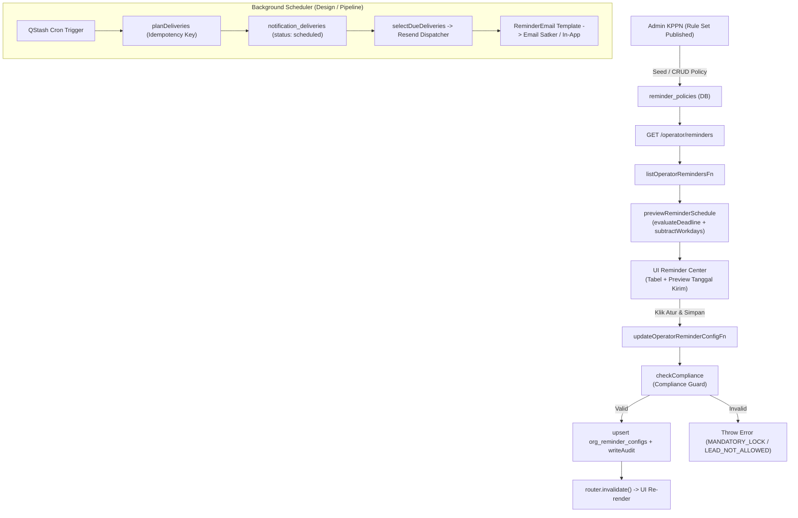

# 10 — Reminder Center (`/operator/reminders`)

**Anchor:** `00-system-overview.md`, `01-dashboard.md` | **Tanggal:** 2026-09-07
**Mode:** INSPECT → TRACE → DOCUMENT. Tanpa vonis regulasi, tanpa ubahan code/docs operasional.

## 1. Module Purpose

Halaman `/operator/reminders` (Reminder Center) berfungsi sebagai pusat kendali preferensi jadwal dan notifikasi pengingat tenggat waktu indikator IKPA pada tingkat Satker (Organization Delivery Layer). Modul ini menjembatani kebijakan kepatuhan KPPN (`reminder_policies` dari Regulatory Policy Layer) dengan kebutuhan operasional Satker (`org_reminder_configs`), mengkalkulasi preview tanggal kirim H-lead time secara server-authoritative berbasis kalender hari kerja/kalender via engine `packages/policy-reminder` & Compliance Guard, serta mengunci kebijakan bersifat *mandatory* agar tidak dapat dimatikan oleh Satker. Modul ini bukan penghitung skor IKPA langsung (bobot 0%), melainkan pelindung ketepatan waktu seluruh indikator berbobot IKPA.

## 2. Implementation Status

| Aspek | Status |
|---|---|
| Read policy aktif + config satker + server-authoritative preview | IMPLEMENTED |
| Form Drawer konfigurasi reminder (lead days, recipients, custom message) | IMPLEMENTED |
| Compliance Guard enforcement (mandatory lock, lead range, recipient wajib) | IMPLEMENTED |
| Reset konfigurasi satker ke default policy KPPN | IMPLEMENTED |
| Summary Metrics Banner (Aktif, Mandatory Terkunci, Kanal Pengiriman) | IMPLEMENTED (kalkulasi client dari loader) |
| Pre-fill data tersimpan di Form Drawer | NOT IMPLEMENTED (selalu reset ke string `"7, 3, 1"` & email `""`, §21) |
| Mapping Event Type DB vs UI | PARTIAL / DISCREPANCY (DB snake_case vs UI uppercase, §21) |
| Background Cron Scheduler & Dispatcher nyata (QStash + Resend email) | STUB / DEFERRED (helper & template ada, runner belum aktif di lokal) |
| Template Email Pengingat (`ReminderEmail`) | IMPLEMENTED (React HTML template + unit test) |
| Strip Pengingat Kontekstual di halaman Indikator | IMPLEMENTED (Output, Tagihan SPM-LS, UP/TUP, Deviasi RPD) |
| No-DB Fallback | IMPLEMENTED (payload kosong aman tanpa crash) |
| Audit Trail konfigurasi reminder | IMPLEMENTED (`org_reminder_configs` via `writeAudit`) |

## 3. Source Code Map

| Lapisan | File |
|---|---|
| UI Halaman | `apps/web/src/routes/operator/reminders.tsx` (485 baris) |
| Service tipis | `apps/web/src/services/reminders-service.ts` (66 baris, passthrough 3 fn) |
| ServerFn | `apps/web/src/server/reminders.ts` (270 baris, `listOperatorRemindersFn`, `updateOperatorReminderConfigFn`, `resetOperatorReminderConfigFn` + FY auto-init + fallback) |
| Query Domain | `apps/web/src/server/reminders/config.queries.ts` (`listReminderConfigs`, `getReminderConfig`, `previewReminderSchedule`) |
| Mutasi Domain | `apps/web/src/server/reminders/config.mutations.ts` (`upsertReminderConfig`, `resetReminderConfigToDefault` + `sanitizeMessage` + `writeAudit`) |
| Query/Mutasi Delivery (Admin) | `apps/web/src/server/reminders/delivery.queries.ts` (`listDeliveriesForAdmin`, `getDeliveryForAdmin`), `apps/web/src/server/reminders/delivery.mutations.ts` (`retryFailedDelivery`) |
| Engine Kebijakan | `packages/policy-reminder/src/index.ts`, `compliance-guard.ts` (`checkCompliance`, `assertCompliance`), `deadline-calculator.ts` (`evaluateDeadline`), `scheduler.ts` (`buildIdempotencyKey`, `planDeliveries`, `insertScheduledDeliveries`, `selectDueDeliveries`), `workday-calendar.ts` (`isWorkday`, `addWorkdays`, `subtractWorkdays`, `countWorkdays`), `rule-set-resolver.ts` (`resolveRuleSet`, `validateNoOverlap`) |
| Email Component | `apps/web/src/emails/reminder-email.tsx` (`ReminderEmail`), `reminder-email.test.tsx` |
| Skema DB | `packages/db/src/schema/policy.ts` (`reminderPolicies`, `ruleSets`), `packages/db/src/schema/reminder-configs.ts` (`orgReminderConfigs`), `packages/db/src/schema/notification-deliveries.ts` (`notificationDeliveries`) |
| Seed Kebijakan | `packages/db/src/seed.ts:181-285` (5 policy 2026: revisi DIPA, SPM-LS 17 HK, revolving UP, capaian output, dispensasi Q4) |
| Navigasi Shell | `apps/web/src/components/layout/operator-navigation.tsx:50-54` (`Reminder Center` → `/operator/reminders`) |
| Integrasi Indikator | `routes/operator/data/contracts-invoices.tsx:1402`, `routes/operator/up-tup.tsx:173`, `routes/operator/data/output-achievement.tsx:388`, `routes/operator/data/rpd-realization.tsx` |
| Mock Mati / Admin | `apps/web/src/mocks/reminders.ts` (`mockReminders`), `apps/web/src/mocks/reminder-policies.ts`, `routes/admin-kppn/policy/reminders.tsx`, `routes/admin-kppn/monitoring/reminders.tsx` |

## 4. User Flow

1. Sidebar `Reminder Center` → `/operator/reminders` (guard operator, `ActiveContextProvider`).
2. `loader` → `fetchOperatorReminders(activeOrgId)` → `listOperatorRemindersFn`:
   - Validasi sesi auth & otorisasi via `getAccessResolutionForSession` + `assertOperatorOrgScope`.
   - `getOrInitFiscalYear(db, targetOrgId, 2026)`.
   - Query `reminderPolicies` aktif (`isActive = true`).
   - Query `orgReminderConfigs` satker pada FY aktif (`listReminderConfigs`).
   - Komputasi preview jadwal via `previewReminderSchedule` (evaluasi DSL `evaluateDeadline` + pengurangan hari kerja `subtractWorkdays` / hari kalender) untuk setiap kebijakan.
3. Halaman me-render:
   - Header banner: "Reminder Center — Jadwal & Notifikasi Tenggat" + badge "Compliance Guard Active".
   - 3 Kartu Metrik: "Kebijakan Aktif", "Kebijakan Mandatory", "Kanal Pengiriman" (Email Satker & In-App, 08:00 WIB).
   - Tabel `DomainDataTable`: "Daftar Jadwal & Kebijakan Pengingat IKPA" (kolom Event & Batas Evaluasi, Kategori Policy + badge Lock, Jadwal Kirim & Lead Time, Status Aktif/Non-Aktif, Tombol Aksi Atur & Reset).
4. Klik `Atur` pada baris tabel → `handleOpenEdit` → buka `DomainFormDrawer`:
   - Jika policy mandatory (`!allowDisable`): banner merah peringatan mandatory + checkbox `Aktifkan Notifikasi Pengingat` terkunci (*disabled*).
   - Input `Lead Days Notifikasi` (comma-separated, min–max lead days ditampilkan pada subteks).
   - Input `Email Tambahan Penerima` (comma-separated, disabled bila `!allowRecipientOverride`).
   - Input `Pesan Tambahan (Opsional)` (textarea max 500 karakter).
5. Klik `Simpan` → `handleSaveConfig`:
   - Client parse input integer array dan recipient string array.
   - Panggil `saveReminderConfig` → ServerFn `updateOperatorReminderConfigFn` → `upsertReminderConfig`.
   - Validasi Zod `upsertSchema` + verifikasi `checkCompliance` (menolak jika mandatory dinonaktifkan, lead time di luar batas `minLeadDays..maxLeadDays`, atau required recipients dihapus).
   - Sanitasi script tags pada `customMessage` (`sanitizeMessage`).
   - Upsert ke `org_reminder_configs` + catat `writeAudit` (`update_reminder_config` / `create_reminder_config`).
   - Kembalikan sukses → drawer tertutup → pesan hijau feedback 4 detik → `router.invalidate()` re-fetch data.
6. Klik tombol `Reset` (RotateCcw) pada baris yang memiliki `configId`:
   - Browser dialog `confirm()` → `resetReminderConfig` → ServerFn `resetOperatorReminderConfigFn` → `resetReminderConfigToDefault`.
   - Kembalikan `scheduleJson` ke `policy.defaultScheduleJson`, kosongkan `additionalRecipientsJson` (`[]`), bersihkan `customMessage` (`null`), set `enabled = true`.
   - Catat `writeAudit` (`reset_reminder_config`) → `router.invalidate()`.

Empty/error: tabel kosong → empty state `DomainDataTable`; gagal otorisasi/FY → error boundary route; mutasi/compliance guard gagal → banner `role="alert"` merah; sukses → `<output>` hijau auto-hilang dalam 4 detik.

## 5. Input Inventory

| Input | Type | Required | Default | Validation | Source | Digunakan Engine / Scheduler? |
|---|---|---|---|---|---|---|
| `formEnabled` | checkbox | Ya | `true` | FE: disabled jika mandatory; BE: `checkCompliance` tolak `false` pada mandatory | drawer | YA (menentukan apakah delivery dijadwalkan) |
| `formLeadDays` | text (comma-separated) | Ya | `"7, 3, 1"` (hardcoded prefill) | FE: split int, filter `>0`; BE: `minLeadDays <= lead <= maxLeadDays`, array tidak boleh kosong | drawer | YA (menentukan tanggal kirim H-n) |
| `formRecipients` | text (comma-separated) | Tidak | `""` (hardcoded prefill) | FE: split string trim; BE: disabled jika `!allowRecipientOverride`, required recipients policy wajib ada | drawer | YA (alamat tujuan email pengingat) |
| `formMessage` | textarea | Tidak | `""` | FE: `maxLength={500}`; BE: `max(1000)`, sanitasi tag `<script>` | drawer | YA (disertakan pada body email pengingat) |
| `search` | text | Tidak | `""` | client `includes` pada event name / eventType | toolbar tabel | TIDAK |
| `timezone` | string | Sistem | `"Asia/Jakarta"` | BE: `z.string().min(1).max(64)` | server mutasi | YA (penentu offset waktu kirim ISO) |
| `sendHour` | integer | Sistem | `8` | hardcoded di mutasi `scheduleJson.sendHour = 8` | server mutasi | YA (penentu jam kirim 08:00 WIB) |

## 6. Validation Rules

- Frontend (`reminders.tsx:123-141`):
  - Parse `formLeadDays`: `split(",")` → `parseInt(s, 10)` → filter `!isNaN(n) && n > 0`. Fallback ke `[7, 3, 1]` jika kosong.
  - Parse `formRecipients`: `split(",")` → `trim()` → filter non-empty string.
  - Form lock: checkbox `formEnabled` disabled jika `!selectedPolicy.allowDisable`; input `formRecipients` disabled jika `!selectedPolicy.allowRecipientOverride`.
- Backend Zod (`config.mutations.ts:14-22`):
  - `upsertSchema`: `fiscalYearId` UUID, `reminderPolicyId` UUID, `enabled` boolean, `scheduleJson` unknown, `additionalRecipientsJson` array string optional, `customMessage` string max 1000 nullable optional, `timezone` string 1..64 optional. `strictObject` menolak atribut asing.
- Compliance Guard Backend (`compliance-guard.ts:32-127`):
  - `MANDATORY_LOCK`: `policy.category === "mandatory" && !config.enabled` → throw error "Policy {eventType} mandatory tidak boleh dinonaktifkan."
  - `POLICY_INACTIVE`: `!policy.isActive && config.enabled` → throw error "Policy {eventType} sudah tidak aktif."
  - `LEAD_NOT_ALLOWED`: setiap `lead` harus berada dalam rentang `[minLeadDays..maxLeadDays]` (atau `allowedLeadDays`) → throw error.
  - `LEAD_EMPTY`: array `scheduleLeadDays` tidak boleh kosong → throw error.
  - `REQUIRED_RECIPIENT_MISSING`: seluruh recipient yang ada di `policy.requiredRecipientsJson` wajib ada pada gabungan daftar recipient → throw error.
  - `RECIPIENT_OVERRIDE_NOT_ALLOWED`: jika `!policy.allowRecipientOverride` dan recipient diubah → throw error.
  - `CHANNEL_INVALID`: channel di luar `["email", "digest", "escalation"]` → throw error.
- Sanitasi Input (`config.mutations.ts:40-44`):
  - `sanitizeMessage`: menghapus regex `/<script[^>]*>.*?<\/script>/gi` dan memotong string maksimal 1000 karakter sebelum disimpan ke database.
- Otorisasi Scope:
  - `assertOperatorOrgScope(access, targetOrgId)` + `assertFy(db, access, orgId, fiscalYearId)` memastikan operator hanya dapat mengakses dan mengonfigurasi policy pada Satker yang menjadi wewenangnya.

## 7. Business Rules

**Rule ID:** REM-BR-001 — Model Dua Lapisan (Two-Layer Governance)
Trigger: Semua operasi reminder. Condition: KPPN menetapkan aturan dasar pada `reminder_policies` (Regulatory Layer); Satker hanya boleh mengkustomisasi pada `org_reminder_configs` dalam batasan yang diizinkan policy (Organization Delivery Layer). Output: Konfigurasi satker tunduk pada invariant KPPN. Ref: FSD:924-930; PRD:114.

**Rule ID:** REM-BR-002 — Mandatory Policy Lock
Trigger: Pembukaan form drawer & submit mutasi. Condition: `policy.category === "mandatory"` atau `policy.allowDisable === false`. Processing: Checkbox UI disabled; `checkCompliance` menolak mutasi bila `enabled === false` (`MANDATORY_LOCK`). Output: Kebijakan mandatory selalu aktif. Ref: `compliance-guard.ts:39-45`; `reminders.tsx:400-403`.

**Rule ID:** REM-BR-003 — Batasan Rentang Lead Time
Trigger: Submit konfigurasi reminder. Condition: Setiap elemen `leadDays` harus memenuhi `minLeadDays <= lead <= maxLeadDays`. Processing: `checkCompliance` memvalidasi array lead days. Output: Jika melanggar, mutasi dibatalkan dengan error `LEAD_NOT_ALLOWED`. Ref: `compliance-guard.ts:54-80`; ADR-003.

**Rule ID:** REM-BR-004 — Perlindungan Penerima Wajib (Required Recipients)
Trigger: Submit konfigurasi reminder. Condition: `policy.requiredRecipientsJson` memuat peran wajib (misal `["ppk", "kpa"]` atau `["bendahara"]`). Processing: Server menggabungkan required recipients dengan `additionalRecipientsJson` dan memastikan penerima wajib tidak hilang. Output: Jika dihilangkan atau `!allowRecipientOverride` dilanggar, mutasi ditolak. Ref: `compliance-guard.ts:88-112`; `config.mutations.ts:84-88`.

**Rule ID:** REM-BR-005 — Evaluasi Deadline Deterministik (DSL & Workdays)
Trigger: Query preview jadwal (`previewReminderSchedule`) & planning scheduler (`planDeliveries`). Processing: Deadline dievaluasi via `evaluateDeadline(formula, ctx, cal)`:
- `workdays_after_bast`: `addWorkdays(bastDate, workdays, cal)`
- `workdays_after_month_end`: `addWorkdays(lastDayOfMonth(year, month), workdays, cal)`
- `monthly_revolving`: `addCalendarDays(referenceDate, days)`
- `quarterly_deadline`: `quarterEnd(year, quarter)`
- `end_of_year_schedule`: `${year}-12-31`
Output: Tanggal ISO `deadline` (YYYY-MM-DD). Ref: `deadline-calculator.ts:36-83`.

**Rule ID:** REM-BR-006 — Perhitungan Tanggal Kirim H-Lead Time
Trigger: Komputasi jadwal kirim per lead. Condition: `dayType === "workday"` vs `dayType === "calendar_day"`. Processing:
- Workday: `subtractWorkdays(deadline, leadDays, cal)` (mundur melewati Sabtu, Minggu, dan hari libur kalender).
- Calendar day: `deadline - leadDays` hari kalender.
Output: Array `scheduledDate` (YYYY-MM-DD) dan waktu kirim lokal `${scheduledDate}T08:00:00+07:00`. Ref: `config.queries.ts:114-125`; `scheduler.ts:48-74`.

**Rule ID:** REM-BR-007 — Idempotency Key Pengiriman
Trigger: Pembentukan antrean notifikasi `notification_deliveries`. Processing: `buildIdempotencyKey` menghasilkan format `${orgId.slice(0,8)}-${policyId.slice(0,8)}-${deadline}-H${leadDays}-${hash16}` dari sha256 parameter organisasi, policy, deadline, lead, dan rule set version. Output: Mencegah duplikasi pengiriman email pada tanggal/tenggat yang sama (safe replay). Ref: `scheduler.ts:8-21, 80-124`.

**Rule ID:** REM-BR-008 — Reset Konfigurasi ke Default Policy KPPN
Trigger: Klik tombol Reset pada baris dengan konfigurasi tersimpan. Processing: Server mengembalikan `scheduleJson` ke `policy.defaultScheduleJson`, `additionalRecipientsJson` ke `[]`, `customMessage` ke `null`, dan `enabled` ke `true`. Output: Konfigurasi satker kembali persis mengikuti standar regulasi KPPN. Ref: `config.mutations.ts:170-218`.

**Rule ID:** REM-BR-009 — Audit Logging Mutasi Konfigurasi
Trigger: Tiap eksekusi `upsertReminderConfig` atau `resetReminderConfigToDefault`. Processing: `writeAudit` mencatat log dengan `entityType: "org_reminder_configs"`, action `create_reminder_config` / `update_reminder_config` / `reset_reminder_config`, disertai snapshot `beforeJson` dan `afterJson`. Output: Jejak audit tersimpan di tabel `audit_logs`. Ref: `config.mutations.ts:125-136, 155-166, 205-216`.

## 8. Calculation Logic

Reminder Center tidak menghitung nilai numerik skor IKPA, melainkan menjalankan kalkulasi tanggal (*calendar arithmetic*) yang authoritative:
1. **Evaluasi Deadline:** Berdasarkan formula DSL (`deadlineFormula`) dan kalender hari kerja (`WorkdayCalendar` yang memuat array `holidays` dan `workdays`), engine mengevaluasi tanggal jatuh tempo evaluasi kepatuhan indikator.
2. **Kalkulasi Offset Pengiriman:** Dari tanggal deadline yang diperoleh, untuk setiap `leadDays` (misal 7, 3, 1), engine menghitung mundur tanggal eksekusi notifikasi:
   - Jika `dayType: "workday"`, pengurangan menggunakan algoritma `subtractWorkdays` yang melewati weekend (Sabtu/Minggu) serta daftar hari libur nasional (`holidays`).
   - Jika `dayType: "calendar_day"`, pengurangan menggunakan pengurangan tanggal kalender murni.
3. **Format Jadwal Preview:** Hasil kalkulasi dirakit menjadi objek `{ policyId, deadline, dayType, scheduled: [{ leadDays, scheduledDate, deadline }] }` yang dikirim ke UI untuk ditampilkan pada kolom "Jadwal Kirim".

## 9. Formula & Variables

Persis implementasi package `packages/policy-reminder`:

- **Hitung Mundur Hari Kerja (`subtractWorkdays`):**
  $$\text{scheduledDate} = \text{Date}(\text{deadline}) - n \text{ hari kerja (excluding holidays \& weekends)}$$
  Loop terikat (*bounded guard* $\le 800$ iterasi) untuk mencegah *infinite loop*.
- **Hitung Maju Hari Kerja (`addWorkdays`):**
  $$\text{deadline} = \text{Date}(\text{startDate}) + n \text{ hari kerja}$$
- **Selisih Hari Kerja (`countWorkdays`):**
  Start-exclusive, end-inclusive per ADR-001. Menghitung jumlah hari kerja antara dua tanggal ISO.
- **Idempotency Hash:**
  $$\text{Key} = \text{orgId}_{0..8} \text{ + } \text{policyId}_{0..8} \text{ + } \text{deadline} \text{ + } \text{"H"} \text{leadDays} \text{ + } \text{SHA256}(\text{raw})_{0..16}$$
  di mana $\text{raw} = \text{orgId} \mid \text{policyId} \mid \text{eventType} \mid \text{deadline} \mid \text{H-leadDays} \mid \text{ruleSetVersion}$.

## 10. Threshold / Weight / Period / Rounding

- **Bobot Indikator:** Modul ini berbobot `0%` pada total IKPA (merupakan modul utilitas kepatuhan & notifikasi).
- **Rentang Lead Time (Default 2026 Seed):**
  - Revisi DIPA (`dipa_revision_quarterly`): 5–14 hari kalender (default `[14, 7, 3, 1]`).
  - SPM-LS 17 HK (`spm_ls_contract_17d`): 3–10 hari kerja (default `[10, 5, 2]`).
  - UP/TUP Revolving (`up_tup_revolving_monthly`): 3–7 hari kalender (default `[7, 3, 1]`).
  - Capaian Output (`output_report_monthly`): 2–5 hari kerja (default `[5, 2]`).
  - Dispensasi SPM Q4 (`spm_dispensation_q4`): 7–21 hari kalender (default `[21, 14, 7, 3, 1]`).
- **Waktu Pengiriman Notifikasi:** Jam `08:00` atau `09:00` WIB (Asia/Jakarta, UTC+7).
- **Format Tanggal:** ISO-8601 `YYYY-MM-DD` (penanggalan UTC midnight untuk eliminasi tz-shift).
- **Rounding:** Tidak ada pembulatan numerik desimal pada modul ini.

## 11. Calculation Examples (engine aktual, `packages/policy-reminder`)

### Normal Case — SPM-LS 17 Hari Kerja
- Input Policy: `dayType: "workday"`, `deadlineFormula: { type: "workdays_after_bast", workdays: 17 }`.
- Konteks: `bastDate: "2026-01-30"`, `leadDays: [10, 5, 2]`, Kalender: Mon–Fri kerja reguler.
- Eksekusi:
  1. `evaluateDeadline`: BAST 2026-01-30 + 17 hari kerja → Deadline: `2026-02-24` (Selasa).
  2. `subtractWorkdays(2026-02-24, 10)` → `2026-02-10` (H-10).
  3. `subtractWorkdays(2026-02-24, 5)` → `2026-02-17` (H-5).
  4. `subtractWorkdays(2026-02-24, 2)` → `2026-02-20` (H-2).
- Hasil: 3 jadwal pengiriman terbentuk pada tanggal `2026-02-10`, `2026-02-17`, dan `2026-02-20` pukul 08:00 WIB.

### Boundary Case — Capaian Output H-5 & H-2 (Batas Min & Max)
- Input Policy: `dayType: "workday"`, `minLeadDays: 2`, `maxLeadDays: 5`, `defaultScheduleJson: { leadDays: [5, 2] }`.
- Input User: `leadDays: [5, 2]` (persis batas minimum 2 dan maksimum 5).
- Eksekusi: `checkCompliance` memverifikasi seluruh nilai $\in [2, 3, 4, 5]$ → Valid. Lolos dan tersimpan.

### Edge/Invalid Case
- (a) **Pelanggaran Lead Time Range:** User menginput lead time `[10]` pada policy Capaian Output (max 5) → `checkCompliance` melempar `LEAD_NOT_ALLOWED` ("Lead 10 tidak diperbolehkan untuk output_report_monthly. Allowed: 2,3,4,5"). Mutasi ditolak.
- (b) **Percobaan Menonaktifkan Kebijakan Mandatory:** User mengirim `enabled: false` pada policy `spm_ls_contract_17d` → `checkCompliance` melempar `MANDATORY_LOCK` ("Policy spm_ls_contract_17d mandatory tidak boleh dinonaktifkan."). Mutasi ditolak.
- (c) **Penerima Wajib Dihapus:** Policy mewajibkan `["ppk", "kpa"]`, user mengirim `additionalRecipients: ["operator@satker.go.id"]` dengan menghapus `ppk` dari array kirim → `checkCompliance` melempar `REQUIRED_RECIPIENT_MISSING`. Mutasi ditolak.
- (d) **Fallback Database Kosong:** Saat `DATABASE_URL` tidak tersedia, loader mengembalikan `{ fiscalYearId: "fy-mock-2026", year: 2026, policies: [], configs: [], previews: [] }` dan UI menampilkan empty state tabel secara aman tanpa runtime crash.

## 12. Data Model & Persistence

- `reminder_policies` (`packages/db/src/schema/policy.ts:48-85`):
  `id` (UUID PK), `ruleSetId` (FK `rule_sets`), `eventType` (text), `indicatorKey` (text), `category` (`mandatory | recommended | optional`), `deadlineFormula` (JSONB), `dayType` (`workday | calendar_day | event_based | schedule`), `minLeadDays` (int), `maxLeadDays` (int), `defaultScheduleJson` (JSONB), `requiredRecipientsJson` (JSONB), `allowDisable` (bool), `allowRecipientOverride` (bool), `isActive` (bool), `createdAt`, `updatedAt` + unique index `(rule_set_id, event_type)`.
- `org_reminder_configs` (`packages/db/src/schema/reminder-configs.ts:15-56`):
  `id` (UUID PK), `orgId` (FK `organizations`), `fiscalYearId` (FK `fiscal_years`), `reminderPolicyId` (FK `reminder_policies`), `enabled` (bool), `scheduleJson` (JSONB), `additionalRecipientsJson` (JSONB), `customMessage` (text), `timezone` (text default "Asia/Jakarta"), `updatedBy` (FK `users`), `createdAt`, `updatedAt` + unique index `(org_id, fiscal_year_id, reminder_policy_id)`.
- `notification_deliveries` (`packages/db/src/schema/notification-deliveries.ts:15-53`):
  `id` (UUID PK), `orgId` (FK), `reminderPolicyId` (FK), `ruleSetVersion` (text), `entityType` (text), `entityId` (UUID), `scheduledFor` (timestamp with tz), `sentAt` (timestamp with tz), `status` (`scheduled | sent | failed | skipped`), `attemptCount` (int), `idempotencyKey` (text unique), `payloadJson` (JSONB), `errorMessage` (text), `createdAt`, `updatedAt`.
- `audit_logs` (`packages/db/src/schema/audit.ts`):
  Pencatatan mutasi `entityType: "org_reminder_configs"` untuk aksi `create_reminder_config`, `update_reminder_config`, dan `reset_reminder_config`.

## 13. API / Service

- `reminders-service.ts`:
  - `fetchOperatorReminders(orgId?)` → memanggil ServerFn `listOperatorRemindersFn({ data: { orgId } })`.
  - `saveReminderConfig(input)` → memanggil ServerFn `updateOperatorReminderConfigFn({ data: input })`.
  - `resetReminderConfig(configId, orgId?)` → memanggil ServerFn `resetOperatorReminderConfigFn({ data: { configId, orgId } })`.
- Server Functions (`server/reminders.ts`):
  - `listOperatorRemindersFn`: Method `GET`, otorisasi `assertOperatorOrgScope`, baca `reminderPolicies` & `orgReminderConfigs`, hitung `previewReminderSchedule`.
  - `updateOperatorReminderConfigFn`: Method `POST`, otorisasi scope, delegasi ke `upsertReminderConfig`.
  - `resetOperatorReminderConfigFn`: Method `POST`, otorisasi scope, delegasi ke `resetReminderConfigToDefault`.
- Fallback Tanpa Database:
  - Query mengembalikan array kosong (`policies: []`, `configs: []`, `previews: []`).
  - Mutasi mengembalikan `{ success: true }` (*silent no-op*).

## 14. End-to-End Data Flow

## 15. Dashboard Integration

- **Kondisi Aktual di Dashboard (`server/dashboard.ts:213-221`):** Komponen `DeadlinePanel` di Dashboard utama Operator saat ini menggunakan data deadline terdekat yang di-*hardcode* oleh server (`title: "Batas Konfirmasi Capaian Output"`, `deadlineDate: "2026-09-07"`, `daysRemaining: 5`, `status: "safe"`).
- **Deep-link Dashboard:** Tombol aksi pada `DeadlinePanel` secara kaku bertuliskan `Buka Data Tagihan` dan mengarah ke `/operator/data/contracts-invoices?tab=invoices`, meskipun label event menampilkan Capaian Output.
- **Status Integrasi:** Belum terhubung secara dinamis ke tabel `notification_deliveries` atau kalkulasi `previewReminderSchedule` dari Reminder Center.

## 16. Indikator & Menu Integration (Strip Pengingat)

Reminder Center terhubung secara modular ke berbagai halaman indikator melalui tautan strip pengingat:
- **Penyelesaian Tagihan (`contracts-invoices.tsx:1402`):** Tautan ke `/operator/reminders` pada tab SPM-LS H+17 hari kerja.
- **UP/TUP & KKP (`up-tup.tsx:173`):** Tautan ke `/operator/reminders` pada kartu monitoring revolving GUP 30 hari kalender.
- **Capaian Output (`output-achievement.tsx:388`):** Tautan ke `/operator/reminders` pada banner pelaporan H+5 hari kerja awal bulan.
- **Deviasi Halaman III DIPA (`rpd-realization.tsx`):** Peringatan kepatuhan batas pemutakhiran RPD triwulan H+10 hari kerja.
- **Sidebar Navigasi (`operator-navigation.tsx:50-54`):** Menu mandiri `Reminder Center` dengan ikon lonceng (`Bell`).

## 17. History Integration

- Konfigurasi pengingat tidak memicu pembuatan baris pada tabel `simulations` atau `score_snapshots` (bukan bagian dari nilai simulasi numerik IKPA).
- Jejak perubahan konfigurasi Satker dicatat secara permanen pada tabel `audit_logs` dengan detail `beforeJson` dan `afterJson` untuk keperluan akuntabilitas dan audit kepatuhan.

## 18. Report/Export Integration

- Export laporan formal Satker saat ini (`operator-xlsx.ts` dan `operator-pdf.tsx`) berfokus pada 8 sheet/bagian indikator nilai IKPA dan belum menyertakan rekap konfigurasi atau log pengiriman pengingat.
- Riwayat pengiriman pengingat diproyeksikan untuk konsumsi monitoring Admin KPPN melalui tabel `notification_deliveries`.

## 19. Error Handling

- **Loader Failure:** Loader tidak membungkus panggilan dengan try/catch; kegagalan otorisasi atau inisialisasi Fiscal Year langsung dilempar ke TanStack Router Error Boundary.
- **Mutasi & Form Error:** `handleSaveConfig` dan `handleResetConfig` menangani error via `try/catch` lokal dan menampilkan pesan error pada banner `role="alert"` berwarna merah (`errorMessage`).
- **Reset Confirmation:** Dialog reset konfigurasi menggunakan `window.confirm()` bawaan browser.
- **Preview Resilience:** Panggilan `previewReminderSchedule` di dalam `listOperatorRemindersFn` dibungkus dalam blok `try/catch` per-policy (`server/reminders.ts:110-138`) dengan fallback deadline `"2026-12-31"` dan `scheduled: []` bila formula DSL gagal dievaluasi.

## 20. Edge Cases

- **Seluruh Policy Non-Mandatory Dinonaktifkan:** Summary metric menampilkan sisa kebijakan mandatory yang terkunci aktif, tabel tetap me-render baris dengan badge status "Non-Aktif".
- **Lead Days = 0 (H-0):** Engine menghitung pengiriman pada hari deadline itu sendiri (pukul 08:00 WIB), tidak menghasilkan error offset negatif.
- **Hari Libur Berturut-turut pada Workday Calculation:** Algoritma `subtractWorkdays` secara deterministik melompati hari libur berturut-turut dan akhir pekan tanpa merusak urutan lead time.
- **Input String Lead Time Acak:** Input string acak (misal `"abc, -5, 7, 0"`) diproteksi oleh filter client sehingga hanya angka positif valid yang dikirimkan ke server.
- **Zona Waktu Satker Non-WIB:** Default timezone saat ini terkunci pada `"Asia/Jakarta"`. Satker di zona WITA (+8) dan WIT (+9) menerima penandaan UTC+7 pada jadwal pengiriman server.

## 21. Mock/Hardcoded/Placeholder Findings (10)

1. **DISCREPANCY Mapping Event Name UI (`reminders.tsx:40-48`):** Objek `EVENT_NAMES` di UI mendefinisikan kunci dalam format *uppercase snake_case* (`REVISI_DIPA_DEADLINE`, `KONTRAK_3HK`, `SPM_LS_17HK`, dll.), sedangkan data kebijakan di DB seed menggunakan format *lowercase snake_case* (`dipa_revision_quarterly`, `spm_ls_contract_17d`, dll.). Akibatnya, `EVENT_NAMES[item.policy.eventType]` selalu *undefined* dan nama event pada tabel/drawer jatuh ke fallback string teknis mentah DB.
2. **HARDCODED Pre-fill Form Drawer (`reminders.tsx:75, 112-113`):** Handler `handleOpenEdit` selalu mengeset `formLeadDays` ke `"7, 3, 1"` dan `formRecipients` ke `""`, alih-alih membaca dan mem-prefill nilai `scheduleJson.leadDays` dan `additionalRecipientsJson` yang sebenarnya sudah tersimpan di database.
3. **HARDCODED Jam Pengiriman Server (`server/reminders.ts:213`, `config.mutations.ts:147`):** Jam kirim terkunci pada `sendHour: 8` dan teks UI statis "Dikirim otomatis pada jam 08:00 WIB" (`reminders.tsx:357`), tanpa UI picker waktu kirim.
4. **HARDCODED Konteks Deadline Preview (`config.queries.ts:100-103`):** Evaluasi preview menggunakan nilai statis dummy (`bastDate: "2026-01-30"`, `month: 2`, `quarter: 1`), bukan tanggal transaksi aktual Satker.
5. **HARDCODED Tahun Anggaran 2026:** Inisialisasi fiscal year pada `server/reminders.ts:32, 94, 200` mengunci tahun `2026`.
6. **MOCK Mati `mocks/reminders.ts` & `mocks/reminder-policies.ts`:** File mock lokal tidak diimpor oleh route operator utama (telah digantikan oleh jalur ServerFn DB).
7. **MOCK Penuh Halaman Admin KPPN:** Rute Admin Policy (`admin-kppn/policy/reminders.tsx`) dan Admin Monitoring (`admin-kppn/monitoring/reminders.tsx`) masih menggunakan *state mock* client murni (`getMockReminderPolicies`, `getMockAdminReminders`) dan belum tersambung ke `delivery.queries.ts` / `delivery.mutations.ts`.
8. **STUB Background Dispatcher Runtime:** Eksekusi harian pengiriman email via QStash Cron dan Resend API belum berjalan aktif sebagai cron runner otomatis di lingkungan development lokal.
9. **PLACEHOLDER Tombol Impor / Ekspor Toolbar:** Handler toolbar `DomainDataTable` untuk aksi impor memiliki handler kosong `onImportClick={() => {}}`.
10. **HARDCODED Timezone:** String timezone terkunci statis ke `"Asia/Jakarta"` di seluruh mutasi konfigurasi.

## 22. Source Code Evidence

| Bagian | File → function / component → purpose |
|---|---|
| Halaman UI | `routes/operator/reminders.tsx` → `OperatorRemindersPage`, `handleSaveConfig`, `handleResetConfig` → UI Reminder Center |
| Service | `services/reminders-service.ts` → `fetchOperatorReminders`, `saveReminderConfig`, `resetReminderConfig` → Passthrough ServerFn |
| ServerFn | `server/reminders.ts` → `listOperatorRemindersFn`, `updateOperatorReminderConfigFn`, `resetOperatorReminderConfigFn` → Endpoint data & mutasi |
| Query Config | `server/reminders/config.queries.ts` → `listReminderConfigs`, `previewReminderSchedule` → Query konfigurasi & kalkulasi preview |
| Mutasi Config | `server/reminders/config.mutations.ts` → `upsertReminderConfig`, `resetReminderConfigToDefault` → Zod, compliance check, & audit |
| Admin Delivery | `server/reminders/delivery.queries.ts`, `delivery.mutations.ts` → `listDeliveriesForAdmin`, `retryFailedDelivery` → Monitoring & retry pengiriman |
| Compliance Guard | `packages/policy-reminder/src/compliance-guard.ts` → `checkCompliance`, `assertCompliance` → Validasi batas regulasi |
| Deadline DSL | `packages/policy-reminder/src/deadline-calculator.ts` → `evaluateDeadline` → Hitung tanggal jatuh tempo via formula |
| Scheduler Engine | `packages/policy-reminder/src/scheduler.ts` → `buildIdempotencyKey`, `planDeliveries`, `insertScheduledDeliveries` → Perencanaan antrean |
| Workday Calendar | `packages/policy-reminder/src/workday-calendar.ts` → `subtractWorkdays`, `addWorkdays`, `countWorkdays` → Aritmetika hari kerja |
| Skema DB Policy | `packages/db/src/schema/policy.ts` → `reminderPolicies`, `ruleSets` → Struktur tabel kebijakan KPPN |
| Skema DB Config | `packages/db/src/schema/reminder-configs.ts` → `orgReminderConfigs` → Struktur tabel konfigurasi satker |
| Skema DB Delivery | `packages/db/src/schema/notification-deliveries.ts` → `notificationDeliveries` → Antrean & status pengiriman |
| Seed Data | `packages/db/src/seed.ts:181-285` → Definisi 5 kebijakan pengingat tahun anggaran 2026 |
| Email Template | `apps/web/src/emails/reminder-email.tsx` → `ReminderEmail` → Template HTML notifikasi email |
| Dashboard Link | `server/dashboard.ts:213-221` → `nearestDeadline` pada panel dashboard operator |

## 23. Documentation Discrepancies

1. **DEVLOG / BACKLOG F11-11 vs Kode Form:** Devlog mengklaim integrasi Reminder Center dengan custom lead time dan email penerima telah tuntas, namun kenyataannya form drawer tidak memuat (*pre-fill*) data `leadDays` dan email yang sudah tersimpan sebelumnya saat dibuka ulang (`reminders.tsx:112-113`).
2. **FSD:941-955 vs Seed Kebijakan Aktual:** FSD mendefinisikan 12 jenis event pengingat default 2026, sedangkan seed database (`seed.ts`) baru memuat 5 jenis kebijakan (`dipa_revision_quarterly`, `spm_ls_contract_17d`, `up_tup_revolving_monthly`, `output_report_monthly`, `spm_dispensation_q4`).
3. **ADR-003 vs Skema DB Aktual:** ADR-003 menetapkan penghapusan `min_lead_days` / `max_lead_days` dan mewajibkan kolom `allowed_lead_days_json` serta `required_lead_days_json`, namun skema `packages/db/src/schema/policy.ts` masih menggunakan kolom integer `min_lead_days` dan `max_lead_days`.
4. **FSD:929 & Wireframe vs Fitur UI:** Dokumen rancangan menggambarkan pengaturan jam pengiriman per satker, multi-channel (digest/eskalasi), dan pemilihan hari, namun UI Operator saat ini hanya menyediakan input teks *comma-separated* untuk lead days dan textarea pesan internal.
5. **Dashboard Deadline Integration:** PRD/FSD mengindikasikan deadline terdekat pada Dashboard diambil secara otomatis dari Reminder Scheduler, namun kode aktual `server/dashboard.ts` masih menggunakan data statis *hardcoded*.

## 24. Implementation Gaps (7)

1. **Ketidakcocokan Naming Key `EVENT_NAMES`:** Kunci kamus nama event di UI tidak cocok dengan `eventType` pada DB seed, menyebabkan nama event teknis tampil mentah di layar pengguna.
2. **Drawer Edit Tidak Melakukan Pre-fill State:** Pembukaan drawer edit selalu mengeset ulang form ke nilai default `"7, 3, 1"` dan email kosong, mengabaikan konfigurasi yang sudah tersimpan di database.
3. **Ketiadaan Background Dispatcher Runner:** Eksekusi otomatis harian via QStash cron & Resend email belum berjalan aktif pada lingkungan lokal (baru berupa modul engine dan fungsi mutasi terisolasi).
4. **Konteks Preview Deadline Statis:** Preview tanggal jatuh tempo menggunakan tanggal anchor dummy (Januari/Februari 2026) alih-alih data transaksi riil Satker yang belum terselesaikan.
5. **Halaman Admin Policy & Monitoring Masih Mock:** Modul admin KPPN untuk memantau delivery dan mengelola policy belum tersambung ke ServerFn dan database nyata.
6. **Validasi Email Klien/Server Belum Parsial:** Input email tambahan penerima belum memvalidasi format email per item melalui regex/Zod email validator (hanya pemisahan string koma).
7. **Ketiadaan Konfigurasi Timezone Satker:** Timezone terkunci statis ke `Asia/Jakarta` tanpa opsi penyesuaian untuk Satker di wilayah WITA dan WIT.

## 25. Questions for AI Reviewer

1. Apakah penamaan `eventType` di seluruh sistem (DB seed, Admin Policy, UI Operator `EVENT_NAMES`, dan FSD 6.3) harus segera diselaraskan ke satu format standar kanonis (misal format *lowercase snake_case* `spm_ls_contract_17d`)?
2. Apakah form drawer `OperatorRemindersPage` perlu segera diperbaiki agar mem-prefill nilai `scheduleJson.leadDays` dan `additionalRecipientsJson` dari data konfigurasi yang sudah tersimpan saat dibuka?
3. Bagaimana arsitektur aktivasi cron runner pengiriman email (QStash Cron harian) yang direncanakan untuk Fase 13 — apakah menggunakan scheduler lokal atau endpoint webhook terverifikasi signature?
4. Apakah skema database `reminder_policies` perlu dimigrasikan ke array `allowed_lead_days_json` penuh sesuai ketetapan ADR-003, atau tetap mempertahankan representasi rentang `min_lead_days` / `max_lead_days`?
5. Apakah preview deadline di Reminder Center sebaiknya menghitung deadline dinamis dari data transaksi Satker yang sedang berjalan (misal BAST SPM-LS nyata di database) atau tetap berupa evaluasi formula regulasi per periode?
6. Apakah `nearestDeadline` pada Dashboard utama Operator harus segera disambungkan secara dinamis ke query antrean `notification_deliveries` / `previewReminderSchedule` agar tidak menampilkan data *hardcoded*?
7. Apakah Satker di wilayah Indonesia Tengah (WITA) dan Indonesia Timur (WIT) membutuhkan pengaturan jam kirim berbasis timezone lokal masing-masing pada `org_reminder_configs.timezone`?

---
*Dokumen ini melengkapi seri review implementasi sistem (00–10).*
